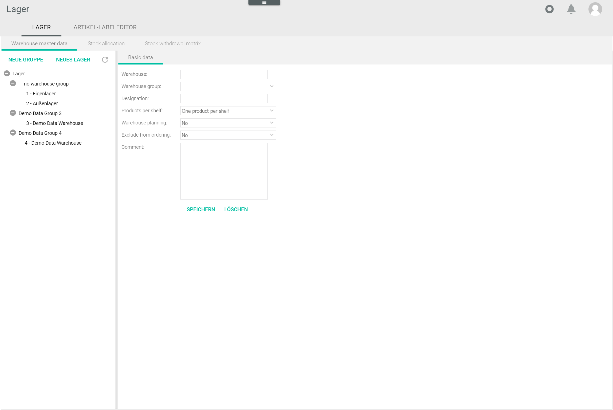
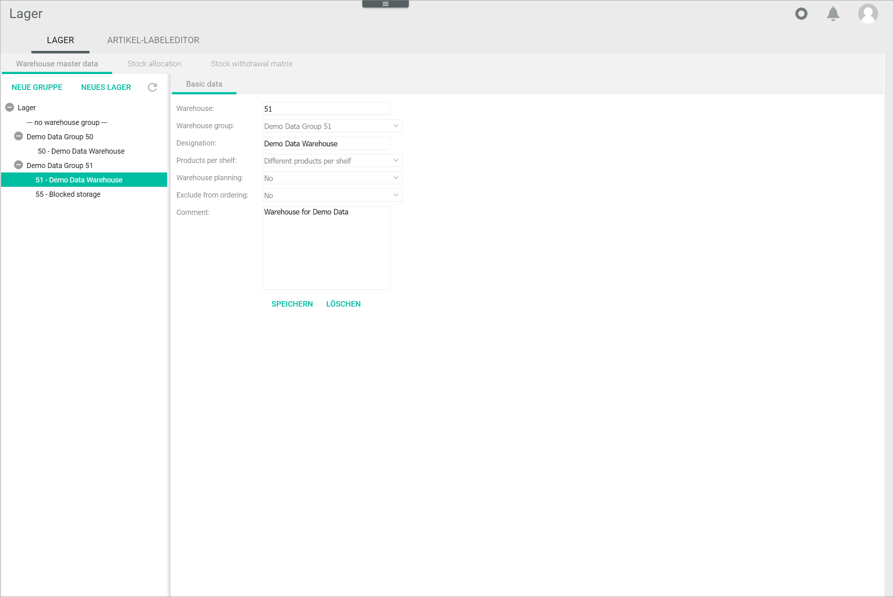

# Configure the warehouses

A warehouse is a subordinate storage area within a warehouse group used for a specific purpose, such as sales, returns, or blocked stock. A warehouse can be assigned, or not, to a specific warehouse group. If a warehouse is not assigned to any warehouse group, it will be listed under the general *No warehouse group* in the left side bar. 

Warehouses can be created, edited and deleted.

## Create a warehouse

Create one or more specific warehouses from which the stock is taken.

#### Prerequisites

No prerequisites to fulfill.

#### Procedure

*Warehouse > Settings > Tab WAREHOUSE > Tab Warehouse master data*

1. Click the [NEW WAREHOUSE] button.   
    The *Basic data* sub-tab is displayed on the right side.

     

2. Enter a number for the warehouse in the *Warehouse* field. This is the warehouse ID.

3. If desired, select the warehouse group in the *Warehouse group* drop-down list.  
    
    > [Info] If you do not select a warehouse group, the warehouse will be included in the **No warehouse group**.

4. Enter a name for the new warehouse in the *Designation* field.

5. Click the *Products per shelf* drop-down list and select the **Different products per storage shelf** option.  
        
[comment]: <> (One product per storage shelf ignorieren; aktuell bei keinem Kunden benutzt und und Probleme beim Anlegen der Lagerfächer. Warehouse planning Warehouse planing can be ignored, as it is no longer developed and has no effect.)

6. Click the *Exclude from ordering* drop-down list and select **No** to deactivate the purchasing process.

    > [Info] The *Purchasing* module can calculate the suggested amount of a product that needs to be purchased from a supplier to replenish the stock level. If this option is activated, that is, set to **Yes**, the stock amount available in this warehouse will not be part of the calculation, that is, it will be ignored by the system.

7. If desired, enter any comments in the *Comment* field.

8. Click the [SAVE] button.  
    The warehouse has been saved.
    
9. Click the  (Refresh) button at the top of the left column.   
    The new warehouse is displayed in the left column.

## Edit a warehouse

Once you have created a warehouse, you can edit it. 

#### Prerequisites

At least one warehouse has been created, see [Create a warehouse](#create-a-warehouse).

#### Procedure

*Warehousing > Settings > Tab WAREHOUSE > Tab Warehouse master data*

1. Click the warehouse you want to edit.  
    The *Basic data* sub-tab of the selected warehouse is displayed.

    

    > [Caution] **Potential loss of data**   
    Editing has the potential to cause loss of data due to overwrite. The overwrite cannot be undone and the overwritten data cannot be restored. Check all your entries before proceeding.

2. Modify any settings as necessary in the applicable fields.  

3. Click the [SAVE] button.  
    The changes have been saved.

 > [Info] It may be necessary to click the  (Refresh) button at the top of the left column to display certain changes, for example, if the warehouse has been assigned to a different warehouse group.   
    

## Delete a warehouse

Once you have created a warehouse, you can delete it. 

#### Prerequisites

At least one warehouse has been created, see [Create a warehouse](#create-a-warehouse).

#### Procedure

*Warehousing > Settings > Tab WAREHOUSE > Tab Warehouse master data*

1. Click the warehouse you want to edit.  
    The *Basic data* sub-tab of the selected warehouse is displayed.

    

    > [Caution] **Loss of data**  
        Deleting will permanently remove the selected data. The deletion cannot be undone and the deleted data cannot be restored. Problems may occur due to unresolved dependencies. Make sure you really want to delete the selected data.

2. Click the [DELETE] button.  
    The warehouse is deleted and is no longer displayed in the left side bar in the *Warehouse master data* tab.
    
    > [Info] If the warehouse has already been included in the stock allocation matrix, the warehouse cannot be deleted. A window with the following error message is displayed: *Error deleting: There are warehouse allocations in this warehouse.* In this case, you have to ... first, see [To be determined](#to-be-determined).
