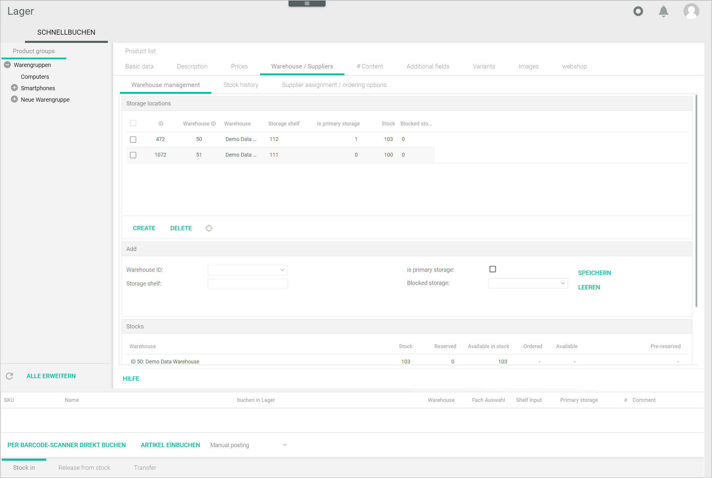

[!!Configure warehouses](./02_ConfigureWarehouses.md)

# Configure the storage shelves 

Warehouses are subdivided into storage shelves, from which stock is actually posted. Storage shelves are, therefore, subordinate storage areas within a warehouse that can contain one or several materials. This depends on the warehouse settings. To modify the amount of materials per shelf, see [Edit a warehouse](./02_ConfigureWarehouses.md#edit-a-warehouse).

Each material can be stored in several storage shelves and different warehouses, but they can only have one primary storage shelf, that is, the main storage location. When an order is received, stock is taken from the primary storage shelf automatically, as long as the ordered material is in stock, and no configuration is stored in the stock withdrawal matrix or no configuration matches the criteria.

## Create a storage shelf  

You can create an unlimited number of storage shelves in your warehouses to specify exactly where your materials are stored.

#### Prerequisites

- At least one warehouse has been created, see [Create a warehouse](./02_ConfigureWarehouses.md#create-a-warehouse).
- The warehouse logistics must be active for the selected material, see [Activate the warehouse logistics for a material](../Operation/01_ManageStock.md#activate-warehouse-logistics-for-a-material).

#### Procedure

*Warehousing > Quick posting > Tab QUICK POSTING > Select a material > Tab Warehouse/suppliers > Sub-tab Warehouse management*

1. Click the [CREATE] button in the bottom left corner of the *Storage location* section.  
    The *Add* section is displayed.

    

2. Click the *Warehouse ID* drop-down list and select the warehouse where you want to create the storage shelf. All available warehouses are displayed in the list.

    > [Info] If you select a warehouse where only one product per shelf is allowed, the [TREE VIEW] button is displayed. The [TREE VIEW] button is no longer supported and can be ignored. 

[comment]: <> (Storage shelf: Address drop-down list -> Wenn One product per shelf -> TREE VIEW button, beim Klicken zur Lagerplanung, aber was bewirkt das? Oder einfach weglassen?)

3. Click the *Storage shelf* field and enter a unique number. This is the storage shelf ID.  

4. If desired, click the *is primary storage shelf* checkbox to set the storage shelf as primary for the selected material.  

    > [Info] The primary storage shelf is marked with **1** in the **is primary storage shelf** column in the *Storage locations* section. 

5. If you want to create a storage shelf for blocked storage, click the *Blocked storage* drop-down list and select appropriate material conditions. The following options are available:  

    - **ALL CONDITIONS**  
    - **NO ORIGINAL PACKAGING**  
    - **Incomplete**
    - **Defective item**
    - **Defective item, to be repaired**
    - **Out of withdrawal period**
    - **Out of warranty**
    - **Used**
    - **Wrong serial number**

    > [Info] You can create different blocked storage shelves for different material conditions. 
    
6. Click the [SAVE] button to save the storage shelf.  
    The message *Please wait... Saving...* is displayed. The new storage shelf is displayed in the list in the *Storage locations* section. 

## Edit a storage shelf  

Once you have created a storage shelf, you can edit it.

#### Prerequisites

A storage shelf has been created, see [Create a storage shelf](#create-a-storage-shelf).

#### Procedure

*Warehousing > Quick posting > Tab QUICK POSTING > Select a material > Tab Warehouse/suppliers > Sub-tab Warehouse management*

1. Select the storage shelf you want to edit from the list in the *Storage location* section.  
    The *Edit* section is displayed.

      

    > [Caution] **Potential loss of data**   
    Editing has the potential to cause loss of data due to overwrite. The overwrite cannot be undone and the overwritten data cannot be restored. Check all your entries before proceeding.

2. If desired, modify the storage shelf ID.  

3. Select or deselect the **is primary storage shelf** checkbox as necessary to change the storage shelf setting.  
    
    > [Info] Note that the *Warehouse ID* und the *Blocked storage* settings cannot be changed for existing warehouse storage shelves. If you need to do it, you have to create a new warehouse shelf with the desired settings.   

4. Click the [SAVE] button.  
    The message *Please wait... Saving...* is displayed. The changes are displayed in the list in the *Storage locations* section. 

## Delete a storage shelf   

You can delete a storage shelf if it is no longer needed.

#### Prerequisites

*Warehousing > Quick posting > Tab QUICK POSTING > Select a material > Tab Warehouse/suppliers > Sub-tab Warehouse management*

#### Prerequisites

A storage shelf has been created, see [Create a storage shelf](#create-a-storage-shelf).

#### Procedure

1. Select the storage shelf you want to delete from the list in the *Storage location* section.  
    The *Edit* section is displayed.

    

    > [Caution] **Loss of data**  
    Deleting will permanently remove the selected data. The deletion cannot be undone and the deleted data cannot be restored. Problems may occur due to unresolved dependencies. Make sure you really want to delete the selected data.

2. Click the [DELETE] button.  
    The message *Please wait... Saving...* is displayed.  
    The deleted storage shelf is no longer displayed in the list in the *Storage locations*.  

    > [Info] If you try to delete a primary storage shelf, a confirmation window is displayed with the notice "Do you really want to delete the main storage location?". The deletion of a primary storage shelf is also possible, and the system will assign another storage shelf as primary. It is recommended ...

[comment]: <> (Ist das so gedacht? Was wird empfohlen? Kann es nicht zu Probleme wegen Abhängigkeiten führen? Mit welchem Kriterium wird das neue Primär-Lagerfach vom System zugeordnet?)

Operation?
Set storage shelf as primary storage (Warehouse management) 
Block a storage shelf (Warehouse management) 
