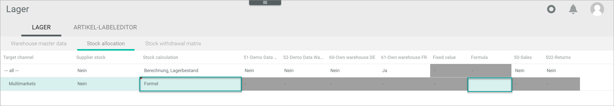
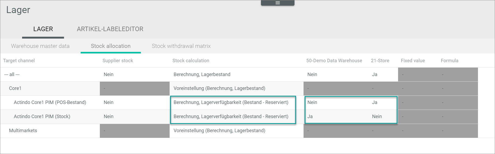

[!!Configure the warehouse groups](./01_ConfigureWarehouseGroups.md)
[!!Configure the warehouses](./02_ConfigureWarehouses.md)
[!!User interface Warehouse](../UserInterface/03a_Warehouse.md)
[!!Manage an attribute in PIM](../../PIM/Integration/01_ManageAttributes.md)
[!!Manage an attribute set in DataHub](../../DataHub/Integration/02_ManageAttributeSets.md)

# Configure the stock allocation

The stock allocation function allows you to update the stock levels automatically across all your sales channels. In the stock allocation table, you can define which value should be indicated as available stock in each sales channel. There are different methods you can choose from to calculate the available stock. The calculated stock amount is then automatically transferred to the *PIM* product, where it is displayed in the *Stock level* field. From the *PIM* module, the calculated stock amount is transferred via ETL to the *Omni-Channel* module, and from there to the corresponding sales channel via driver. 

Every time a posting is made in the *Warehousing* module, the stock value in the *PIM* module is updated. This process occurs asynchronously and may take a few moments. The stock value is transferred in turn to the corresponding sale channel via the *Omni-Channel* module.

The stock allocation table includes automatically all warehouses you have created. You can decide any time if you want to include the stock stored in a specific warehouse in the stock calculation. For detailed information to create a warehouse, see [Create a warehouse](./02_ConfigureWarehouses.md#create-a-warehouse). Besides, all configured target channels are also listed in the *Target channel* column. Depending on the configured target channels and warehouses, the displayed columns and rows will vary. 

#### Prerequisites

- At least one warehouse has been created, see [Create a warehouse](./02_ConfigureWarehouses.md#create-a-warehouse).
- The necessary attributes of the *Stock value* data type have been created in the *PIM* module, see [Create an attribute](../../PIM/Integration/01_ManageAttributes.md#create-an-attribute). 
- The *Stock value* attribute has been assigned to the relevant attribute sets, see [Add an attribute to the set](../../DataHub/Integration/02_ManageAttributeSets.md#add-an-attribute-to-the-set). 

[comment]: <> (Julian: Create an attribute auch möglich in DataHub hier, richtig? Also, ich kann in beiden Fällen auf DataHub verweisen?)

#### Procedure 

*Warehousing > Settings > Tab WAREHOUSE > Tab Stock allocation*

1. Select the row with the desired stock value to be calculated and transferred in the *Target channel* column. In the example screenshot, there are two stock values: *Actindo Core1 PIM (POS stock)*, for the stock units available in the physical store (point of sale), and *Actindo Core1 PIM (Stock)*, for the stock units available in the warehouse for incoming orders.  

2. Double-click the corresponding field in the *Stock calculation* column.   
    A drop-down list is displayed.

3. Click the drop-down list and select the appropriate option. The following options are available:  
      
    - **Default setting**  
        Select this option if you do not want to transfer any value for this target channel.  
        All fields in the row are locked.  

    - **Fixed value**  
        Select this option to transfer a fixed stock amount to the target channel.   
        The corresponding field in the *Fixed value* column is unlocked. 

    - **Formula**  
        Select this option to create your own formula to calculate the stock amount. For this purpose, Actindo implements php formulas using the different posting types, for example GET_BESTAND(50)+GET_RESERVED(50)+GET_PRE_RESERVED(50)+GET_SELL(50).  
        The corresponding field in the *Formula* column is unlocked. 

        > [Info] Bear in mind that all outgoing postings, such as pre-reservations, reservations or sales, are negative, and therefore they must be added to the formula with a plus sign, not a minus. 

        Below, you can see a table containing the php commands used in the *Actindo Core1 Platform* and their meaning:

        | php commands | Meaning |
        | ------------ | ---------------- |
        | GET_BESTAND | Physical stock |
        | GET_RESERVED | Reserved material |
        | GET_PRE_RESERVED | Pre-reserved material |
        | GET_RESERVED_SPECIAL | Reserved material for open delivery note |
        | GET_SELL | Material sold |
        | GET_COUNT | Physical stock minus reserved material for open delivery note |
        | GET_COUNTAVAIL | Physical stock minus reserved material |
        
    - **Calculation, stock level**  
        Select this option to transfer the physical stock stored in the warehouse.  
        The fields in the warehouse columns are unlocked.
        
    - **Calculation, stock availability (stock level - reserved)**  
        Select this option to transfer the stock amount resulting from the physical stock stored in the warehouse minus the reservations (open customer orders). This is done to prevent overselling.  
        The fields in the warehouse columns are unlocked.

    - **Calculation, availability (stock level + ordered - reserve)**   
        Select this option to transfer the stock amount resulting from the physical stock stored in the warehouse, plus the stock ordered from the supplier (open supplier orders, even if the materials have not yet arrived in the warehouse), minus the reservations (open customer orders).  
        The fields in the warehouse columns are unlocked.

4. Depending of the option you have selected in the previous step, proceed as follows:

    - If you have selected the **Fixed value** option, double-click the corresponding editable field in the *Fixed value* column and enter the desired value.  

        

    - If you have selected the **Formula** option, double-click the corresponding editable field in the *Formula* column and enter the desired formula. See the table in step **3** for the php commands and their meaning. 

        

    - If you have selected one of the predefined calculation formulas, double-click the field corresponding to the desired warehouse to display the drop-down list. Then, select the **Yes** option in the drop-down list to include the warehouse in the stock allocation calculation or select the **No** option to exclude it.  

        

    > [Info] The small red triangle in the left upper corner of the field indicates that the marked field has been changed.  

5. If you want to include the stock located at the suppliers' premises in the calculation, click the corresponding field in the *Supplier stock* column and select the appropriate option. The fields in this column are only unlocked when you select a predefined calculation formula in the *Stock calculation* column. The following options are available:

    - **No**  
        Select this option to exclude stock from all suppliers.
    - **Yes, all**  
        Select this option to include stock from all suppliers.
    - **Yes, only dropship suppliers**    
        Select this option to include stock only from dropship suppliers.
    - **Yes, only normal suppliers**  
        Select this option to include stock only from normal suppliers.

6. Click the [SAVE] button in the bottom right corner.   
    The stock allocation is saved. 
    

