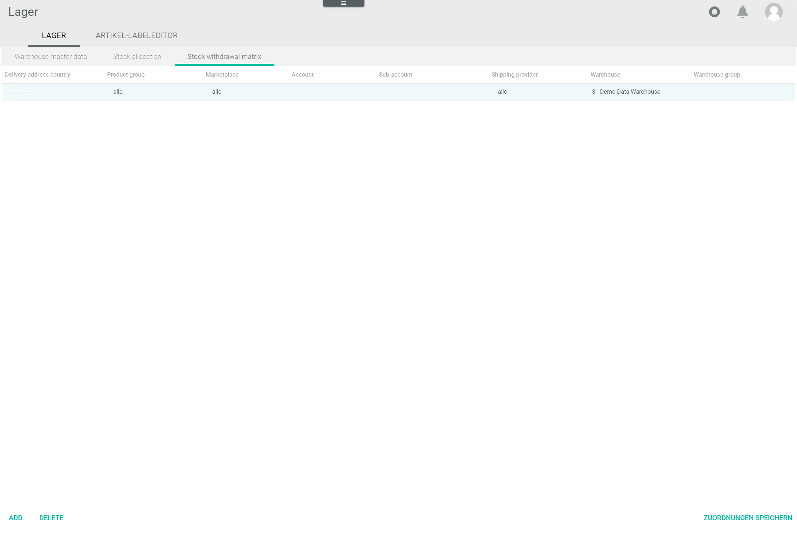

[!!User interface Stock withdrawal matrix](../UserInterface/to-be-determined)
[!!Configure the warehouse groups](./01_ConfigureWarehouseGroups.md)
[!!Configure the warehouses](./02_ConfigureWarehouses.md)
[!!](../Integration/.md)

# Configure the stock withdrawal matrix

The stock withdrawal matrix is designed to determine automatically from which warehouse and under which conditions stock is withdrawn. Usually, the main parameters are the country of delivery and the sales channel, but the following parameters can also be configured: 

- Product group: a product included in a specific product group is ordered 
- Sales channel: the output channel via which you want to create offers, for example, the *Omni-Channel* module 
- Account: the connection used in the *Omni-Channel* module, for example, Salesforce Commerce Cloud or POS 
- Sub-account: the shop where the order is placed, for example, the online store in Germany or in the US
- Shipping provider: in case of express delivery, for example, the material is taken from a warehouse, and in case of standard delivery, from a different one
- Warehouse: the specific warehouse where the stock should be withdrawn
- Warehouse group: if desired, you can also specify only the warehouse group where the stock should be withdrawn from

 > [Info] When both warehouse and warehouse group are specified, the warehouse must be included in the warehouse group.

The stock withdrawal matrix is a so-called priority list, that is, a list of criteria arranged in descending order based on their priority. Therefore, the correct order of these criteria is crucial, as the system goes through them in the order they are listed, starting from the top, and stops checking them as soon as a matching criterion is found. For example, if two entries have the same matching criteria, the system withdraws the stock from the one warehouse that comes first until there is no more materials in stock, and then it goes to the next one.   

[comment]: <> (Product group noch relevant? Product group wird in Artikelverwaltung konfiguriert, aber noch im Einsatz? Oder kann man auch in PIM?)

## Create an entry

Create an entry to determine a set of criteria to withdraw stock from a specific warehouse.

#### Prerequisites  

- At least one warehouse has been created, see [Create a warehouse](./02_ConfigureWarehouses.md#create-a-warehouse).
- A connection with a sales channel has been established, see [Create a connection](../../Channels/Integration/01_ManageConnections.md#create-a-connection). 

[comment]: <> (Check prerequisites)

#### Procedure

*Warehouse > Settings > Tab WAREHOUSE > Tab Stock withdrawal matrix*

1. Click the [ADD] button in the bottom left corner.   
    A new data input line is displayed.

2. Double-click the field in the *Delivery address country* column and select the applicable country from the drop-down list.  

    > [Info] The small red triangle in the left upper corner of the field indicates that the marked field has been changed.  
    
3. If necessary, double-click the field in the *Product group* column and select the applicable product group from the drop-down list. To create product groups, go to *Product management > Product groups*.

[comment]: <> (Julian: Ist diese Funktion noch aktuell oder wird es abgebaut? Ich kann eine Gruppe erstellen und wird auch in der Lagerentnahme-Matrix angezeigt, aber wie kann ich Produkte zur Gruppe hinzufügen? In Artikelverwaltung ist die Option ausgegraut. Keine Doku von Artikelverwaltung. Ähnliche Funktion in PIM? Oder in Fakturierung?)

4. Double-click the field in the *Sales channel* column and select the applicable output channel via which you want to create offers. The following options are available: 

    - **All**  
        Select this option to include all sales channels.
    - **None**  
        Select this option if your warehouse is managed by a fulfiller.
    - **Core 1 Channels**  
        Select this option for all sales channels connected via the *Omni-Channel* module. 
    - **Shop**   
        Select this option if you use your own external web shop.

[comment]: <> (Stimmt das so? Oder kann es weitere Optionen geben? None z.B. bei NoE nud dann Arvato UK warehouse group. Ist es so, wenn man einen Fulfiller im Einsatz hat?)

5. Double-click the field in the *Account* column and select the applicable connection established in the *Omni-Channel* module. All available connections are displayed in the list.

6. If necessary, double-click the field in the *Sub-account* column and select the applicable sub-account, that is, the specific sub-shop where the order has been placed.

7. If desired, double-click the field in the *Shipping provider* column and select the applicable shipping provider. You can configure the shipping providers in the *Order Management* module.

[comment]: <> (Stimmt das so? Wo genau? Order Management > Settings > Tab SHIPPING PROVIDER > Shipping?)

8. Double-click the field in the *Warehouse* column and select the applicable warehouse where the stock should be withdrawn from. All available warehouses are displayed in the list.

9. If desired, double-click the field in the *Warehouse group* column and select the applicable warehouse group where the stock should be withdrawn from. All available warehouses are displayed in the list. 

    > [Info] You can indicate the warehouse group generally or specify more precisely the exact warehouse within a warehouse group where the stock has to be taken from. When both warehouse and warehouse group are specified, the warehouse must be included in the warehouse group.

10. Click the [SAVE ASSIGNMENTS] button in the bottom right corner.   
    The entry in the stock withdrawal matrix is saved.

    > [Info] Repeat steps **1** to **10** to add further entries.

## Edit an entry

Once you have created an entry, you can edit it.

#### Prerequisites  

An entry has been created, see [Create an entry](#create-an-entry). 

#### Procedure

*Warehouse > Settings > Tab WAREHOUSE > Tab Stock withdrawal matrix*

1. Select the entry you want to edit.

2. Edit the settings as necessary by double-clicking in the corresponding field.  
    
    > [Info] The small red triangle in the left upper corner of the field indicates that the marked field has been changed.
    
3. Click the [SAVE ASSIGNMENTS] button in the bottom right corner.   
    The new assignment in the stock withdrawal matrix is saved.

## Delete an entry

Once you have created an entry, you can edit it.

#### Prerequisites  

An entry has been created, see [Create an entry](#create-an-entry). 

#### Procedure

*Warehouse > Settings > Tab WAREHOUSE > Tab Stock withdrawal matrix*

1. Select the entry you want to delete.

2. Click the [DELETE] button in the bottom right corner.   
    The entry has been removed from the matrix.

