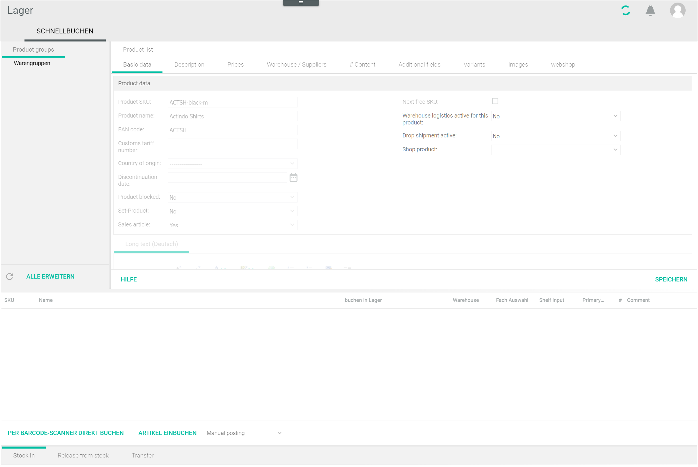

[!!User interface Quick posting](../UserInterface/to-be-determined)

# Manage the stock

The main purpose of the *Warehousing* module is to manage the stock, that is, to post stock in and release stock from the warehouse. Stock postings are usually carried automatically by the system after the applicable business document is created and processed. This is in turn determined by the workflow you have previously configured. Additionally, you can perform stock postings manually if necessary, see [Create a manual stock posting](#create-a-manual-stock-posting). 

[comment]: <> (In Overview: The *Warehousing* module is undergoing a major redesigning process and, therefore, only the most important features are described in this documentation. Oder Diese Funktion wird in absehbarer Zeit sich ändern oder wegfallen und daher wird aktuell nicht beschrieben.)

## Activate the warehouse logistics for a product

All products created in the *Actindo Core1 Platform* are displayed in the *Product list* in the *Warehousing* module. However, not all products displayed in the product list are actually kept in stock.

...

However, a  product is not relevant for the warehouse logistics by default. To be able to post stock of a specific product in the *Warehousing* module, you have to activate the warehouse logistics for that individual product. 

Once you have activated the warehouse logistics for a selected product, the sub-tab *Warehouse/suppliers* is displayed. As soon as a stock amount has been posted, the warehouse logistics cannot be deactivated for this material any more. 

Warehouse logistics cannot be activated for the following materials:  

- Master product  
    A master material is a superordinate (parent) entity that has subordinate (child) entities, that is, the material variants. A master material is an abstract entity that represents an object; the material variants, on the other hands, are the actual materials, in all its variants, that are on sale. For example, the master material "t-shirt" can have the different material variants, for instance a red t-shirt in M size and blue t-shirt in L size.

- Product bundle 
    A bundle is a set of materials that are sold together. However, they are individual materials that are managed independently in the *Warehouse* module. Bundle availability depends on the stock of the individual materials included in the bundle. If one of the materials is not in stock any more, the bundle cannot be sold. 

[comment]: <> (Artikel im Lager kommen aus Artikelverwaltung oder aus PIM kommen? Terminologie problematisch: hier ist immer die Rede von Artikel oder Produkt,  nicht Material... Sollen wir das schon mal trotz Abweichungen im UI ändern? Wie/wo ändern? Sollen wir das ausdrücklich in der Doku erklären, also PIM Product-> OC Offer -> Warehousing Material)

[comment]: <> (Begriffe zu erklären: Verpackungseinheiten/packaging unit, hard bundle?)

[comment]: <> (Zur Terminologie: hier Material statt Produkt / Artikel verwenden? In UI gemischt. Master material, variant material auch ok?)

#### Prerequisites

No prerequisites to fulfill.

#### Procedure

*Warehousing > Quick posting > Tab QUICK POSTING*

1. Double-click the material for which you want to activate the warehouse logistics. Alternatively, you can right-click and select the [ Open] button in the context menu.  
    The *Basic data* view is displayed.

    

2. Click the *Warehouse logistics active for this product* drop-down list and select **Yes** to activate the selected material.  

3. Click the [SAVE] button.  
    The notice *Please wait... Saving...* is displayed while saving. The setting has been saved. The *Successfully saved** pop-up window is displayed. 

    

    
## Create a manual stock posting

Stock postings are usually automatically performed by the system, triggered by the creation and processing of business documents as configured in your workflow. However, you can also create manual sock postings if necessary. 

You can create a manual posting for a single material or for multiple materials at once.

### Manual posting of a single material  

You can create a manual posting of a selected single material.

#### Prerequisites

The warehouse logistics has been activated for the selected material, see [Activate the warehouse logistics for a product](../Operation/01_ManageStock.md#activate-warehouse-logistics-for-a-product).

#### Procedure

*Warehousing > Quick posting > Tab QUICK POSTING > Select a material > Tab Warehouse/suppliers > Sub-tab Warehouse management*

1. Click the [ADD POSTING] button in the bottom left corner of *Warehouse management* view. You may need to scroll down to be able to see the button.  
    The *Add posting* window is displayed.

     

2. Click the *Stock location* drop-down list and select the storage shelf where you want to post the stock. All available storage shelves for this material are displayed in the list.

3. Click the *Posting type* drop-down list and select the desired posting type. Depending on the option you select, the fields displayed below may slightly vary. The following options are available:

    - **Reservation**   
        Select this option if you want to reserve a material for an open order. This reservation does not reduce the actual, physical stock, only the available stock. A reservation can therefore result in a negative stock level.

    - **Sale**  
        Select this option if the ordered material has left the warehouse. This posting reduces the actual, physical stock in the warehouse.  
        The *Customer name* and *Sale price net* fields are additionally displayed.

    - **Order**   
        Select this option if you have ordered additional materials from a supplier for restocking purposes. This posting does not increase the actual, physical stock in the warehouse but does affect the available stock calculation.

    - **Purchase**  
        Select this option if you want to add purchased and received materials in the warehouse. This posting increases the actual, physical stock in the warehouse.    
        The *Supplier* and *Purchase price net* fields are additionally displayed.

    - **Stock adjustment posting**  
        Select this option if you want to adjust the stock in the warehouse after stocktaking.   
        
    - **Stock transfer**  
        Select this option if you want to post a redistribution of a material from a source storage shelf to a destination storage shelf.   
        The *New stock location* drop-down list is additionally displayed. 

    - **Return**  
        Select this option if you want to post a returned material. If a material is available in more than one storage shelf, the returned material will be always posted to the primary storage shelf.

    - **Problem**  
        Select this option if you want to post a material that cannot be sold for any reason, for instance due to a defect.

    - **Pre-reservation**  
        Select this option if you want to post a reservation for an order that has not been received in the system yet, that is, there is no business document assigned to it yet. This can be the case, for example, when a customer places a product in the shopping cart.  

        > [Info] Pre-reservation postings are not standard and must be additionally configured in the system. If you have not had configured, this option will not be displayed in the list.

3.  If you have selected the *Stock transfer* posting type, click the *New stock location* drop-down list and select the destination storage shelf. Otherwise, proceed to next step.

4. Check the material amount in the *Change* field and enter a different material amount if necessary.  
    The *Old stock*, *Old total stock*, *New stock* and *New total stock* fields are updated accordingly. All these fields are read-only and are updated automatically. 

    > [Info] Depending of the posting type, the sign changes. A positive value means a receipt of materials, whereas a negative value means the dispatch of materials. The amount posted is in turn added or removed to the old and new stock values.  

5. Click the *Posting date* field and enter the desired date with your keyboard. Alternatively, click the  (Calendar) button to select a date.

6. If desired, add a comment to the posting in the *Comment* field.

7. If you have selected the *Sale* or *Purchase* posting types, you can enter a customer or supplier name, as well as a the net sale or purchase price in the corresponding fields if desired.

8. Click the [SAVE & NEW] button.  
    The posting has been saved. The stock in the *Storage locations* and *Stocks* section is updated accordingly.

### Manual posting of multiple materials

You can create a manual posting of multiple materials at once. 

The posting types you can create for multiple materials at once are limited. You can only create manual postings, stocktaking entries, both positive and negative, sales and transfer postings. 
    
#### Prerequisites

The warehouse logistics has been activated for the selected materials, see [Activate the warehouse logistics for a material](../Operation/01_ManageStock.md#activate-warehouse-logistics-for-a-material).

#### Procedure

*Warehousing > Quick posting > Tab QUICK POSTING*

1. Select the applicable tab at the bottom of the workspace. The following tabs are available:
    - *Stock in*  
        Select this tab if you want to add multiple materials to stock. 
    - *Release from stock*  
        Select this tab if you want to remove multiple materials from stock.
    - *Transfer*  
        Select this tab if you want to transfer multiple materials from a storage location to another.

2. Click the products for which you want to post stock while pressing and holding the CTRL key.  
    The selected products are highlighted.

2. Drag an drop the selected products to the empty section at the bottom of the workspace.

3. Double-click the corresponding fields in the *Post in warehouse* column.  
    A drop-down list with all storage locations, that is, warehouse and storage shelf where the material is stored, are displayed. If necessary, you can also create a new storage shelf here.

4. Select the storage location where you want to post the material. Alternatively, create a new storage shelf following the procedure below:  
    - Select the **New storage shelf** option in the drop-down list.  
    A small red triangle is displayed in the left upper corner of the field indicating that the marked field has been changed.  
    - Double-click the field in the *Warehouse* column and select the warehouse where you want to create the storage shelf.  
    - Double-click the field in the *Shelf input* column and enter a number for the new storage shelf.

5. Enter the amount of materials you want to post in the *#* column.  
    A small red triangle is displayed in the left upper corner of the field indicating that the marked field has been changed.

6. Add a comment in the *Comment* column if desired.

7. Click the *Manual posting* drop-down list and select the desired posting type. The options displayed in the list vary depending on the tab selected.
   
8. Click the [STOCK IN MATERIAL] button to post all selected materials.  
    The *Please wait...* notice and a confirmation window are displayed. Click [OK] to confirm the process. The materials are posted to the selected storage shelves. The stock values are updated accordingly.

    > [Info] The procedure to release from stock and transfer stock is identical. Just select the corresponding tab follow the steps described above.

 

## Check the stock allocation for a material

You can check the stock allocation for a selected material from the product list.

#### Prerequisites

- The warehouse logistics has been activated for the selected material, see [Activate the warehouse logistics for a product](../Operation/01_ManageStock.md#activate-warehouse-logistics-for-a-product).
- The stock allocation has been configured, see [Configure the stock allocation](../Integration/04_ConfigureStockAllocation.md).

#### Procedure

*Warehousing > Quick posting > Tab QUICK POSTING*

1. Right-click the row with the material you want to check from the product list.   
    The context menu is displayed.

    

2. Click the *Display stock allocation* entry.    
    The *Display stock allocation* window is displayed.

    

3. Check the stock allocation values displayed. These values are the result of the calculations configured in the stock allocation table and are transferred to the *PIM* product and, via *Omni-Channel* to the corresponding sales channel.  

    > [Info] Bear in mind that product bundles are not actually kept in stock as such, since they are grouping of two or more individual products. For stock allocation purposes, this means that the stock allocation displayed for product bundles is the result of the stock allocation of the individual products included in the bundle but rounded down: if there are 3 materials in stock left and a bundle contains 2 of them, bundle stock is 1, and not 2.

