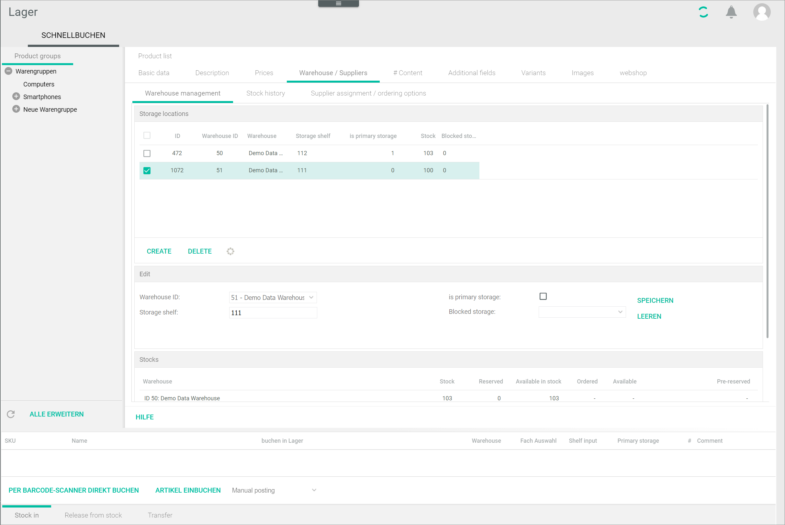

[!!Configure the stock allocation](../Integration/04_ConfigureStockAllocation.md)
[!!Manage the stock](./02_ManageStock.md)
[!!User interface Posting history](../UserInterface/02a_PostingHistory.md)
[!!User interface Quick posting](../UserInterface/01a_QuickPosting.md)

# Manage the warehouse

Once you have created a warehouse, you can manage it. The warehouse management functions include setting a storage shelf as primary, checking the stocks, checking the stock allocation and checking the stock history for a selected material.

Before you can post stock for a material, you have to activate the warehouse logistics for the corresponding product.

## Activate the warehouse logistics for a product

All products created in the *Actindo Core1 Platform* are displayed in the *Product list* in the *Warehousing* module. However, a product is not relevant for the warehouse logistics by default. To be able to post stock for a material corresponding to a specific product in the *Warehousing* module, you have to activate the warehouse logistics for that individual product first. 

Once you have activated the warehouse logistics for a selected product, the *Warehouse/suppliers* sub-tab is displayed. As soon as a stock amount has been posted, the warehouse logistics cannot be deactivated for this product anymore. 

Not all products displayed in the product list are actual items kept in stock. Warehouse logistics cannot be activated for the following products:  

- Master product  
    A master product is a superordinate (parent) entity that has subordinate (child) entities, that is, the product variants. A master product is an abstract entity that represents an object; the product variants, on the other hand, are the actual products, in all its variants, that are on sale. For example, the master product "T-shirt" can have different product variants, for instance a red T-shirt in M size and blue T-shirt in L size.

- Product bundle  
    A bundle is a set of products that are sold together. However, these are individual products that are managed independently in the *Warehouse* module. The bundle stock depends, therefore, on the stock of the individual products included in the bundle. If one of the products is not in stock any more, the bundle cannot be sold. 

#### Prerequisites

No prerequisites to fulfill.

#### Procedure

*Warehousing > Quick posting > Tab QUICK POSTING*

1. Double-click the product for which you want to activate the warehouse logistics. Alternatively, you can right-click and select the [ Open] button in the context menu.  
    The *Basic data* sub-tab is displayed.

    

2. Click the *Warehouse logistics active for this product* drop-down list and select **Yes** to activate the selected product.  

3. Click the [SAVE] button.  
    The notice *Please wait... Saving...* is displayed while saving. The setting has been saved. The *Successfully saved* pop-up window is displayed. 

## Check the stock allocation for a material

You can check the stock allocation for a selected material from the product list.

#### Prerequisites

- The warehouse logistics has been activated for the selected material, see [Activate the warehouse logistics for a product](#activate-the-warehouse-logistics-for-a-product).
- The stock allocation has been configured, see [Configure the stock allocation](../Integration/04_ConfigureStockAllocation.md).

#### Procedure

*Warehousing > Quick posting > Tab QUICK POSTING*

1. Right-click the row with the material you want to check from the product list.   
    The context menu is displayed.

    

2. Click the *Display stock allocation* entry.    
    The *Display stock allocation* window is displayed.

    

3. Check the stock allocation values displayed. These values are the result of the calculations configured in the stock allocation table and are transferred to the *PIM* product and, via *Omni-Channel*, to the corresponding sales channel.  

    > [Info] Bear in mind that product bundles are not actually kept in stock as a single material, since they are a grouping of two or more individual products. For stock allocation purposes, this means that the stock allocation displayed for product bundles is the result of the stock allocation of the individual products included in the bundle but rounded down: if there are 3 materials in stock left and a bundle contains 2 of them, the bundle stock is 1, and not 2.

## Set a storage shelf as primary

You can set any storage shelf as primary for a selected material to determine from which storage shelf the material must be taken by default.

#### Prerequisites

- The warehouse logistics has been activated for the selected material, see [Activate the warehouse logistics for a product](#activate-the-warehouse-logistics-for-a-product).
- The stock allocation has been configured, see [Configure the stock allocation](../Integration/04_ConfigureStockAllocation.md).

#### Procedure

*Warehousing > Quick posting > Tab QUICK POSTING*

1. Double-click the product for which you want to activate the warehouse logistics. Alternatively, you can right-click and select the [ Open] button in the context menu.  
    The *Basic data* sub-tab is displayed.

    

2. Click the *Warehouse/suppliers* tab.  
    The *Warehouse management* sub-tab is displayed by default.

    

3. Select the storage shelf you want to set as primary in the *Storage locations* section.  
    The *Edit* section is displayed.

      

4. Click the *is primary storage* checkbox in the *Edit* section.  
    
5. Click the [SAVE] button to save the changes made.  
    The storage shelf is set as primary for the selected material. The primary storage shelf is then marked with **1** in the **is primary storage shelf** column in the *Storage locations* section.  

## Check the stocks for a material

You can check the stocks for a selected material in real time.

#### Prerequisites

- The warehouse logistics has been activated for the selected material, see [Activate the warehouse logistics for a product](#activate-the-warehouse-logistics-for-a-product).
- The stock allocation has been configured, see [Configure the stock allocation](../Integration/04_ConfigureStockAllocation.md).

#### Procedure

*Warehousing > Quick posting > Tab QUICK POSTING*

*Warehousing > Quick posting > Tab QUICK POSTING*

1. Double-click the product for which you want to activate the warehouse logistics. Alternatively, you can right-click and select the [ Open] button in the context menu.  
    The *Basic data* sub-tab is displayed.

    

2. Click the *Warehouse/suppliers* tab.  
    The *Warehouse management* sub-tab is displayed by default.

    

3. Check the stocks values for the selected material in the *Stocks* section. You can check the following stock values:
    - *Stock*: actual, physical units in stock
    - *Reserved*: reserved units for open customer orders 
    - *Available in stock*: actual physical units minus reserved units 
    - *Ordered*: ordered units for restocking purposes
    - *Available*: actual, physical units in stock plus ordered units 
    - *Pre-reserved*: pre-reserved units for orders placed in the customer shopping cart ( if this option is configured)  

    > [Info] The stock values displayed are updated in real time, that is, immediately after a posting has been made. 

## Check the stock history for a material

You can check all stock postings that have been performed for a selected material. Stock postings can be done automatically, that is, by the system, and manually by the user. If a business document number is provided in the *Document no.* column, the stock posting is automatic. If no business document number is displayed, the stock posting is a manual one.

The list displayed in this tab is the same as the one you obtain when searching for the stock postings for a product in the *Posting history* menu entry, see [Check posting history for a material](./03_CheckPostingHistory.md#check-the-posting-history-for-a-material).

[comment]: <> (Stimmt das?)

#### Prerequisites

At least a stock posting has been performed, see [Create a manual posting](./01_ManageStock.md#create-a-manual-stock-posting).  

#### Procedure

*Warehousing > Quick posting > Tab QUICK POSTING*

1. Double-click the material for which you want to check the stock history.   
    The *Basic data* tab is displayed.

     

2. Click the *Warehouse/suppliers* tab.  
    The *Warehouse management* sub-tab is displayed by default.

    

3. Click the *Stock history* tab.  
    The stock posting history for the selected material is displayed.

    

4. If desired, click the *Storage location* drop-down list to select a specific warehouse. All available warehouses are displayed in the list.  
    The list displays only the entries for the selected warehouse.

5. If desired, click the *Posting type* to select a specific posting type. All available posting types are displayed in the list.  
    The list displays only the entries with the selected posting type.

    > [Info] If a posting is red-colored and crossed out, it indicates that the business document has been cancelled.

6. If necessary, click the [EXCEL] button to export the stock history as an Excel file.  
    
    > [Info] The [EXCEL] button is only displayed if the *Statistics* module is installed.