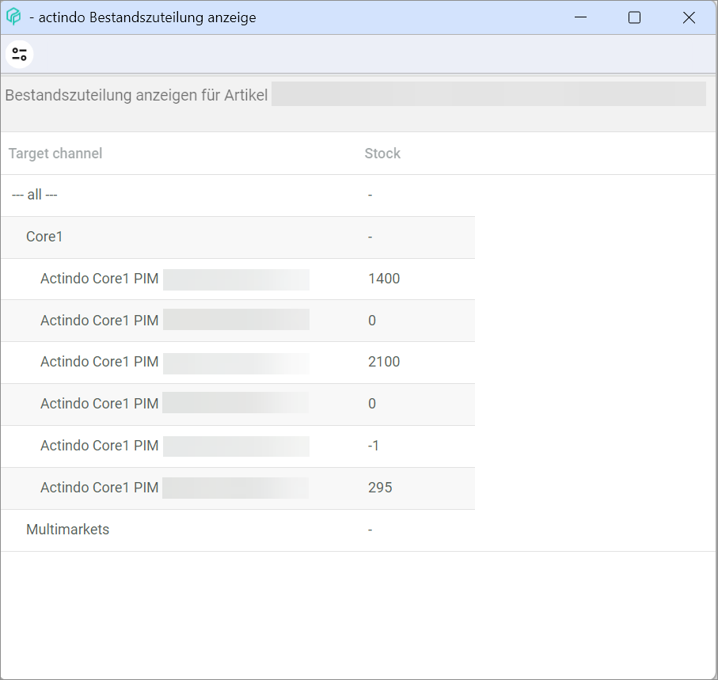

[!!Manage the stock](./02_ManageStock.md)
[!!Activate the warehouse logistics for a product](../Integration/06_ActivateWarehouseLogistics.md)
[!!Configure the stock allocation](../Integration/04_ConfigureStockAllocation.md)
[!!User interface Quick posting](../UserInterface/01a_QuickPosting.md)
[!!User interface Posting history](../UserInterface/02a_PostingHistory.md)

# Manage the warehouse

Once you have created a warehouse, you can manage it. The warehouse management functions allow you to set a storage shelf as primary, and to check the stocks, the stock allocation, and the stock history for a selected material.

Before you can manage the warehouse materials, you have to activate the warehouse logistics for the corresponding product. For detailed information, see [Activate the warehouse logistics for a product](../Integration/06_ActivateWarehouseLogistics.md).

## Set a storage shelf as primary

You can set any storage shelf as primary for a selected material to determine from which storage shelf the material must be taken by default.

#### Prerequisites

The warehouse logistics has been activated for the selected material, see [Activate the warehouse logistics for a product](../Integration/06_ActivateWarehouseLogistics.md).

#### Procedure

*Warehousing > Quick posting > Tab QUICK POSTING*

1. Double-click the product for which you want to set a storage shelf as primary. Alternatively, you can right-click and select the [ Open] button in the context menu.  
    The *Basic data* sub-tab is displayed.

    

2. Click the *Warehouse/suppliers* tab.  
    The *Warehouse management* sub-tab is displayed by default.

    

3. Select the storage shelf you want to set as primary in the *Storage locations* section.  
    The *Edit* section is displayed.

      

4. Click the *is primary storage* checkbox in the *Edit* section.  
    
5. Click the [SAVE] button to save the changes made.  
    The storage shelf is set as primary for the selected material. The primary storage shelf is then marked with **1** in the *is primary storage shelf* column in the *Storage locations* section.  

## Check the stock allocation for a material

You can check the stock allocation for a selected material from the product list. 

#### Prerequisites

- The warehouse logistics has been activated for the selected material, see [Activate the warehouse logistics for a product](../Integration/06_ActivateWarehouseLogistics.md).
- The stock allocation has been configured, see [Configure the stock allocation](../Integration/04_ConfigureStockAllocation.md).

#### Procedure

*Warehousing > Quick posting > Tab QUICK POSTING*

1. Right-click the row with the material you want to check from the product list.   
    The context menu is displayed.

    

2. Click the *Display stock allocation* entry.    
    The *Display stock allocation* window is displayed.

    

3. Check the stock allocation values displayed. These values are the result of the calculations configured in the stock allocation table and are transferred to the *PIM* product and, via *Omni-Channel*, to the corresponding sales channel.  

    > [Info] Bear in mind that product bundles are not actually kept in stock as a single material, since they are a grouping of two or more individual products. For stock allocation purposes, this means that the calculated stock value displayed for product bundles in the *PIM* module is the result of the stock allocation of the individual products included in the bundle, but rounded down: if there are 3 materials in stock left and a bundle contains 2 of them, the bundle stock is 1, and not 2.

[comment]: <> (Julian: Stimmt das so?)

4. Alternatively to the procedure described, you can also display the stock allocation for a selected material following the procedure below: 

    1. Select a product from the list in the *Quick posting*.  
    2. Select the *Warehouse/Suppliers* tab and the *Warehouse management* sub-tab.  
    3. Click the [DISPLAY STOCK ALLOCATION] button at the bottom.  
    
    > [Info] The [DISPLAY STOCK ALLOCATION] button is located at the bottom of the *Stocks* section. You may need to expand the section or scroll down to see the button. 

## Check the stocks for a material

You can check the stocks for a selected material in real time.

#### Prerequisites

The warehouse logistics has been activated for the selected material, see [Activate the warehouse logistics for a product](../Integration/06_ActivateWarehouseLogistics.md).

#### Procedure

*Warehousing > Quick posting > Tab QUICK POSTING*

1. Double-click the material for which you want to check the stocks. Alternatively, you can right-click and select the [ Open] button in the context menu.  
    The *Basic data* sub-tab is displayed.

    

2. Click the *Warehouse/suppliers* tab.  
    The *Warehouse management* sub-tab is displayed by default.

    

3. Check the stocks for the selected material in the *Stocks* section. You may need to expand the *Stocks* section by dragging the lower edge or scroll down to see the complete list of stocks. You can check the following stock values per warehouse and in total:
    - *Stock*: actual units in stock
    - *Reserved*: reserved units for open customer orders 
    - *Available in stock*: actual units minus reserved units 
    - *Ordered*: ordered units for restocking purposes
    - *Available*: actual units in stock plus ordered units 
    - *Pre-reserved*: pre-reserved units for products placed in the customer shopping cart (if this option is supported and configured in the shop)  

    > [Info] The stock values displayed are updated in real time, that is, immediately after a posting has been made. 

## Check the stock history for a material

You can check all stock postings that have been created for a selected material. Stock postings can be done automatically  or manually. If the business document number and customer/supplier details are provided in the corresponding columns, the stock posting is automatic. If this information is not displayed, the stock posting is a manual one.

The list displayed in this tab is similar to the one you obtain when checking the posting history for a material in the *Posting history* menu entry, see [Check the posting history for a material](./03_CheckPostingHistory.md#check-the-posting-history-for-a-material).

Additionally, if the *Statistics* module is installed, you can download the list of stock postings in Excel format for further analysis.

#### Prerequisites

At least a stock posting has been created, see [Create a manual posting](./02_ManageStock.md#create-a-manual-stock-posting).  

#### Procedure

*Warehousing > Quick posting > Tab QUICK POSTING*

1. Double-click the material for which you want to check the stocks. Alternatively, you can right-click and select the [ Open] button in the context menu.   
    The *Basic data* tab is displayed.

     

2. Click the *Warehouse/suppliers* tab.  
    The *Warehouse management* sub-tab is displayed by default.

    

3. Click the *Stock history* tab.  
    The stock history for the selected material is displayed.

    

4. If desired, click the *Storage location* drop-down list to select a specific warehouse. All available warehouses are displayed in the list.  
    The list displays only the entries for the selected warehouse.

5. If desired, click the *Posting type* to select a specific posting type. All available posting types are displayed in the list. For detailed information on the different posting types, see [Posting types](../UserInterface/04_PostingTypes.md).  
    The list displays only the entries with the selected posting type.

    > [Info] If a posting is red-colored and crossed out, it indicates that the order, and therefore the linked business document, has been cancelled.

6. If necessary, click the [EXCEL] button to export the stock history as an Excel file.  
    
    > [Info] The [EXCEL] button is only displayed if the *Statistics* module is installed.