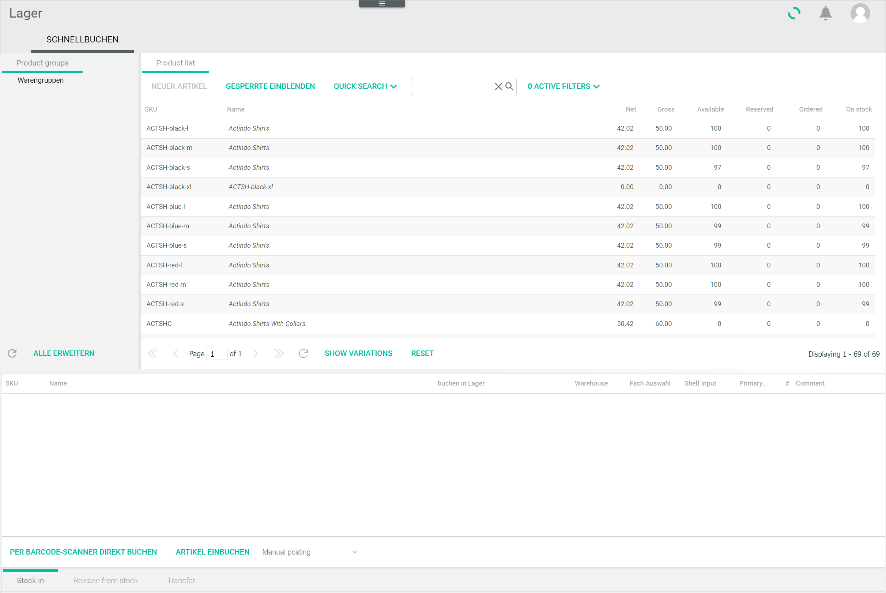
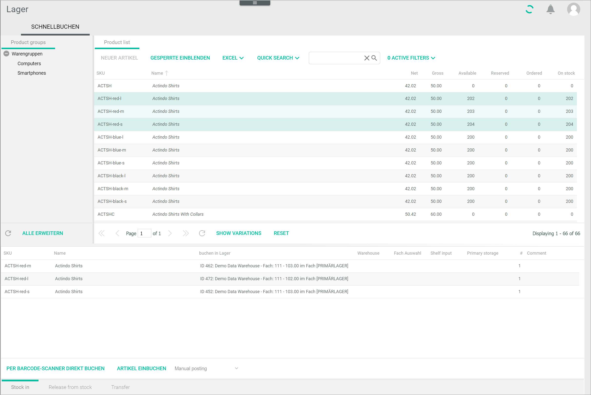

[!!User interface Posting history](../UserInterface/02a_PostingHistory.md)
[!!User interface Quick posting](../UserInterface/01a_QuickPosting.md)

# Manage the stock

The main purpose of the *Warehousing* module is to manage the stock, that is, to post stock in, release stock from the warehouse, and transfer stock between storage locations. 

Stock postings are usually performed automatically by the system after the applicable business document is created and processed. This is in turn determined by the workflow you have previously configured. For detailed information on the different stock postings and how they are automatically posted, see [Check the posting history](../Operation/03_CheckPostingHistory.md). 

You can also perform stock postings manually if necessary, see [Create a manual stock posting](#create-a-manual-stock-posting). However, before you can post stock for a material, you have to activate the warehouse logistics for the corresponding product, see [Activate the warehouse logistics for a product](./02_ManageWarehouse.md#activate-the-warehouse-logistics-for-a-product).

   
## Create a manual stock posting

Stock postings are usually performed automatically by the system, triggered by the creation and processing of business documents as configured in your workflow. However, you can also create manual sock postings if necessary. 

[comment]: <> (Link zu Basic OM process hinzufügen, wenn online)

You can create a manual posting for a single material or for multiple materials at once.

### Manual stock posting of a single material  

You can create a manual posting of a selected single material.

#### Prerequisites

The warehouse logistics has been activated for the selected material, see [Activate the warehouse logistics for a product](../02_ManageWarehouse.md#activate-warehouse-logistics-for-a-product).

#### Procedure

*Warehousing > Quick posting > Tab QUICK POSTING*

1. Double-click the material for which you want to post stock.   
    The *Basic data* sub-tab is displayed.

     

2. Click the *Warehouse/suppliers* tab.  
    The *Warehouse management* sub-tab is displayed by default.

    
    
3. Click the [ADD POSTING] button in the bottom left corner of the *Warehouse management* sub-tab. You may need to scroll down to be able to see the button.  
    The *Add posting* window is displayed.

     

4. Click the *Stock location* drop-down list and select the storage shelf where you want to post the stock. All available storage shelves for this material are displayed in the list.

5. Click the *Posting type* drop-down list and select the desired posting type. Depending on the option you select, the fields displayed below may slightly vary. The following options are available:

    - **Reservation**   
        Select this option if you want to reserve a material for an open order. This posting type does not reduce the actual, physical stock in the warehouse, but does affect the available stock calculation. A reservation can therefore result in a negative stock level.

    - **Sale**  
        Select this option if the ordered material has left the warehouse. This posting type reduces the actual, physical stock in the warehouse.  
        The *Customer name* and *Sale price net* fields are additionally displayed.

    - **Order**   
        Select this option if you have ordered additional materials from a supplier for restocking purposes. This posting type does not increase the actual, physical stock in the warehouse but does affect the available stock calculation.

    - **Purchase**  
        Select this option if you want to add purchased and received materials in the warehouse. This posting type increases the actual, physical stock in the warehouse.    
        The *Supplier* and *Purchase price net* fields are additionally displayed.

    - **Stock adjustment posting**  
        Select this option if you want to adjust the stock in the warehouse after stocktaking. This posting type affects the actual stock in the respective storage shelf.  
        
    - **Stock transfer**  
        Select this option if you want to post a redistribution of a material from a source storage shelf to a destination storage shelf. This posting type affects the actual stock in both storage shelves.    
        The *New stock location* drop-down list is additionally displayed. 

    - **Return**  
        Select this option if you want to post a returned material. If a material is available in more than one storage shelf, the returned material will be always posted to the primary storage shelf. This posting type affects the actual stock in the respective storage shelf. 

    - **Problem**  
        Select this option if you want to post a material that cannot be sold for any reason, for instance due to a defect. This posting type affects the actual stock in the respective storage shelf. 

    - **Pre-reservation**  
        Select this option if you want to post a reservation for an order that has not been received in the system yet, that is, there is no business document assigned to it yet. This can be the case, for example, when a customer places a product in the shopping cart. This posting type does not affect the actual nor the available stock in the warehouse. 

        > [Info] To be able to use pre-reservation posting in the system, your shop must support this function.  

6.  If you have selected the *Stock transfer* posting type, click the *New stock location* drop-down list and select the destination storage shelf. Otherwise, proceed to next step.

7. Check the material amount in the *Change* field and enter a different material amount if necessary.  
    The *Old stock*, *Old total stock*, *New stock* and *New total stock* fields are updated accordingly. All these fields are read-only and are updated automatically. 

    > [Info] Depending of the posting type, the sign changes. A positive value indicates that materials are added to stock. A negative value means that materials are removed from stock. The amount posted is in turn added to or removed from the old and new stock values.  

9. Click the *Posting date* field and enter the desired date with your keyboard. Alternatively, click the  (Calendar) button to select a date.

10. If desired, add a comment to the posting in the *Comment* field.

11. If you have selected the *Sale* or *Purchase* posting types, you can enter a customer or supplier name, as well as the net sale or purchase price in the corresponding fields.

12. Click the [SAVE & NEW] button.  
    The posting has been saved. The stock in the *Storage locations* and *Stocks* section is updated accordingly.  

    > [Info] You can also see all postings performed for the selected material in the *Stock history* tab, see [Check stock history](03_CheckStockHistory.md).

### Manual stock posting of multiple materials

You can create a manual posting of multiple materials at once. 

The posting types you can create for multiple materials at once are limited. You can only create manual postings, stocktaking entries, both positive and negative, sales and transfer postings. 
    
#### Prerequisites

The warehouse logistics has been activated for the selected materials, see [Activate the warehouse logistics for a material](../Operation/01_ManageWarehouse.md#activate-warehouse-logistics-for-a-material).

#### Procedure

*Warehousing > Quick posting > Tab QUICK POSTING*

1. Select the applicable tab at the bottom of the workspace. The following tabs are available:
    - *Stock in*  
        Select this tab if you want to add stock for multiple materials. 
    - *Release from stock*  
        Select this tab if you want to remove stock for multiple materials.
    - *Transfer*  
        Select this tab if you want to transfer stock for multiple materials from a storage location to another.

2. Click the materials for which you want to post stock while pressing and holding the CTRL key.  
    The selected materials are highlighted.

3. Drag an drop the selected materials to the blank section at the bottom of the workspace.  
    All selected materials are displayed in the bottom section.

    

[comment]: <> (Ab hier, abhängig vom Tab unten unterscheiden sich die Prozeduren minimal. 3 "Unterprozedure" - Stock in, Release from stock und Transfer- nötig oder ist es so verständlich?)

4. Double-click the corresponding field in the *Post in warehouse* column.  
    A drop-down list with all storage locations, that is, warehouse and storage shelf where the material is stored, are displayed. If necessary, you can also create a new storage shelf.

    > [Info] Every time you edit a field, a small red triangle is displayed in the left upper corner to indicate that there are unsaved changes.

5. Select the storage location where you want to post the material. Alternatively, create a new storage shelf following the procedure below:  
    - Select the **New storage shelf** option in the drop-down list.   
    - Double-click the field in the *Warehouse* column and select the warehouse where you want to create the storage shelf.  
    - Double-click the field in the *Shelf input* column and enter a number for the new storage shelf.
    - If desired, click the *Primary storage shelf* column and select **Yes** if you want to set the new storage shelf as primary. Otherwise, select **No**.

6. Enter the amount of materials you want to post in the *#* column.  

7. Add a comment in the *Comment* column if desired.

8. Click the *Manual posting* drop-down list and select the desired posting type. The options displayed in the list vary depending on the tab selected.  
   
9. Click the [STOCK IN MATERIAL] button to post all selected materials.  
    The *Please wait...* notice and a confirmation window are displayed. Click [OK] to confirm the process. The materials are posted to the selected storage shelves. The stock values are updated accordingly.

    > [Info] The procedure to release from stock and transfer stock is similar. Just select the corresponding tab and follow the steps described above.

 

