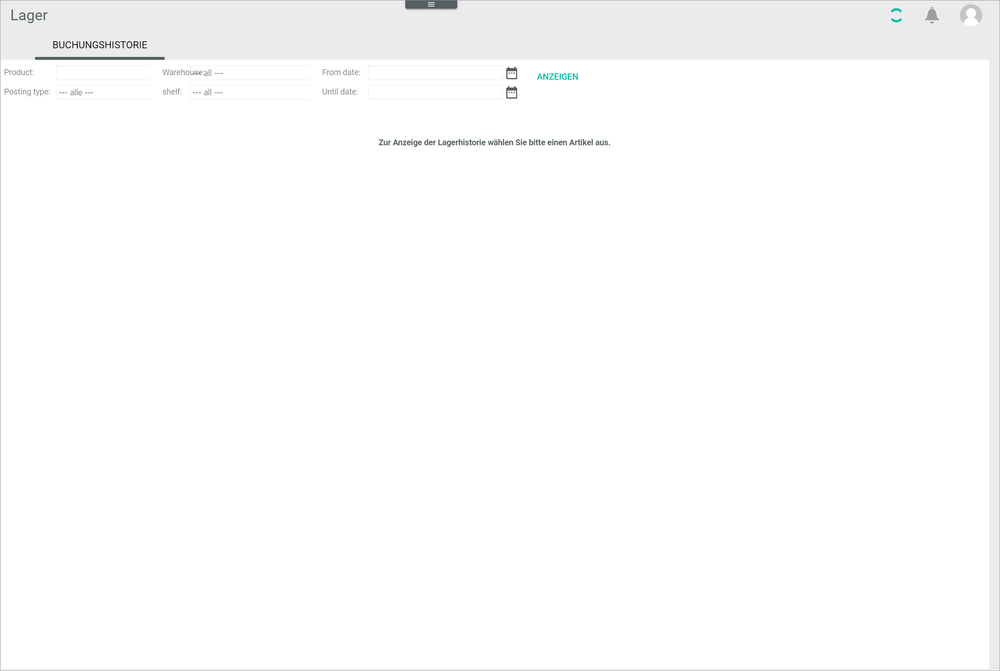
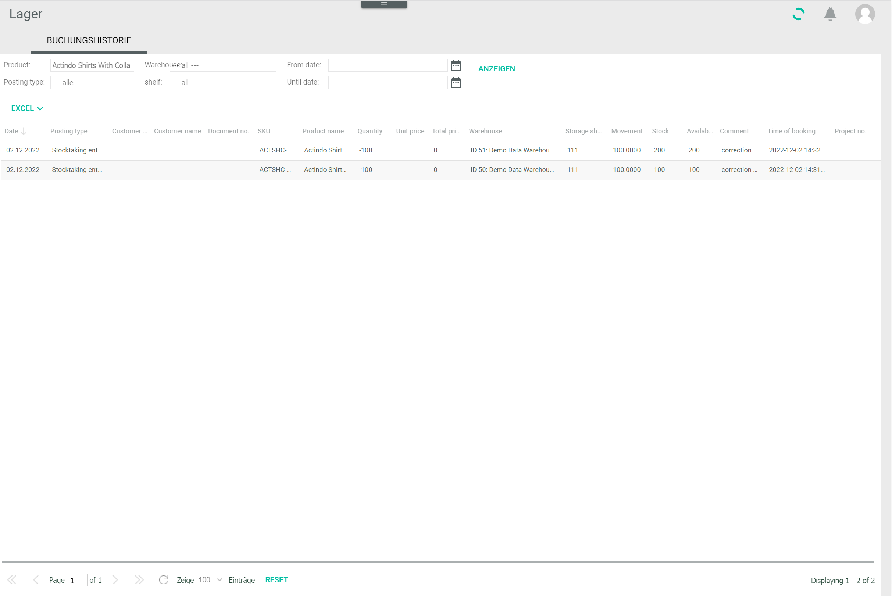
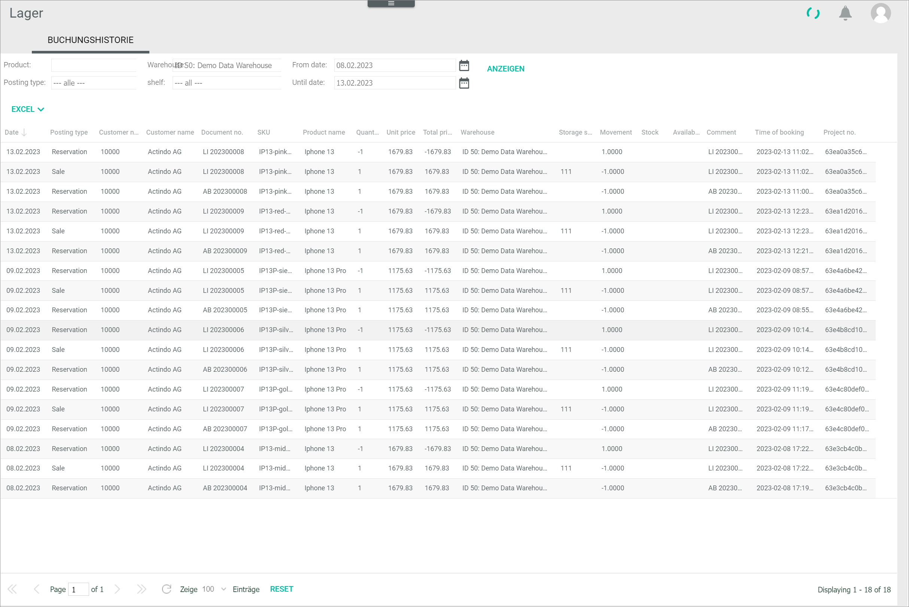

[!!Manage the stock](./02_ManageStock.md)
[!!User interface Quick posting](../UserInterface/01a_QuickPosting.md)

# Check the posting history

You can check all stock postings that have been performed in the *Warehousing* module. Stock postings can be done automatically or manually. If the business document number and customer/supplier details are provided in the corresponding columns, the stock posting is automatic. If this information is not displayed, the stock posting is a manual one. 

For detailed information about how to create a manual posting, see [Create a manual stock posting](./02_ManageStock.md#create-a-manual-stock-posting).

For a detailed description of all posting types and the automatic posting process, see [Posting types](../UserInterface/04_PostingTypes.md).

[comment]: <> (Evtl. Verweis auf Basic OM process in Core1, wenn veröffentlicht)

The *Posting history* tab allows you to check all stock postings created for a specific material and to filter all stock postings according to different criteria.

## Check the posting history for a material

You can check all stock postings created for a specific material. The list displayed is similar to the one displayed in the *Stock history* sub-tab in the *Warehouse/suppliers* tab for a selected material, although additional information is provided here, such as the order number in shop.

Besides, you can further filter the list of postings for a selected material by different criteria to narrow down your results, see [Filter the posting history by different criteria](#filter-the-posting-history-by-different-criteria).

#### Prerequisites

At least a stock posting has been created, see [Create a manual posting](./02_ManageStock.md#create-a-manual-stock-posting).  

#### Procedure

*Warehousing > Posting history > Tab POSTING HISTORY*

1. Enter the product name or SKU to filter the posting history by product. You can find out the product name or SKU in the *Basic data* sub-tab of the respective product in the *Quick posting* tab, see [Basic data](../UserInterface/01a_QuickPosting.md#basic-data).  
    
    > [Info] As soon as you have typed three characters, a context menu with matching suggestions is displayed.

2. Click the [DISPLAY] button to see the posting history for the selected product.  

    

    > [Info] If a posting is red-colored and crossed out, it indicates that the business document has been cancelled.

3. Check the different posting types created in the *Posting type* column. For detailed information on the different posting types, see [Posting types](../UserInterface/04_PostingTypes.md).

4. Check the quantity of stock posted for the selected material in the *Quantity* column. 

    > [Info] Notice that the number signs in this column are reversed with regards to the *Movement* column. 
    
5. Check the physical and the available stock in the *Stock level* and *Available* columns.   

6. Additionally, you can check the order number in shop in the *Project no.* column in case of automatically created stock postings.

## Filter the posting history by different criteria

You can filter all stock postings created using different criteria. You can also combine several criteria to narrow your search results.

#### Prerequisites

At least a stock posting has been created, see [Create a manual posting](./02_ManageStock.md#create-a-manual-stock-posting).  

#### Procedure

*Warehousing > Posting history > Tab POSTING HISTORY*

1. Click the *Posting type* drop-down list and select the desired posting type. The following options are available:  

    - **Manual posting**
    - **Reservation**   
    - **Waiting for picking**
    - **Sale**  
    - **Order**   
    - **Purchase**  
    - **Back to supplier**
    - **Stock adjustment posting**  
    - **Stock transfer**  
    - **Return**  
    - **Drop shipment** 
    - **Problem**  
    - **Pre-reservation**  

    For detailed information on the different posting types, see [Posting types](../UserInterface/04_PostingTypes.md). 
    
[comment]: <> (Vgl. Manual posting in 01_ManageWarehouse.md. Evtl. Posting type allg. beschrieben, z.B. in UI, und Verweis? So wie es jetzt ist, passt in beiden Kontexten nicht.)

2. Click the *Warehouse* drop-down list and select the desired warehouse. All warehouses available are displayed in the list.

3. Click the *Storage shelf* drop-down list and select the desired storage shelf. All available storage shelves are displayed in the list.

4. Click the *From date* and/or the *Until date* fields to enter the desired date range. Alternatively, click the  (Calendar) button to select a date.  

5. Click the [DISPLAY] button to see the posting history according to the set filters.  
    In the example below, the *Warehouse*, *From date* and *Until date* have been combined.

   

    > [Info] If a posting is red-colored and crossed out, it indicates that the business document has been cancelled.
