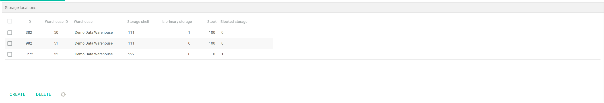
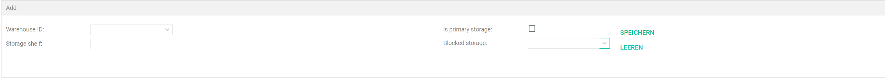
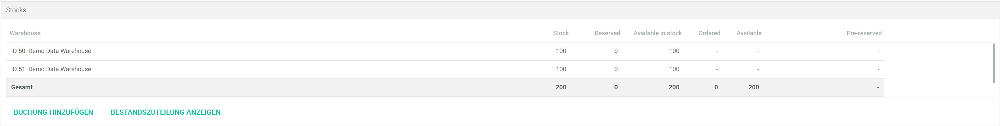

[!!Manage the stock](../Operation/01_ManageStock.md)

# Quick posting

*Warehousing > Quick posting > Tab QUICK POSTING*

In the *QUICK POSTING* tab, the list of all available products and product groups, if any, is displayed.  

[comment]: <> (Add, wenn Core1 online: For further details on general UI functions, see...)

**Product groups**  
    
The list displays the group of products created in the old *Product management* module. All available product groups are displayed.
    
> The *Product management* module is no longer supported but still runs in the background, providing the *Warehousing* module with the product list, among other functions.

-  (Collapse)   
    Click this button to collapse a the list of product groups, or a section of it.

-  (Expand)  
    Click this button to expand the list of product groups, or a section of it.

-  (Refresh)  
    Click this button to update the list of product groups.

- [EXPAND ALL]   
    Click this button to expand all sections of the list of product groups.

- [CLOSE ALL]  
    Click this button to expand all sections of the list of product groups.

[comment]: <> (Diese Element ggf. in Core1 Doku integrieren, darauf hinweisen und hier weglöschen)

**Product list**  

The list displays all products created in the old *Product management* module. All available products are displayed.
    
> Major functions, such as create a product, are no longer available and therefore they are locked (grayed out). Only the relevant functions for this version of the *Warehousing* module are described in the following.

- *SKU*  
    Product SKU.

- *Name*  
    Product name.

- *Net*  
    Product net price.

- *Gross*  
    Product gross price.

- *Available*  
    Available units of the product, that is, the units on stock minus the reserved units.

- *Reserved*  
    Reserved units of the product, that is, units included in customers' open orders. 

- *Ordered*  
    Ordered units of product, that is, units ordered by the supplier for restocking.

- *On stock*  
    Actual number of units of the product stored.  

**Multiple posting area**

This area displays a list of the products selected and moved per drag and drop when posting stock for multiple materials at a time. 

Depending on the tab selected below, the columns and the buttons displayed vary slightly.

- *Stock in*  
    Select this tab to add stock to the warehouse.

- *Release from stock*  
    Select this tab to release stock from the warehouse.

- Transfer  
    Select this tab to transfer stock from a storage shelf to another storage shelf.

- *SKU*  
    Product SKU.

- *Name*  
    Product name.

- *Post in warehouse*  
    Double-click the field to display the drop-down list and select the storage shelf where you want to post the material. Alternatively, you can create a storage shelf by selecting the **New storage shelf** option. This column is displayed when you select the *Stock in* and *Transfer* tabs.

- *Post from warehouse*  
    Double-click the field to display the drop-down list and select the storage shelf where you want to take the material from. This column is displayed when you select the *Release from stock* and *Transfer* tabs.

- *Warehouse*  
    Double-click the field to display the drop-down list and select the warehouse where you want to create the storage shelf. This field is only unlocked when the **New storage shelf** option has been selected.

- *Storage shelf input*  
    Double-click the field and enter the storage shelf number when creating a new storage shelf. This field is only unlocked when the **New storage shelf** option has been selected.

- Primary storage*  
    Double-click the field to display the drop-down list and select **Yes** if you want to set the new storage shelf as primary. This field is only unlocked when the **New storage shelf** option has been selected.

- *#*  
    Double-click the field to unlock it and enter the quantity of units you want to post.

- *Comment*  
    Double-click the field to unlock it and enter any comments you desire.

- [STOCK IN]  
    Click this button to stock in the selected materials.

- [RELEASE FROM STOCK]  
    Click this button to release from stock the selected materials. 

- [REDISTRIBUTE]  
    Click this button to transfer the selected material stock from one storage shelf to another. 

- *Manual posting*  
    Click the drop-down list to select the appropriate manual posting type. The posting types displayed vary according to the tab selected.  
    For detailed information on the manual posting types, see [Create a manual posting](../Operation/01_ManageStock.md#create-a-manual-stock-posting).

## Product list context menu

*Warehousing > Quick posting > Tab QUICK POSTING > Right-click a product*

- [Open]  
    Click this menu entry to display the product details. Alternatively, double-click a product in the list to open it. The *Basic data* sub-tab is displayed by default, see [Basic data](#basic-data).

- [Display stock allocation]  
    Click this menu entry to display the stock allocation for the selected product. The *Display stock allocation* window is displayed, see [Display stock allocation](#display-stock-allocation).

## Basic data

*Warehousing > Quick posting > Tab QUICK POSTING > Double-click a product*
*Warehousing > Quick posting > Tab QUICK POSTING > Right-click a product > Menu entry Open*

The *Basic data* sub-tab contains the main product details, such as product SKU and name. These details are imported from the old *Product management* module, are locked (grayed out) and cannot be modified here. 

> [Info] The *Warehousing* module is undergoing a major redesigning process and, therefore, only the most important features are described in this documentation.

- *Warehouse logistics active for this product*  
    Click the drop-down list and select **Yes** if you want to activate the warehouse logistics for this product. Otherwise, you cannot post stock for this product. Once the warehouse logistics is active for a product, the *Warehouse/suppliers* sub-tab is displayed.   
    
    When clicking the *Warehouse/supplier* sub-tab, the *Warehouse management* sub-tab is displayed by default. The *Warehouse management* sub-tab contains three sub-tabs. In this documentation, only the *Warehouse management* and *Stock history* sub-tabs are described. For detailed information, see [Warehouse management](#warehouse-management) and [Stock history](#stock-history).  

    

## Warehouse management

*Warehousing > Quick posting > Tab QUICK POSTING > Double-click a product > Sub-tab Warehouse management*  
*Warehousing > Quick posting > Tab QUICK POSTING > Right-click a product > Menu entry Open > Sub-tab Warehouse management*

**Storage locations**

- *ID*  
    Storage shelf identification number. This value is assigned automatically by the system.

- *Warehouse ID*  
    Warehouse identification. You can choose this number when creating the warehouse. 

- *Warehouse*  
    Warehouse name. You can choose the name when creating the warehouse.

- *Storage shelf*  
    Storage shelf number. You can choose this number when creating the storage shelf.

- *is primary storage*  
    Indication whether the storage shelf is set as primary (**1**) for the selected material or not (**0**). 

- *Stock*  
    Actual number of units stored in the storage shelf.

- *Blocked storage*  
    Indication whether the storage shelf is set as blocked storage (**1**) for the selected material or not (**0**). 

- [x]   
    Select the checkbox of a tax mapping to edit or delete it. The *Edit* section is displayed

- [CREATE]  
    Click this button to create a storage shelf. The *Add* section is displayed.

- [DELETE]  
    Click this button to delete a selected storage shelf. 

-   (Refresh)  
    Click this button to update the list.

**Add/Edit**

> [Info] When clicking the [CREATE] button, the *Add* section is displayed. When selecting a checkbox in the entry list, the *Edit* section is displayed. The fields in the *Add* and the *Edit* section are identical.

- *Warehouse ID*  
    Click the drop-down list where you want to create the storage shelf.

- *Storage shelf*  
    Enter a number for the storage shelf. 

- *is primary storage [x]*  
    Click the checkbox if you want to set the storage shelf as primary.

- *Blocked storage*  
    Click the drop-down list if you want to set the storage shelf as blocked storage and select a condition. The following options are available:  
    - **ALL CONDITIONS**  
    - **NO ORIGINAL PACKAGING**  
    - **Incomplete**
    - **Defective item**
    - **Defective item, to be repaired**
    - **Out of withdrawal period**
    - **Out of warranty**
    - **Used**
    - **Wrong serial number**

- [SAVE]  
    Click this button to save the storage shelf. The new storage shelf is displayed in the *Storage locations* section.

- [CLEAR]  

**Stocks**

- [ADD POSTING]  

- [DISPLAY STOCK ALLOCATION]  

### Add posting

*Warehousing > Quick posting > Tab QUICK POSTING > Right-click a product > Sub-tab Warehouse management > Button ADD POSTING*
*Warehousing > Quick posting > Tab QUICK POSTING > Right-click a product > Menu entry Open > Sub-tab Warehouse management > Button DISPLAY STOCK ALLOCATION*

### Display stock allocation

*Warehousing > Quick posting > Tab QUICK POSTING > Right-click a product > Sub-tab Warehouse management > Button DISPLAY STOCK ALLOCATION*
*Warehousing > Quick posting > Tab QUICK POSTING > Right-click a product > Menu entry Open > Sub-tab Warehouse management > Button DISPLAY STOCK ALLOCATION*

## Stock history

*Warehousing > Quick posting > Tab QUICK POSTING > Right-click a product > Sub-tab Stock history*
*Warehousing > Quick posting > Tab QUICK POSTING > Right-click a product > Menu entry Open > Sub-tab Stock history*

