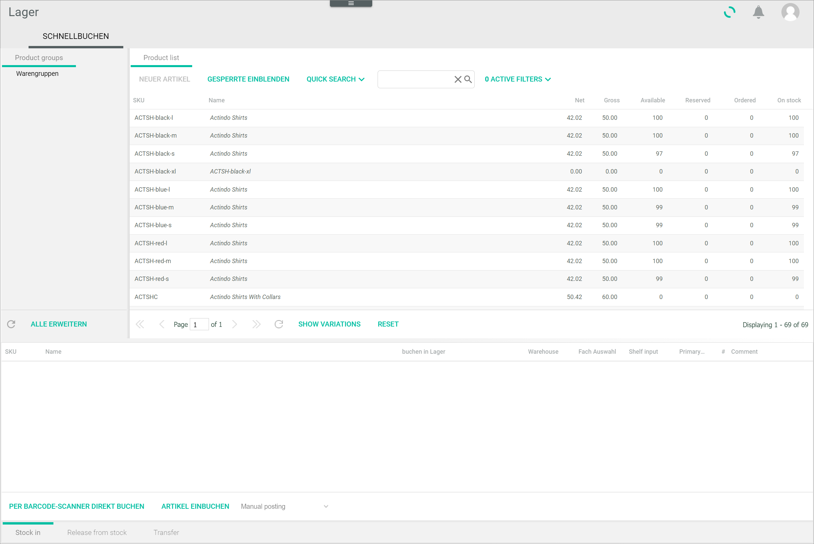
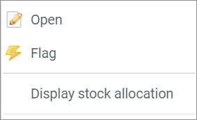
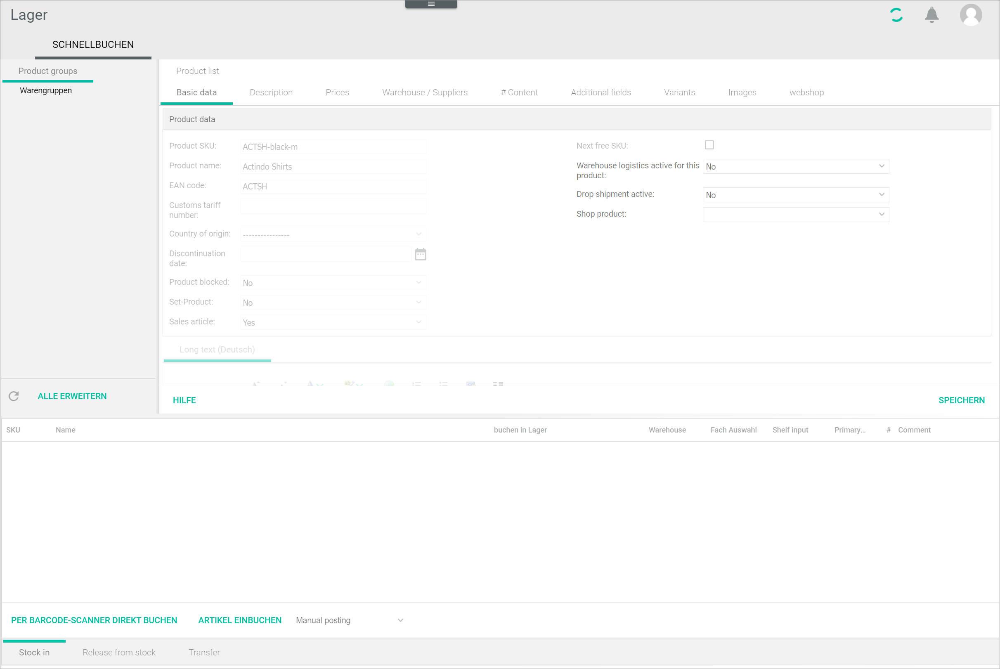
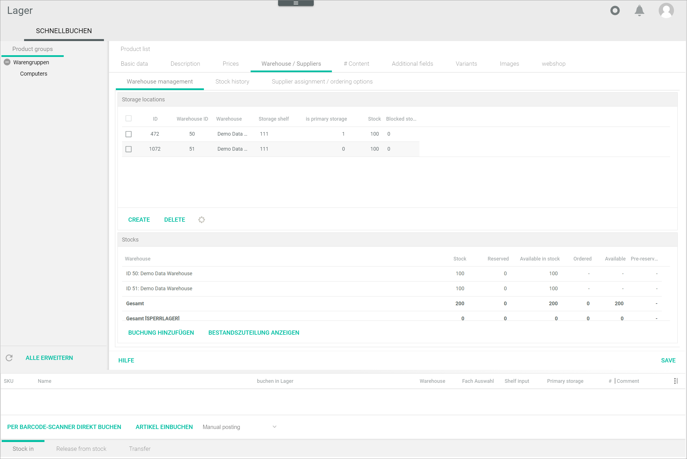
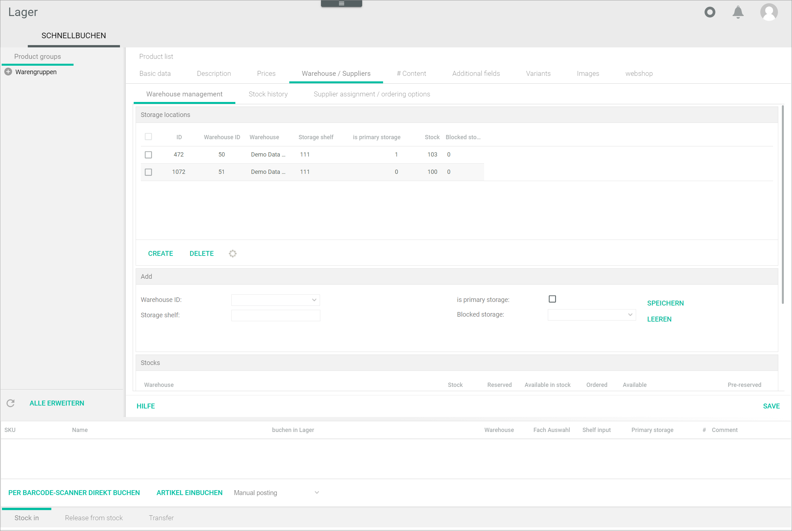
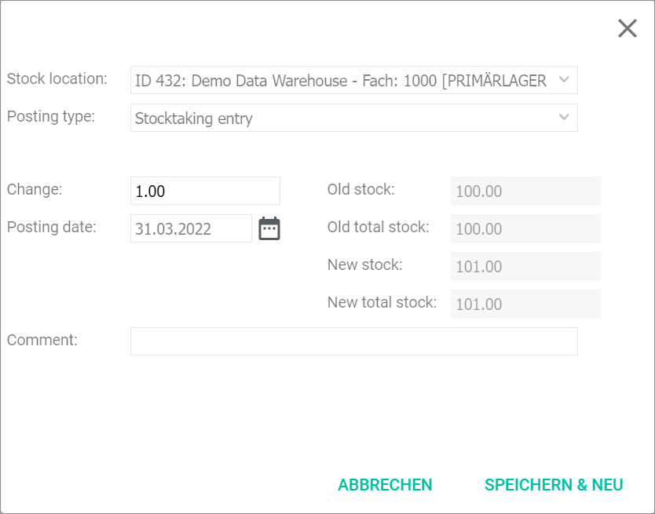
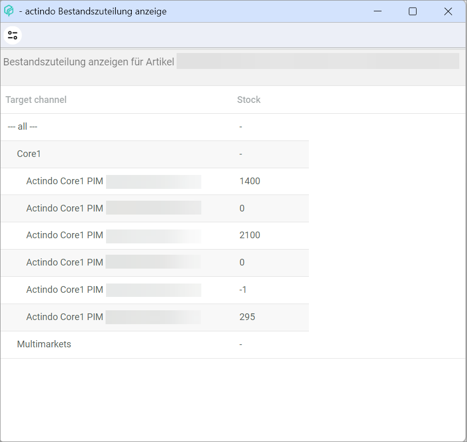
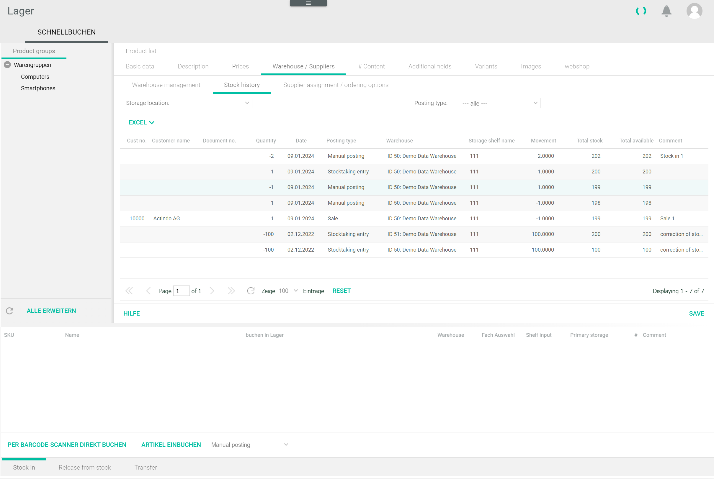

[!!Manage the stock](../Operation/02_ManageStock.md)

# Quick posting

*Warehousing > Quick posting > Tab QUICK POSTING*

The *QUICK POSTING* tab displays a list of all available products and allows to post stock in, release stock from stock and transfer stock in your storage locations.

> [Info] The *Warehousing* module is undergoing a major redesigning process and therefore only the core features are described in this documentation.

**Product list**  

The product list displays all available products. Depending on the settings, the displayed columns may vary. All fields are read-only.  
    
- *SKU*  
    Product SKU.

- *Name*  
    Product name.

- *Net*  
    Product net price.

- *Gross*  
    Product gross price.

- *Available*  
    Available units of the product, that is, the units in stock minus the reserved units.

- *Reserved*  
    Reserved units of the product, that is, units included in customers' open orders. 

- *Ordered*  
    Ordered units of product, that is, units ordered by the supplier for restocking.

- *On stock*  
    Actual number of units of the product stored.  

**Section for multiple posting**

This section displays a list of the products selected and moved per drag and drop when posting stock for multiple materials at a time. 
Depending on the tab selected below, the columns and the buttons displayed may vary.

- *Stock in*  
    Select this tab to add stock to the warehouse.

- *Release from stock*  
    Select this tab to release stock from the warehouse.

- Transfer  
    Select this tab to transfer stock from a storage shelf to another storage shelf.

The following functions and fields are available:

- *SKU*  
    Product SKU.

- *Name*  
    Product name.

- *Post in warehouse*  
    Double-click the field to display the drop-down list and select the storage shelf where you want to post the material. Alternatively, you can create a storage shelf by selecting the **New storage shelf** option. This column is displayed when you select the *Stock in* and *Transfer* tabs.

- *Post from warehouse*  
    Double-click the field to display the drop-down list and select the storage shelf where you want to take the material from. This column is displayed when you select the *Release from stock* and *Transfer* tabs.

- *Warehouse*  
    Double-click the field to display the drop-down list and select the warehouse where you want to create the storage shelf. This field is only unlocked when you select the **New storage shelf** option.

- *Storage shelf input*  
    Double-click the field and enter the storage shelf number when creating a new storage shelf. This field is only unlocked when you select the **New storage shelf** option.

- Primary storage*  
    Double-click the field to display the drop-down list and select **Yes** if you want to set the new storage shelf as primary. This field is only unlocked when you select the **New storage shelf** option.

- *#*  
    Double-click the field to unlock it and enter the quantity of units you want to post.

- *Comment*  
    Double-click the field to unlock it and enter any comments you desire.

- [STOCK IN]  
    Click this button to stock in the selected materials.

- [RELEASE FROM STOCK]  
    Click this button to release from stock the selected materials. 

- [REDISTRIBUTE]  
    Click this button to transfer the selected material stock from one storage shelf to another. 

- *Manual posting*  
    Click the drop-down list to select the appropriate manual posting type. The posting types displayed vary according to the tab selected.  
    For detailed information on the different posting types, see [Posting types](../Operation/03_CheckPostingHistory.md#posting-types).

## Product list context menu

*Warehousing > Quick posting > Tab QUICK POSTING > Right-click a product*

- [Open]  
    Click this menu entry to display the product details. Alternatively, double-click a product in the list to open it. The *Basic data* sub-tab is displayed by default, see [Basic data](#basic-data).

- [Display stock allocation]  
    Click this menu entry to display the stock allocation for the selected material. The *Display stock allocation* window is displayed, see [Display stock allocation](#display-stock-allocation).

## Basic data

*Warehousing > Quick posting > Tab QUICK POSTING > Double-click a product*  
*Warehousing > Quick posting > Tab QUICK POSTING > Right-click a product > Menu entry Open*

The *Basic data* sub-tab contains the main product details, such as product SKU and name. These details are imported from the old *Product management* module, are locked and cannot be modified here. Only the relevant functions for this version of the *Warehousing* module are described below.

- *Warehouse logistics active for this product*  
    Click the drop-down list and select **Yes** if you want to activate the warehouse logistics for this product. Otherwise, you cannot post stock for this product. Once the warehouse logistics is active for a product, the *Warehouse/suppliers* sub-tab is displayed.   
    
    > [Info] When selecting the *Warehouse/supplier* sub-tab, the *Warehouse management* sub-tab is displayed by default. The *Warehouse management* sub-tab contains three sub-tabs. In this documentation, only the *Warehouse management* and *Stock history* sub-tabs are described. For detailed information, see [Warehouse management](#warehouse-management) and [Stock history](#stock-history).  

    

## Warehouse management

*Warehousing > Quick posting > Tab QUICK POSTING > Double-click a product > Sub-tab Warehouse management > Sub-tab Warehouse management*  
*Warehousing > Quick posting > Tab QUICK POSTING > Right-click a product > Menu entry Open > Sub-tab Warehouse management > Sub-tab Warehouse management*  

The *Warehouse management* sub-tab contains the *Storage locations* and *Stocks* sections.

**Storage locations**

In this section, the list displays all storage shelves where the selected material is stored. 

The following functions and fields are available: 

- *ID*  
    Storage shelf identification number. This value is assigned automatically by the system.

- *Warehouse ID*  
    Warehouse identification. You can choose this number when creating the warehouse. 

- *Warehouse*  
    Warehouse name. You can choose the name when creating the warehouse.

- *Storage shelf*  
    Storage shelf number. You can choose this number when creating the storage shelf.

- *is primary storage*  
    Indication whether the storage shelf is set as primary (**1**) for the selected material or not (**0**). 

- *Stock*  
    Actual number of units stored in the storage shelf.

- *Blocked storage*  
    Indication whether the storage shelf is set as blocked storage (**1**) for the selected material or not (**0**). 

- [x]   
    Select the checkbox of a storage shelf to edit or delete it. The *Edit* section is displayed.

- [CREATE]  
    Click this button to create a storage shelf. The *Add* section is displayed.

- [DELETE]  
    Click this button to delete a selected storage shelf. 

-   (Refresh)  
    Click this button to update the list.

[comment]: <> (Refresh in Core1 Docu. Evtl. weglöschen.)

**Add/Edit**

In this section, you can edit the storage shelves and create new ones.

> [Info] When clicking the [CREATE] button, the *Add* section is displayed. When selecting a checkbox in the list, the *Edit* section is displayed. The fields in the *Add* and the *Edit* section are identical.

The following functions and fields are available: 

- *Warehouse ID*  
    Click the drop-down list and select the warehouse where you want to create the storage shelf.

- *Storage shelf*  
    Enter a number for the storage shelf. 

- *is primary storage [x]*  
    Click the checkbox if you want to set the storage shelf as primary.

- *Blocked storage*  
    Click the drop-down list if you want to set the storage shelf as blocked storage and select a condition. The following options are available:  
    - **ALL CONDITIONS**  
    - **NO ORIGINAL PACKAGING**  
    - **Incomplete**
    - **Defective item**
    - **Defective item, to be repaired**
    - **Out of withdrawal period**
    - **Out of warranty**
    - **Used**
    - **Wrong serial number**

- [SAVE]  
    Click this button to save the storage shelf. The new storage shelf is displayed in the *Storage locations* section.

- [CLEAR]  
    Click this button to clear all fields in the section.

**Stocks**

The list in this section displays the current stocks of the selected material. 

The following functions and fields are available: 

- *Warehouse*  
    Warehouse ID and name.

- *Stock*  
    Actual units in stock.  

- *Reserved*  
    Reserved units for open customer orders.  

- *Available in stock*  
    Actual units minus reserved units.

 - *Ordered*  
    Ordered units for restocking purposes.

- *Available*  
    Actual units in stock plus ordered units.

- *Pre-reserved*  
    Pre-reserved units for products placed in the customer shopping cart.  

- [ADD POSTING]  
    Click this button to add a single posting manually. The *Add posting* window is displayed, see [Add posting](#add-posting).

[comment]: <> (Fenster hast keinen Name. Evtl. FETA)

- [DISPLAY STOCK ALLOCATION]  
    Click this button to display the stock allocation for the selected material. The *Display allocation* window is displayed, see [Display stock allocation](#display-stock-allocation).

### Add posting

*Warehousing > Quick posting > Tab QUICK POSTING > Right-click a product > Sub-tab Warehouse management > Button ADD POSTING*  
*Warehousing > Quick posting > Tab QUICK POSTING > Right-click a product > Menu entry Open > Sub-tab Warehouse management > Button DISPLAY STOCK ALLOCATION*

The following functions and fields are available:

- *Stock location*  
    Click the drop-down list and select the storage shelf where you want to post stock. 

- *Posting type*  
    Click the drop-down list and select the desired posting type.  
    For detailed information on the different posting types, see [Posting types](../Operation/03_CheckPostingHistory.md#posting-types). 

- *New stock location*  
    Click the drop-down list and select the desired stock location. This drop-down list is only displayed if you have selected the *Stock transfer* posting type.

- *Change*  
    Number of stock units to be posted. By default, **1.00** is displayed. You can enter a different material amount if desired. Depending of the posting type, the sign changes.

- *Posting date*  
    Enter the desired date with your keyboard. Alternatively, click the  (Calendar) button to select a date.

- *Comment*  
    Enter a comment to the posting if desired.

- *Customer*   
    Enter the customer number if desired. This field is only displayed if you have selected the posting type *Sale*. Alternatively, click the  (Search) button to search for a supplier. The *Select address* window containing the customer/supplier list is displayed, see [Customer/supplier list](../../RetailSuiteAccounting/UserInterface/02a_DebtorsCreditors.md#customersupplier-list).

[comment]: <> (Es ist tatsächlich die Nummer, nicht der Name. UI Texte korrigieren)

- *Sale price net*  
    Enter the product net price if desired. This field is only displayed if you have selected the posting type *Sale*.

- *Supplier*   
    Enter the supplier number if desired. This field is only displayed if you have selected the posting type *Purchase*. Alternatively, click the  (Search) button to search for a supplier. The *Select address* window containing the customer/supplier list is displayed, see [Customer/supplier list](../../RetailSuiteAccounting/UserInterface/02a_DebtorsCreditors.md#customersupplier-list).

- *Purchase price net*  
    Enter the product net price if desired. This field is only displayed if you have selected the posting type *Purchase*.

- *Old stock*   
    Current number of stock unit in the selected storage shelf. This field is read-only.

- *Old total stock*   
    Current number of stock units in all storage shelves. This field is read-only.

- *New stock*   
    New number of stock units in the selected storage shelf after the posting has been made. This field is read-only and updates automatically.

- *New total stock*   
    New number of stock units in all storage shelves after the posting has been made. This field is read-only and updates automatically.

- [SAVE & NEW]  
    Click this button to save the posting.

- [CANCEL]  
    Click this button to cancel the posting process.

### Display stock allocation

*Warehousing > Quick posting > Tab QUICK POSTING > Right-click a product > Sub-tab Warehouse management > Button DISPLAY STOCK ALLOCATION*   
*Warehousing > Quick posting > Tab QUICK POSTING > Right-click a product > Menu entry Open > Sub-tab Warehouse management > Button DISPLAY STOCK ALLOCATION*

The list in this window displays the stock allocations for the selected material. All fields are read-only.

- *Target channel*  
    Channel where a stock allocation value is to be transferred. 

- *Stock*  
    Calculated value to be transferred to the corresponding target channel. 

## Stock history

*Warehousing > Quick posting > Tab QUICK POSTING > Right-click a product > Sub-tab Stock history*  
*Warehousing > Quick posting > Tab QUICK POSTING > Right-click a product > Menu entry Open > Sub-tab Stock history*

The list displays all stock postings for the selected material. The list displayed here is similar to the one displayed in the *Posting history* menu entry when filtering by product. For detailed information on all columns, see [Posting history](./02a_PostingHistory.md).

- *Storage location*  
    Click the drop-down list to filter the postings by storage shelf.

- *Posting type*  
    Click the drop-down list to filter the postings by posting type.  
    For detailed information on the different posting types, see [Posting types](../Operation/03_CheckPostingHistory.md#posting-types). 

- [EXCEL]  
    Click this button to export the stock history as an Excel file. 
 

