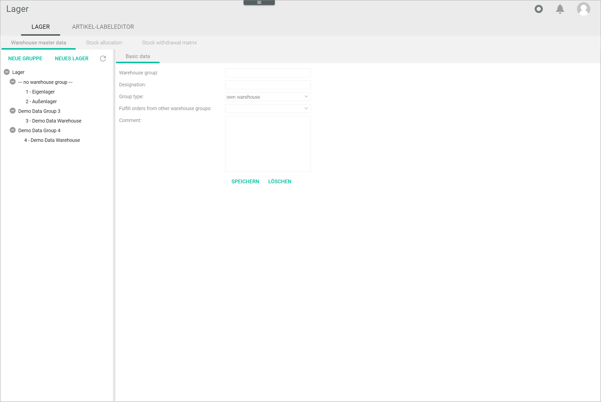

[!!Configure the warehouse groups](../Integration/01_ConfigureWarehouseGroups.md)
[!!Configure the warehouses](../Integration/02_ConfigureWarehouses.md)
[!!Configure the storage shelves](../Integration/03_ConfigureStorageShelves.md)
[!!Configure the stock allocation](../Integration/04_ConfigureStockAllocation.md)
[!!Configure the stock withdrawal matrix](../Integration/05_ConfigureStockWithdrawalMatrix.md)

# Warehouse

*Warehousing > Settings > Tab WAREHOUSE*

The *WAREHOUSE* tab contains three sub-tabs with different functions:

- *Warehouse master data*, see [Warehouse master data](#warehouse-master-data)  
    In this tab, you can see a list of all warehouses available, organized in warehouse groups. It also allows you to create, edit and delete warehouses and warehouse groups. For detailed information about configuring warehouses and warehouse groups, see [Configure the warehouses](../Integration/02_ConfigureWarehouses.md) and [Configure the warehouse groups](../Integration/01_ConfigureWarehouseGroups.md).   

- *Stock allocation*, see [Stock allocation](#stock-allocation)  
    Here you can determine which stock value is displayed as available in your individual sales channels. 

- *Stock withdrawal matrix*, see [Stock withdrawal matrix](#stock-withdrawal-matrix)  
   This function allows you to define the exact storage location where the stock is to be withdrawn.

## Warehouse master data

*Warehousing > Settings > Tab WAREHOUSE > Tab Warehouse master data* 

The list displays all available warehouses. The following buttons are also displayed:

- [NEW GROUP]  
    Click this button to create a warehouse group. The *Basic data* sub-tab is displayed, see [Warehouse group basic data](#warehouse-group-basic-data).

- [NEW WAREHOUSE]  
    Click this button to create a warehouse. The *Basic data* sub-tab is displayed, see [Warehouse basic data](#warehouse-basic-data). 

-  (Refresh)   
    Click this button to update the list of line warehouses.

-  (Collapse)   
    Click this button to collapse the list of warehouses/warehouse groups.

-  (Expand)  
    Click this button to expand the list of warehouses/warehouse groups.

[comment]: <> (Evtl. Refresh, collapse/expand löschen; Verweis auf UI Buttons in Core1)

### Warehouse group basic data

*Warehousing > Settings > Tab WAREHOUSE > Tab Warehouse master data > Button NEW GROUP* 

- *Warehouse group*  
    Enter a unique number for the warehouse group. This is the warehouse group ID. 

- *Designation*  
    Enter a name for the warehouse group.  

- *Group type*  
    Click the drop-down list to select the appropriate group type. The following options are available:  
    - **Own warehouse group**  
        Select this option if you manage this warehouse group.
    - **Externally controlled warehouse group**  
        Select this option if this warehouse group is managed by a third party. If you select this option, additional fields are displayed.

- *Fulfill orders from other warehouse groups*  
    Click the drop-down list and select a warehouse group if desired. With this setting, you can arrange the missing to be taken from the current warehouse group, if orders cannot be completely fulfilled from the warehouse group selected.

- *External warehouse type*  
    Click the drop-down list and select **Fulfillment module**.

    > [Info] Other options are no longer supported. 

- *Connection*  
    Click the drop-down list and select the appropriate connection to the externally controlled warehouse.

- *Return to this location possible*  
     Click the drop-down list and select **Yes** to allow products to be returned to this warehouse group, or **No** not to do so. 

- *Name*

- *Street*

- *Zip*  
    Enter the zip code for the warehouse group location. 

- *City*  

- *Country*  
    Click the drop-down list 

- *Comments*  
    Enter any additional you want information in this field.

- [SAVE]   
    Click this button to save the warehouse group. 
    
    > [Info] You have to click the  (Refresh) to display the new warehouse group in the list of warehouses.

- [DELETE]  
    Click this button to delete a warehouse group after you have selected it.  

    > [Info] You cannot delete a warehouse group that contains warehouses. You have to delete the contained warehouses first.

[comment]: <> (Fulfill orders from other warehouse groups -> nur eine Gruppe erlaubt? UI sieht anders aus. Tooltip auch im Plural...)

### Warehouse basic data

*Warehousing > Settings > Tab WAREHOUSE > Tab Warehouse master data > Button NEW WAREHOUSE* 

- *Warehouse*  
    Enter a unique number for the warehouse. This is the warehouse ID.

- *Warehouse group*  
    Click the drop-down list to select the warehouse group where you want to include the current warehouse.  

- *Designation*  
    Enter a name for the warehouse.

- *Products per storage shelf*  
    Click the drop-down list and select appropriate option. The following options are available:
    - **One product per storage shelf**  
        Select this option if you want to store only one product per storage shelf.  
    - **Different products per storage shelf**   
        Select this option if you want to store more than one product per storage shelf.
    
- *Comment*  
    Enter any additional you want information in this field.
    
- [SAVE]   
    Click this button to save the warehouse. 
    
    > [Info] You have to click the  (Refresh) to display the new warehouse group in the list of warehouses.

- [DELETE]  
    Click this button to delete a warehouse after selecting it.  

    > [Info] You cannot delete a warehouse if stock has already been allocated. 

[comment]: <> (Kann man in diesem Fall was machen?)

[comment]: <> (Exclude from ordering -> Wirklich weglassen oder gibt es eine Empfehlung? Heusel meinte auf Ja)

## Stock allocation  

*Warehousing > Settings > Tab WAREHOUSE > Tab Stock allocation*

The stock allocation table includes automatically all warehouses you have previously created as columns. Besides, all target channels configured in the system are listed in the *Target channel* column. Depending on your configuration, the displayed columns may vary. 

The stock allocation allows you to define the stock values to be displayed in the individual sales channels. The configured values are then transferred to the *Stock value* attribute of the corresponding product in the *PIM* module. This value is in turn transferred via *Omni-Channel* to the sales channel.

For detailed information to configure the stock allocation, see [Configure the stock allocation](../Integration/04_ConfigureStockAllocation.md).

[comment]: <> (Stimmt das?)

- *Target channel*  
    All configured target channels are displayed in this column. All fields are read-only.

- *Supplier stock*  
    Double-click the desired field in this column to display the drop-down list and select the appropriate option. This field is only active when you select a predefined calculation formula in the *Stock calculation* column. The following options are available:  

    - **No**  
        Select this option to exclude stock from all suppliers in the calculation.
    - **Yes, all**  
        Select this option to include stock from all suppliers in the calculation.
    - **Yes, only dropship suppliers**    
        Select this option to include stock only from dropship suppliers in the calculation.
    - **Yes, only normal suppliers**  
        Select this option to include stock only from normal suppliers in the calculation.

- *Stock calculation*  
    Double-click the desired field in this column to display the drop-down list and select the appropriate option. The following options are available:  

    - **Fixed value**  
        Select this option to transfer a fixed stock amount. The corresponding field in the *Fixed value* column is unlocked. 
    - **Formula**  
        Select this option to create your own formula to calculate the stock amount. The corresponding field in the *Formula* column is unlocked. 
    - **Calculation, stock level**  
        Select this option to transfer the physical stock stored in the warehouse. The fields in the warehouse columns are unlocked.
    - **Calculation, stock availability (stock level - reserved)**  
        Select this option to transfer the stock amount resulting from the physical stock stored in the warehouse minus the reservations (open customer orders). The fields in the warehouse columns are unlocked.
    - **Calculation, availability (stock level + ordered - reserve)**   
        Select this option to transfer the stock amount resulting from the physical stock stored in the warehouse, plus the stock ordered from the supplier (open supplier orders, even if the materials have not yet arrived in the warehouse), minus the reservations (open customer orders). The fields in the warehouse columns are unlocked.

- *"Warehouse name"*  
    Double-click the desired field to display the drop-down list and select **Yes** to include this warehouse in the calculation or **No** to exclude it. 

- *Fixed value*  
    Enter the fixed value you want to transfer. This field is only unlocked after selecting the **Fixed value** option in the *Stock calculation* column. 

- *Formula*  
    Enter the desired formula to calculate the stock amount. This field is only unlocked after selecting the **Formula** option in the *Stock calculation* column.  
    For detailed information to create a formula, see [Configure the stock allocation](../Integration/04_ConfigureStockAllocation.md). 

## Stock withdrawal matrix

*Warehousing > Settings > Tab WAREHOUSE > Tab Stock withdrawal matrix*

The stock withdrawal matrix allows you to determine the exact storage location where the stock must be taken when the defined conditions apply. Each column represents a variable, which can be combined with the other variables to define a set of rules. 

For detailed information to configure the stock withdrawal matrix, see [Configure the stock withdrawal matrix](../Integration/05_ConfigureStockWithdrawalMatrix.md).

- *Delivery address country*  
    Click a field to display the drop-down list and select the country where the order has to be delivered, or leave it blank if no delivery applies.

[comment]: <> (Ship-to country in Taxes)

- *Product group*  
    Click a field to display the drop-down list and select a specific product group if desired. All available product groups are displayed in the list.

[comment]: <> (Produktgruppen werden in Artikelverwaltung erstellt, aber dieses Modul funktioniert nur im Hintergrund. Kann man die anders erstellen? Oder lieber dieses Feld rauslassen?)

- *Sales channel*  
    Click a field to display the drop-down list and select the channel where the order originates. The following options are available: 

    - **All**   
        The order originates in any of the available sales channels.   
    - **None**  
        The order originates in an external sales channels with no connection to the *Core1*.
    - **Shop**  
        The order originates in an external shop. 
    - **Core1 Channels**  
        The order originates in a third-party platform connected to the *Core1* via the *Omni-Channel* module. Alternatively, POS...

[comment]: <> (Sales channel hier vs. Target channel in Stock allocation. Ist hier übrigens die beste Benennung? Alt: Marketplace. Was bedeuten die Optionen? All/None/Shop? Sinnvoll? Wie ist Shop angebunden? Unterschied zwischen Shop und None?)

- *Account*  
    Click a field to display the drop-down list and select the specific connection in the *Omni-Channel* module. All available connections are displayed in the list.

- *Sub-account*  
    Click a field to display the drop-down list and select the shop where the order has been placed, for example, the German shop or the US shop. All available shops are displayed in the list.

- *Shipping provider*  
    Click a field to display the drop-down list and select the relevant shipping provider. All available shipping settings are displayed in the list. You can configure additional shipping providers in *Order Management > Settings > Shipping provider*.

[comment]: <> (Add link when/if available) 

- *Warehouse*  
    Click a field to display the drop-down list and select the warehouse where the stock must be taken. All available warehouses are displayed.

- *Warehouse group*  
    Click a field to display the drop-down list and select the warehouse group where the selected warehouse is included. All available warehouse groups are displayed.

- [ADD]  
    Click this button to add a row to the stock withdrawal matrix.

- [DELETE]  
    Click this button to remove a selected row from the stock withdrawal matrix.  

- [SAVE ASSIGNMENTS]  
   Click this button to save any changes made. 
