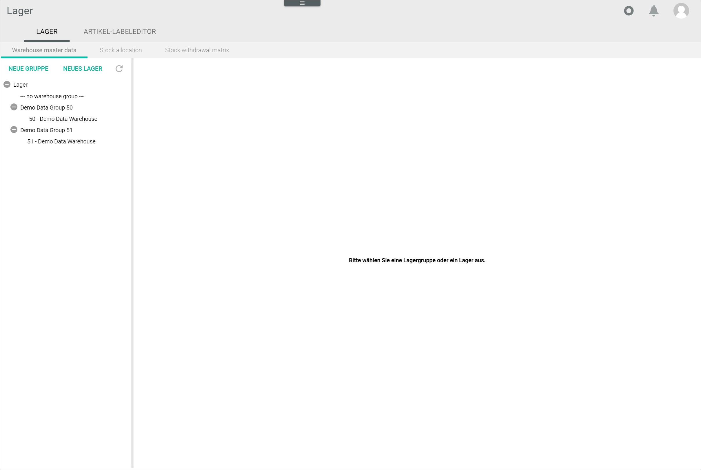
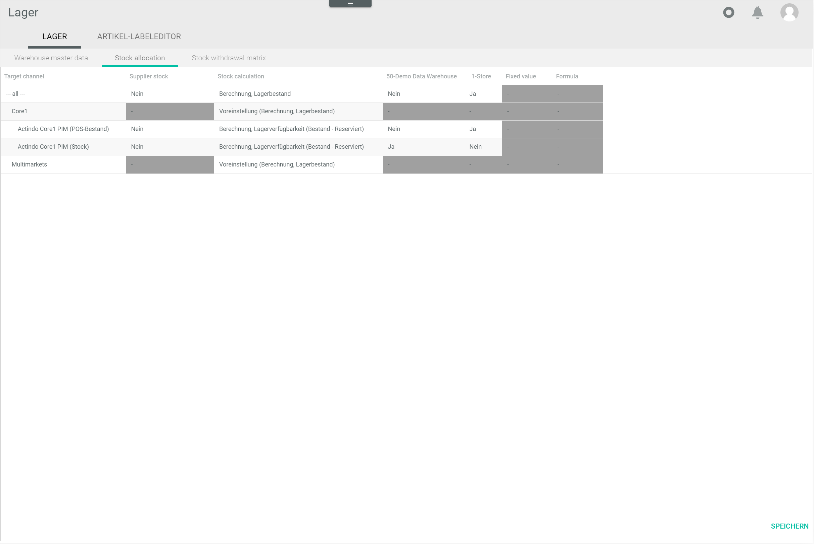

[!!Configure the warehouse groups](../Integration/01_ConfigureWarehouseGroups.md)
[!!Configure the warehouses](../Integration/02_ConfigureWarehouses.md)
[!!Configure the storage shelves](../Integration/03_ConfigureStorageShelves.md)
[!!Configure the stock allocation](../Integration/04_ConfigureStockAllocation.md)
[!!Configure the stock withdrawal matrix](../Integration/05_ConfigureStockWithdrawalMatrix.md)

# Warehouse

*Warehousing > Settings > Tab WAREHOUSE*

The *WAREHOUSE* tab allows you to configure 

displays a list of all warehouses available, organized in warehouse groups. 

It allows you to create, edit and delete warehouses and warehouse groups. For detailed information about configuring warehouses and warehouse groups, see [Configure the warehouses](../Integration/02_ConfigureWarehouses.md) and [Configure the warehouse groups](../Integration/01_ConfigureWarehouseGroups.md).

In this tab, you can also configure the stock allocation. and to define the exact storage location where the  

This tab contains in turn three tabs:  
- *Warehouse master data*, see [Warehouse master data](#warehouse-master-data)  
- *Stock allocation*, see [Stock allocation](#stock-allocation)
- *Stock withdrawal matrix*, see [Stock withdrawal matrix](#stock-withdrawal-matrix)

## Warehouse master data

*Warehousing > Settings > Tab WAREHOUSE > Tab Warehouse master data* 

The list displays all available warehouses. The following buttons are also displayed:

- [NEW GROUP]  
    Click this button to create a warehouse group. The *Basic data* sub-tab is displayed, see [Warehouse group basic data](#warehouse-group-basic-data).

- [NEW WAREHOUSE]  
    Click this button to create a warehouse. The *Basic data* sub-tab is displayed, see [Warehouse basic data](#warehouse-basic-data). 

-  (Refresh)   
    Click this button to update the list of line warehouses.

-  (Collapse)   
    Click this button to collapse the list of warehouses/warehouse groups.

-  (Expand)  
    Click this button to expand the list of warehouses/warehouse groups.

[comment]: <> (Evtl. Refresh löschen; Verweis auf UI Buttons in Core1)

### Warehouse group basic data

*Warehousing > Settings > Tab WAREHOUSE > Tab Warehouse master data > Button NEW GROUP* 

[comment]: <> (Theoretisch sollte es H2 sein Warehouse master data - Warehouse group basic data... zu entscheiden)

- *Warehouse group*  
    Enter a unique number for the warehouse group. This is the warehouse group ID. 

- *Designation*  
    Enter a name for the warehouse group.  

- *Group type*  
    Click the drop-down list to select the appropriate group type. The following options are available:  
    - **Own warehouse group**  
        Select this option if you manage this warehouse group.
    - **Externally managed warehouse group**  
        Select this option if this warehouse group is managed by a third party.

- *Fulfill orders from other warehouse groups*  
    Click the drop-down list and select a warehouse group if desired. With this setting, you can arrange the missing to be taken from the current warehouse group, if orders cannot be completely fulfilled from the warehouse group selected.

- *Comments*  
    Enter any additional you want information in this field.

- [SAVE]   
    Click this button to save the warehouse group. 
    
    > [Info] You have to click the  (Refresh) to display the new warehouse group in the list of warehouses.

- [DELETE]  
    Click this button to delete a warehouse group after you have selected it.  

    > [Info] You cannot delete a warehouse group that contains warehouses. You have to delete the contained warehouses first.

[comment]: <> (Fulfill orders from other warehouse groups -> nur eine Gruppe erlaubt? UI sieht anders aus. Tooltip auch im Plural...)

### Warehouse basic data

*Warehousing > Settings > Tab WAREHOUSE > Tab Warehouse master data > Button NEW WAREHOUSE* 

[comment]: <> (Theoretisch sollte es H2 sein Warehouse master data - Warehouse group basic data... zu entscheiden)

- *Warehouse*  
    Enter a unique number for the warehouse. This is the warehouse ID.

- *Warehouse group*  
    Click the drop-down list to select the warehouse group where you want to include the current warehouse.  

- *Designation*  
    Enter a name for the warehouse.

- *Products per storage shelf*  
    Click the drop-down list and select appropriate option. The following options are available:
    - **One product per storage shelf**  
        Select this option if you want to store only one product per storage shelf.  
    - **Different products per storage shelf**   
        Select this option if you want to store more than one product per storage shelf.
    
- *Comment*  
    Enter any additional you want information in this field.
    
- [SAVE]   
    Click this button to save the warehouse. 
    
    > [Info] You have to click the  (Refresh) to display the new warehouse group in the list of warehouses.

- [DELETE]  
    Click this button to delete a warehouse after selecting it.  

    > [Info] You cannot delete a warehouse if stock has already been allocated to it. 

[comment]: <> (Kann man in diesem Fall was machen?)

[comment]: <> (Exclude from ordering -> Wirklich weglassen oder gibt es eine Empfehlen? Heusel meinte auf Ja)

## Stock allocation

*Warehousing > Settings > Tab WAREHOUSE > Tab Stock allocation*

## Stock withdrawal matrix

*Warehousing > Settings > Tab WAREHOUSE > Tab Stock withdrawal matrix*

