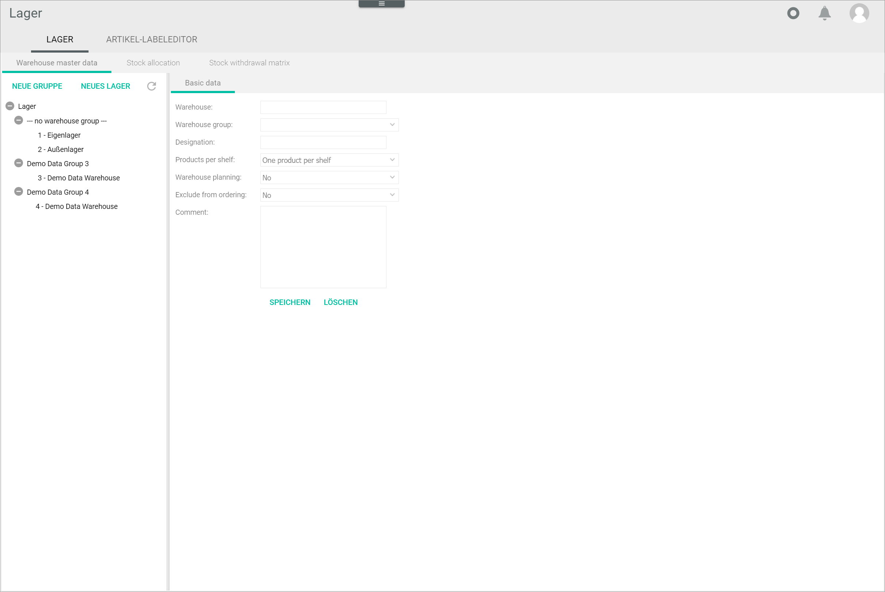

[!!Configure the warehouse groups](../Integration/01_ConfigureWarehouseGroups.md)
[!!Configure the warehouses](../Integration/02_ConfigureWarehouses.md)
[!!Configure the storage shelves](../Integration/03_ConfigureStorageShelves.md)
[!!Configure the stock allocation](../Integration/04_ConfigureStockAllocation.md)
[!!Configure the stock withdrawal matrix](../Integration/05_ConfigureStockWithdrawalMatrix.md)

# Warehouse

*Warehousing > Settings > Tab WAREHOUSE*

The *WAREHOUSE* tab contains three tabs with different functions:

- *Warehouse master data*, see [Warehouse master data](#warehouse-master-data)  
    In this tab, you can see a list of all warehouses available, organized in warehouse groups. You can also create, edit, and delete warehouses and warehouse groups. For detailed information on how to configure warehouses and warehouse groups, see [Configure the warehouses](../Integration/02_ConfigureWarehouses.md) and [Configure the warehouse groups](../Integration/01_ConfigureWarehouseGroups.md).   

- *Stock allocation*, see [Stock allocation](#stock-allocation)  
    In this tab, you can determine which stock value is displayed as available in your individual sales channels. For detailed information on how to configure the stock allocation, see [Configure the stock allocation](../Integration/04_ConfigureStockAllocation.md). 

- *Stock withdrawal matrix*, see [Stock withdrawal matrix](#stock-withdrawal-matrix)  
   In this tab, you can define the exact storage location where the stock is to be withdrawn. For detailed information on how to configure the stock allocation, see [Configure the stock withdrawal matrix](../Integration/05_ConfigureStockWithdrawalMatrix.md).

## Warehouse master data

*Warehousing > Settings > Tab WAREHOUSE > Tab Warehouse master data* 

The list displays all available warehouses and warehouse groups. 

The following functions and fields are displayed:

- [NEW GROUP]  
    Click this button to create a warehouse group. The *Basic data* sub-tab is displayed, see [Warehouse group basic data](#warehouse-group-basic-data).

- [NEW WAREHOUSE]  
    Click this button to create a warehouse. The *Basic data* sub-tab is displayed, see [Warehouse basic data](#warehouse-basic-data). 

-  (Refresh)   
    Click this button to update the list of warehouses/warehouse groups.

-  (Collapse)   
    Click this button to collapse the list of warehouses/warehouse groups.

-  (Expand)  
    Click this button to expand the list of warehouses/warehouse groups.

[comment]: <> (Evtl. Refresh, collapse/expand löschen; Verweis auf UI Buttons in Core1. Collapse/Expand nicht in Core1, da alte UI-Elemente)

### Warehouse group basic data

*Warehousing > Settings > Tab WAREHOUSE > Tab Warehouse master data > Button NEW GROUP* 

The following functions and fields are displayed:

- *Warehouse group*  
    Enter a unique number for the warehouse group. This is the warehouse group ID. 

- *Designation*  
    Enter a name for the warehouse group.  

- *Group type*  
    Click the drop-down list to select the appropriate group type. Depending on the option you select, the fields displayed vary. The following options are available:  
    - **Own warehouse group**  
        Select this option if the warehouse group is managed by your company.
    - **Externally controlled warehouse group**  
        Select this option if the warehouse group is managed by a third party. If you select this option, additional fields are displayed. 

- *Fulfill orders from other warehouse groups*  
    If desired, click the drop-down list and select a warehouse group. With this setting, you can arrange the missing stock to be taken from the current warehouse group if orders cannot be completely fulfilled from the warehouse group selected.

- *External warehouse type*  
    Click the drop-down list to select **Fulfillment module**. 

    > [Info] Other options are no longer supported. 

- *Connection*  
    Click the drop-down list and select the appropriate connection to the externally controlled warehouse. All available connections are displayed.

- *Return to this location possible*  
     Click the drop-down list and select **Yes** to allow products to be returned to this warehouse group. Otherwise, select **No**. 

- *Name*  
    Enter a name for the externally controlled warehouse if desired.

- *Street*  
    Enter the street and house number where the externally controlled warehouse is located if desired.

- *Zip*  
    Enter the zip code of the warehouse group location. This field is mandatory to determine the VAT to be applied.

- *City*  
    Enter the city where the external warehouse group is located if desired.

- *Country*  
    Click the drop-down list and select the country where the warehouse group is located. This field is mandatory to determine the VAT to be applied.

- *Comments*  
    Enter any further relevant information in this field.

- [SAVE]   
    Click this button to save the warehouse group. 
    
-  (Refresh)  
    Click this button to display the new warehouse group in the list of warehouses.

[comment]: <> (Evtl. Refresh löschen)

- [DELETE]  
    Click this button to delete a warehouse group after you have selected it. A warehouse group cannot be deleted if it contains warehouses and after stock has been posted. 

### Warehouse basic data

*Warehousing > Settings > Tab WAREHOUSE > Tab Warehouse master data > Button NEW WAREHOUSE* 

The following functions and fields are displayed:

- *Warehouse*  
    Enter a unique number for the warehouse. This is the warehouse ID.

- *Warehouse group*  
    Click the drop-down list to select the warehouse group where you want to include the current warehouse.  

- *Designation*  
    Enter a name for the warehouse.

- *Products per storage shelf*  
    Click the drop-down list to select **Different products per storage shelf**   
    
    > [Info] The **One product per storage shelf** option is no longer supported.  
    
- *Exclude from ordering*  
    Click the drop-down list and select **No** to deactivate the purchasing process.

- *Comment*  
    Enter any additional you want information in this field.
    
- [SAVE]   
    Click this button to save the warehouse. 
    
-  (Refresh)  
    Click this button to display the new warehouse in the list of warehouses.

[comment]: <> (Evtl. Refresh löschen)

- [DELETE]  
    Click this button to delete a warehouse after selecting it. Warehouses cannot be deleted after stock has been posted. 

## Stock allocation  

*Warehousing > Settings > Tab WAREHOUSE > Tab Stock allocation*

The stock allocation table includes automatically all warehouses you have previously created as columns. Besides, all target channels configured in the system are listed in the *Target channel* column. Depending on the settings, the displayed columns may vary. 

For detailed information on how to configure the stock allocation, see [Configure the stock allocation](../Integration/04_ConfigureStockAllocation.md).

The following functions and fields are displayed:

- *Target channel*  
    All configured target channels are displayed in this column. All fields are read-only.

- *Supplier stock*  
    Double-click the desired field in this column to display the drop-down list and select the appropriate option. This field is only active when you select a predefined calculation formula in the *Stock calculation* column. The following options are available:  

    - **No**  
        Select this option to exclude stock from all suppliers in the calculation.
    - **Yes, all**  
        Select this option to include stock from all suppliers in the calculation.
    - **Yes, only dropship suppliers**    
        Select this option to include stock only from dropship suppliers in the calculation.
    - **Yes, only normal suppliers**  
        Select this option to include stock only from normal suppliers in the calculation.

- *Stock calculation*  
    Double-click the desired field in this column to display the drop-down list and select the appropriate option. The following options are available:  

    - **Fixed value**  
        Select this option to transfer a fixed stock amount to the target channel. The corresponding field in the *Fixed value* column is unlocked. 
    - **Formula**  
        Select this option to create your own formula to calculate the stock amount. The corresponding field in the *Formula* column is unlocked. 
    - **Calculation, stock level**  
        Select this option to transfer the physical stock stored in the warehouse. The fields in the warehouse columns are unlocked.
    - **Calculation, stock availability (stock level - reserved)**  
        Select this option to transfer the stock amount resulting from the physical stock stored in the warehouse minus the reservations (open customer orders). The fields in the warehouse columns are unlocked.
    - **Calculation, availability (stock level + ordered - reserve)**   
        Select this option to transfer the stock amount resulting from the physical stock stored in the warehouse, plus the stock ordered from the supplier (open supplier orders, even if the materials have not yet arrived in the warehouse), minus the reservations (open customer orders). The fields in the warehouse columns are unlocked.

- *"Warehouse name"*  
    Double-click the desired field to display the drop-down list and select **Yes** to include this warehouse in the calculation or **No** to exclude it. 

- *Fixed value*  
    Enter the fixed value you want to transfer. This field is only unlocked after selecting the **Fixed value** option in the *Stock calculation* column. 

- *Formula*  
    Enter the desired formula to calculate the stock amount. This field is only unlocked after selecting the **Formula** option in the *Stock calculation* column.  
    For detailed information to create a formula, see [Configure the stock allocation](../Integration/04_ConfigureStockAllocation.md). 

- [SAVE]   
    Click this button to save the changes made. 

## Stock withdrawal matrix

*Warehousing > Settings > Tab WAREHOUSE > Tab Stock withdrawal matrix*

The stock withdrawal matrix allows you to determine the exact storage location where the stock must be taken when the defined conditions apply. Each column represents a variable, which can be combined with the other variables to define a set of rules. 

For detailed information on how to configure the stock withdrawal matrix, see [Configure the stock withdrawal matrix](../Integration/05_ConfigureStockWithdrawalMatrix.md).

The following functions and fields are displayed:

- *Delivery address country*  
    Click a field to display the drop-down list and select the country where the order has to be delivered, or leave it blank if no delivery applies.

- *Product group*  
    This function is no longer supported and can be ignored. 

[comment]: <> (Evtl. löschen)

- *Sales channel*  
    Click a field to display the drop-down list and select the channel where the order originates. The following options are available: 

    - **All**  
        Select this option for all sales channels.
    - **None**  
        Select this option for orders that are manually created via the *Order Management* module.
    - **Core 1 Channels**  
        Select this option for all sales channels connected via the *Omni-Channel* module. 
    - **Shop**   
        Select this option for orders imported via the *Multimarkets* module. This module is currently being replaced by *Omni-Channel*.  

- *Account*  
    Click a field to display the drop-down list and select the specific connection in the *Omni-Channel* module. All available connections are displayed in the list.

- *Sub-account*  
    Click a field to display the drop-down list and select the shop where the order has been placed, for example, the German shop or the US shop. All available shops are displayed in the list.

- *Shipping provider*  
    Click a field to display the drop-down list and select the relevant shipping service provided. All available shipping settings are displayed in the list. 

- *Warehouse*  
    Click a field to display the drop-down list and select the warehouse where the stock must be taken from. All available warehouses are displayed.

- *Warehouse group*  
    Click a field to display the drop-down list and select the warehouse group where the selected warehouse is included. All available warehouse groups are displayed.

- [ADD]  
    Click this button to add a row to the stock withdrawal matrix.

- [DELETE]  
    Click this button to remove a selected row from the stock withdrawal matrix.  

- [SAVE ASSIGNMENTS]  
   Click this button to save any changes made. 
