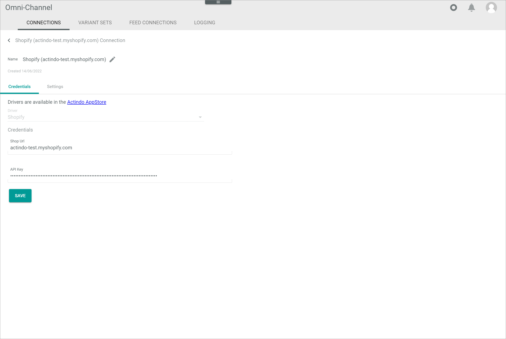

[!!Manage the Shopify connection](../Integration/01_ManageShopifyconnection.md)

# Connections

*Omni-Channel > Settings > Tab CONNECTIONS*

**Connections**

-  (Refresh)   
    Click this button to update the list of connections.

- *VIEW*   
    Click the drop-down list to select the view. All created views are displayed in the drop-down list. Click the  (Points) button to the right of the *VIEW* drop-down list to display the context menu and create a view.   

    -  (Points)      
        Click this button to the right of the *VIEW* drop-down list to display the context menu. The following menu entries are available:

        -  create  
            Click this entry to create a view. The *Create view* window is displayed, see [Create view](#create-view).

        -  rename  
            Click this entry to rename the selected view. The *Rename view* window is displayed, see [Rename view](#rename-view). This menu entry is only displayed if a view has been selected.

        -  reset  
            Click this entry to reset all unsaved changes to the settings of the selected view. This menu entry is only displayed if a view has been selected and any changes have been made to the view settings.

        -  publish  
            Click this entry to publish the view. This menu entry is only displayed if a view has been selected and unpublished.

        -  unpublish  
            Click this entry to unpublish the view. This menu entry is only displayed if a view has been selected and published.

        -  save  
            Click this entry to save the current view settings in the selected view. This menu entry is only displayed if a view has been selected.

            > [Info] When the settings of a view have been changed, an asterisk is displayed next to the view name. The asterisk is hidden as soon as the changes have been saved.

        -  delete  
            Click this entry to delete the selected view. A confirmation window to confirm the deletion is displayed. This menu entry is only displayed if a view has been selected.

-  Columns (x)   
    Click this button to display the columns bar and customize the displayed columns and the order of columns in the list. The *x* indicates the number of columns that are currently displayed in the list.

- [x]     
    Select the checkbox to display the editing toolbar. If you click the checkbox in the header, all connections in the list are selected.

- [DELETE]  
    Click this button to delete the selected connection. This button is only displayed if a single checkbox in the list of connections is selected.
    
    > [Info] Deleting a connection is a very complex process and can therefore take a long time. 

- [SYNCHRONIZE]  
    Click this button to synchronize the selected connection. This button is only displayed if a single checkbox in the list of connections is selected. The *Sync triggered* pop-up window is displayed.

    

- [DISABLE]  
    Click this button to disable the selected connection(s). This button is only displayed if the checkbox of at least one active connection is selected.

- [ENABLE]  
    Click this button to enable the selected connection(s). This button is only displayed if the checkbox of at least one inactive connection is selected. 

-  (Edit)  
    Click this button to edit the selected connection. This button is only displayed if a single checkbox in the list of connections is selected. Alternatively, you can click directly a row in the list to edit a connection. The *Edit connection* view is displayed, see [Edit connection](#edit-connection).

The list displays all available connections. Depending on the settings, the displayed columns may vary. All fields are read-only.

- *Name*  
    Connection name.

- *Status*  
    Connection status. The following statuses are available:
    -  **Active**   
        The connection is enabled and data is being synchronized via the connection.
    -  **Inactive**   
        The connection is disabled and no data is being synchronized via the connection.   

- *Order/Return have errors*  
    Indication whether errors have occurred in orders or  returns:. The following options are available:  
    - **Yes**   
        Errors have occurred.   
    - **No**   
        No errors have occurred.

- *Driver*  
    Driver name.

- *ID*  
    Connection identification number. The ID number is automatically assigned by the system.

-  (Add)  
    Click this button to add a connection. The *Create connection* view is displayed, see [Create connection](#create-connection).

## Create view

*Omni-Channel > Settings > Tab CONNECTIONS > Button Points > Menu entry create*

- *Name*   
    Enter a name for the view.

- [CANCEL]   
    Click this button to cancel creating a view. The *Create view* window is closed.

- [SAVE]   
    Click this button to save the new view and display it in the *VIEW* drop-down list. The *Create view* window is closed.

## Rename view

*Omni-Channel > Settings > Tab CONNECTIONS > Button Points > Menu entry rename*

- *Name*   
    Click this field to edit the view name.

- [CANCEL]   
    Click this button to cancel renaming the view. The *Rename view* window is closed.

- [SAVE]   
    Click this button to save the changes and display it in the *VIEW* drop-down list. The *Rename view* window is closed.

## Create Shopify connection

*Omni-Channel > Settings > Tab CONNECTIONS > Button Add*

-  (Back)   
    Click this button to close the *Create connection* view and return to the connection list. All changes are rejected.

- *Name*   
    Enter a connection name.

-  (Apply)  
    Click this button to apply the entered connection name. This button is only displayed if the connection name has not yet been confirmed. 

-  (Edit)  
    Click this button to edit the connection name. This button is only displayed if the connection name has been confirmed. 

- *Driver*  
    Click the drop-down list and select the *Shopify* driver. All installed drivers are displayed. The *Credentials* section is displayed below the drop-down list.

    > [Info] Drivers are licensed and must be acquired via the app store or the corresponding e-commerce partner platform. The applicable driver credentials to establish the connection are obtained when acquiring the corresponding license.

**Credentials**

- *Shop URL*   
    URL of the Shopify shop. This field is automatically filled after having created the Shopify connection, see [Create the Shopify connection](../Integration/01_ManageShopifyConnection.md#create-a-shopify-connection).

- *API key*   
    API key for the Shopify connection. This field is automatically filled after having created the Shopify connection, see [Create the Shopify connection](../Integration/01_ManageShopifyConnection.md#create-a-shopify-connection).

- [SAVE]  
    Click this button to save the connection. As the connection is established from the Shopify shop side, this button is not used for creating a connection.

## Edit Shopify connection

*Omni-Channel > Settings > Tab CONNECTIONS > Select Shopify connection*

-  (Back)   
    Click this button to close the *Edit connection* view and return to the connection list. All changes are rejected.

- *Name*   
    Connection name. Click the button  (Edit) to the right of the name to edit it.

-  (Edit)  
    Click this button to edit the connection name.

-  (Apply)  
    Click this button to apply the changes to the connection name.  This button is only displayed if you are editing the connection name.

- *Created DD/MM/YYYY*  
    Creation date of the connection. This field is read-only.  

## Edit Shopify connection &ndash; Credentials

*Omni-Channel > Settings > Tab CONNECTIONS > Select Shopify connection > Tab Credentials*

- *Driver*  
    Driver name. For Shopify, the *Shopify* driver is displayed. This drop-down list is read-only.

**Credentials** 

- *Shop URL*   
    Click the field to edit the URL of the Shopify shop.

- *API key*   
    Click the field to edit the API key for the Shopify connection.

- [SAVE]  
    Click this button to save any changes made.

## Edit Shopify connection &ndash; Settings

*Omni-Channel > Settings > Tab CONNECTIONS > Select Shopify connection > Tab Settings*

The *Settings* tab is composed of the following setting entries:
- [ID in shop](#id-in-shop)
- [Default tax class for order import](#default-tax-class-for-order-import)
- [Configuration for offer import](#configuration-for-offer-import)

### ID in shop

*Omni-Channel > Settings > Tab CONNECTIONS > Select Shopify connection > Tab Settings > Menu entry ID in shop*

**ID in shop**

- [SAVE]  
    Click this button to save any changes made.

-  *Enable order name as ID in shop*   
    Enable this toggle to use the order number including the prefix and suffix as ID in the Shopify shop. If disabled, only the order ID is displayed as ID in the Shopify shop. The prefix and the suffix can be defined in your Shopify shop.

### Default tax class for order import

*Omni-Channel > Settings > Tab CONNECTIONS > Select Shopify connection > Tab Settings > Menu entry Default tax class for order import*

**Default tax class for order import**

- [SAVE]  
    Click this button to save any changes made.

- *Select default tax class*   
    Click the drop-down list and select a tax class that will be set as default tax class for the order import if no tax class could be found for the order within Shopify. All available Actindo tax classes are displayed in the list. 

### Configuration for offer import

*Omni-Channel > Settings > Tab CONNECTIONS > Select Shopify connection > Tab Settings > Menu entry Configuration for offer import*

**Configuration for offer import**

- [SAVE]  
    Click this button to save any changes made.

- *Select default tax class*   
    Click the drop-down list and select a tax class that will be set as default tax class for the offer import if no tax class could be found for the offer within Shopify. All available Actindo tax classes are displayed in the list. 

- *Save the title of the collections for each tax class "Tax class name" here*   
    Enter the Shopify collection names you want to assign to the corresponding Actindo tax class. To assign multiple collections, separate the names with a comma, but without adding spaces.   
    For each available Actindo tax class, a single field is displayed. Make sure that all collection names entered are unique in your Shopify store. 

    > [Info] When importing the offers, the respective tax class is assigned to all products within the collections specified in the corresponding tax class field. If no collection is specified in any of the tax class fields, the default tax class specified in the *Select default tax class* drop-down list is applied to all products of this collection.