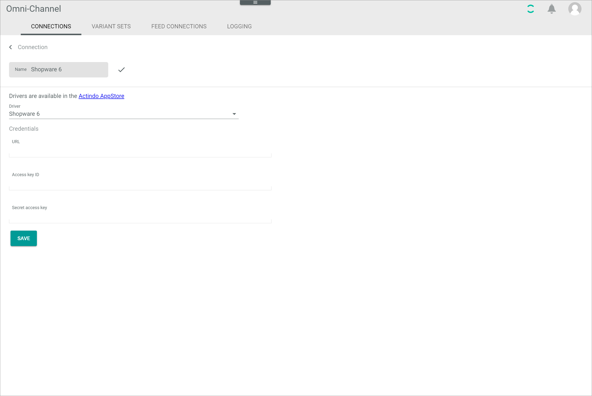
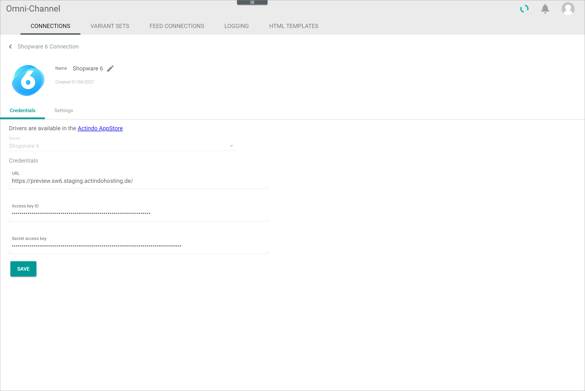
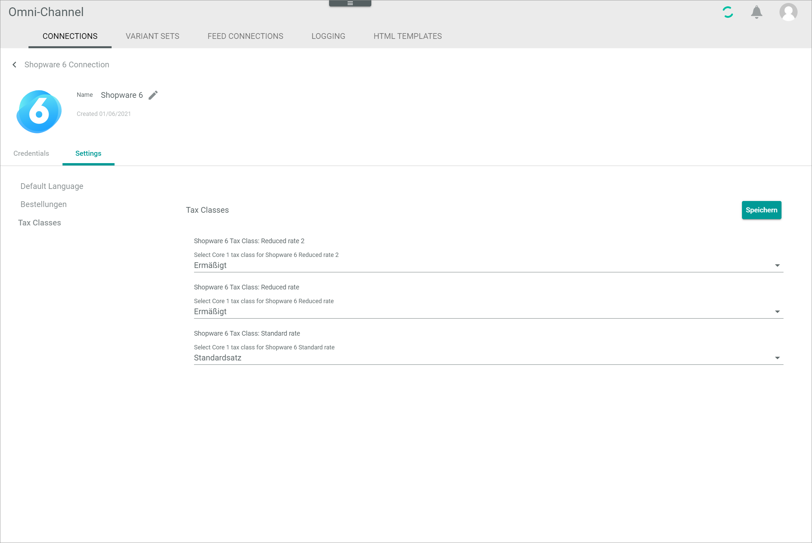
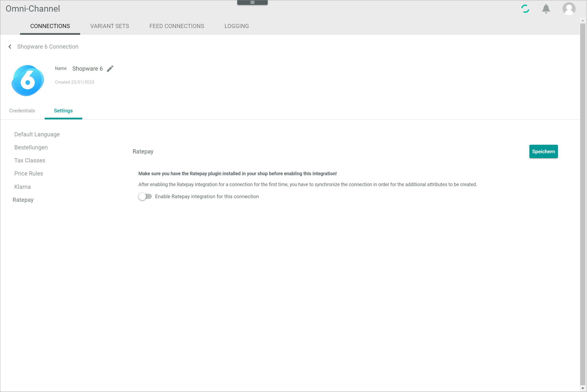

[!!Manage the connections](../../Channels/Integration/01_ManageConnections.md)
[!!Manage the languages in DataHub](../../DataHub/Integration/05_ManageLanguages.md)
[!!User interface Connections](../UserInterface/01_Connections.md)

# Manage the Shopware 6 connection

To establish a connection to a Shopware 6 shop, there are several particularities to consider. Therefore, the creation and the configuration of the Shopware 6 connection are described in detail below.

## Create a Shopware 6 connection

Create the connection to a Shopware 6 shop using the Shopware 6 driver. Further settings can only be configured after the connection has been established.

Be aware that, before a Shopware 6 connection can be established in the *Actindo Core1 Platform*, the corresponding integration must be created in Shopware 6. Besides, all languages configured in Shopware 6 must be available in the *DataHub* module. Otherwise, an error is displayed when trying to create the connection in the *Actindo Core1 Platform* and the connection creation is cancelled.

#### Prerequisites

- A Shopware 6 shop is installed.
- The *Shopware 6* driver plugin has been installed in the Core1 account.
- All languages configured in the Shopware 6 account have been created in the *DataHub* module, see [Create a language](../../DataHub/Integration/05_ManageLanguages.md#create-a-language). 

> [Info] For the *Omni-Channel* module version 4.1.0 or higher, the *Shopware 6* plugin is required in at least version 4.0.0.

#### Procedure

*Omni-Channel > Settings > Tab CONNECTIONS*

1. Click the  (Add) button in the bottom right corner.    
    The *Create connection* view is displayed.

    

2. Enter a name for the connection in the *Name* field.

3. Click the *Driver* drop-down list and select the *Shopware 6* driver.  
    The *Credentials* section is displayed below the drop-down list.

    

4. Enter the shops base URL in the *URL* field.  

5. In a new browser window, go to your Shopware 6 backend and log in.    
    The Shopware 6 dashboard is displayed.

    

6. In the Shopware 6 backend, go to *Settings > System > Integrations* and click the [Add integration] button in the top right corner.  
    The *Create integration* window is displayed.

    

7. Enter a name for the integration in the *Name* field and enable the *Administrator* toggle.

8. Copy the access key ID in the *Access key ID* field to your clipboard.

9. Switch to the *Actindo Core1 Platform* and paste the access key ID from your clipboard in the *Access key ID* field in the *Credentials* section.  
  
10. Repeat the steps **8** and **9** for the secret access key in the *Secret access key* field.

    

11. Switch to your Shopware 6 account and click the [Save integration] button.  
    The integration is saved. The *Success* pop-up window is displayed.

    

12. Switch to the *Actindo Core1 Platform* and click the [SAVE] button.  
    The connection has been created. The *Settings* tab of the connection is displayed when the connection has been established. The initial sync for the connection has been automatically triggered.

    

13. If necessary, continue to configure the Shopware 6 connection settings, see [Configure the Shopware 6 connection](#configure-the-shopware-6-connection).

## Configure the Shopware 6 connection   

After the Shopware 6 connection has been established, further settings can be configured for the connection.

#### Prerequisites

A Shopware 6 connection has been established, see [Create a Shopware 6 connection](#create-a-shopware-6-connection).

#### Procedure

*Omni-Channel > Settings > Tab CONNECTIONS*

1. Click the Shopware 6 connection in the list of connections.   
    The *Edit connection* view is displayed. By default, the *Credentials* tab is selected.

    

2. Click the *Settings* tab.   
    The *Settings* tab is displayed. By default, the *Default language* menu entry is selected.
  
    

3. Click the *Select Shopware default language* drop-down list and select the appropriate language. All languages configured in Shopware 6 are displayed in the list.   

    > [Info] In Shopware 6, the default language is configured during installation, which cannot be edited subsequently. This default language must be defined manually in the *Actindo Core1 Platform*, as it cannot be detected via API. 

4. Click the *Orders* menu entry in the left side bar.  
    The import settings for orders are displayed on the right side.

    

5. Configure the following settings:
    + If desired, enter an order number in the *Import only orders with a higher number than this* field. Only orders with a higher order number than the specified number will be imported.  

    + Enable the toggles of all statuses for which the orders are to be imported. All statuses available in Shopware 6 are displayed.
        
    + If desired, click the *Order state to set in shop after successful import* drop-down list and select the state that will be set for the order if the import has been successful. All states available in Shopware 6 are displayed.

        > [Info] The order states in Shopware 6 have fixed transitions. This means that, once an order has a certain state, only specific states can be selected for the next state of the order. Make sure that the selected state is also supported by Shopware 6.    

    + If desired, click the *Order state to set in shop after the order is fully shipped* drop-down list and select the state that will be set for the order if the shipment has been completed. All states available in Shopware 6 are displayed.
  
    + If desired, enable for each payment method the toggles of all states for which the orders are to be imported. If you select no order state for a certain payment method, all orders with this payment method, regardless of their state, will be imported. All states available in Shopware 6 are displayed for each payment method. All payment methods configured in Shopware 6 are displayed. This allows you, for example, to only process paid orders for methods like PayPal where it is uncommon to process orders prior to them being paid.

[comment]: <> (Check mit Oli: For every payment method you can select payment states an order has to have for it to be exported to the OMS. Also imported from Shopware to Actindo oder weiter exported zu OMS?)

6. Click the *Tax classes* menu entry in the left side bar.  
    The tax classes available in Shopware 6 are displayed on the right side.  

    

7. Click the *Select Core1 tax class for Shopware 6 "Shopware tax class name"* drop-down list and select the corresponding tax class in the *Actindo Core1 Platform*. All available tax classes are displayed in the list. Repeat this step for all Shopware 6 tax classes.

    > [Info] If the *Ratepay* menu entry is available, proceed with step **8**.   
    If the *Klarna* menu entry is available, proceed with step **10**.   
    In any other case, proceed with step **12**.

8. If available, click the *Ratepay* menu entry in the left side bar.  
    The Ratepay settings are displayed on the right side.

    

    > [Info] The *Ratepay* menu entry is only displayed if the *Ratepay Integration for Shopware 6* plugin has been installed in your *Actindo Core1 Platform* and the *Ratepay Payment Plugin for Shopware 6* has been installed in your Shopware 6 account.
  
9. If desired, enable the *Enable Ratepay integration for this connection* toggle.  
    The *Ratepay Payment Plugin for Shopware 6* imports the following additional fields from the shop for further processing:   
    - *transactionId*   
    - *descriptor*    

    > [Info] After the initial activation of the *Ratepay* integration, you must synchronize the connection so that the new order attributes are created for the corresponding connection, see [Synchronize a connection](../../Channels/Integration/01_ManageConnections.md#synchronize-a-connection).
    
10. If available, click the *Klarna* menu entry in the left side bar.  
    The Klarna settings are displayed on the right side.
    
    

    > [Info] The *Klarna* menu entry is only displayed if the *Klarna Integration for Shopware 6* plugin has been installed in your *Actindo Core1 Platform* and the *Klarna Payment Plugin for Shopware 6* has been installed in your Shopware 6 account.

11. If desired, enable the *Enable Klarna plugin integration for this connection* toggle.    
    The *Klarna integration for Shopware 6* plugin imports the following additional fields from the shop for further processing:
    - *captured_amount*
    - *currency*
    - *decimal_precision*
    - *expiry_date*
    - *fraud_status*
    - *initial_payment_method*
    - *order_amount* 
    - *order_id* 
    - *order_number* 
    - *order_status* 
    - *reference* 
    - *refunded_amount*
    - *remaining_amount*  

    > [Info] After the initial activation of the *Klarna* integration, you must synchronize the connection so that the new order attributes are created for the corresponding connection, see [Synchronize a connection](../../Channels/Integration/01_ManageConnections.md#synchronize-a-connection).

12. Click the *Price rules* menu entry in the left side bar.  
    The price rule settings are displayed on the right side.

    

13. Enable the toggles for all price rules for which you want to create a price attribute in the *Actindo Core1 Platform* to maintain deviating prices. All price rules available in Shopware 6 are displayed.   
If a certain price rule is not available, make sure that the *Price* option in the *Type* drop-down list of the corresponding rule in the Shopware 6 backend is selected. After you have changed the type of a price rule, you must synchronize the connection before you can continue to edit this setting.

    > [Info] You must synchronize the connection to create the corresponding price attribute(s), see [Synchronize a connection](../../Channels/Integration/01_ManageConnections.md#synchronize-a-connection). Once a price attribute has been created, the corresponding toggle is locked and cannot be disabled anymore.

14. Click the [SAVE] button.  
    All changes have been saved. The *Saving successful* pop-up window is displayed.

     