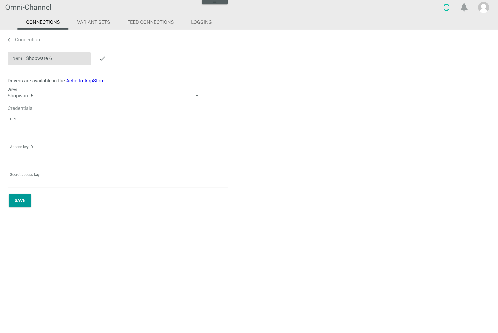
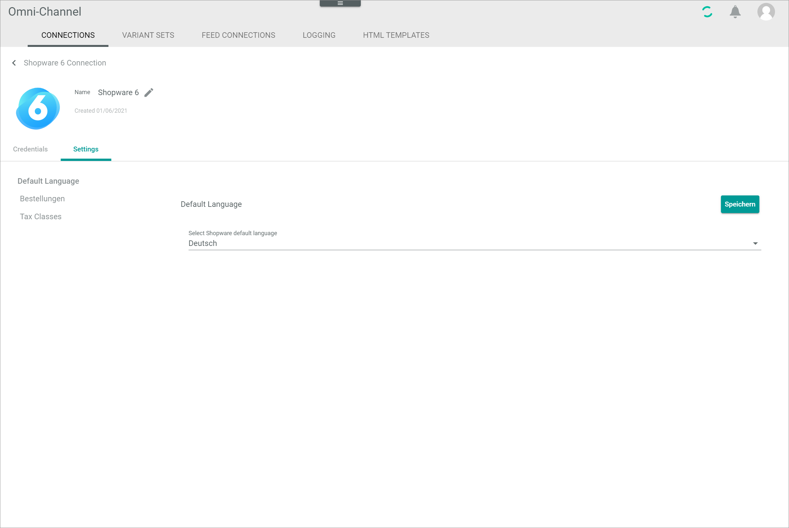
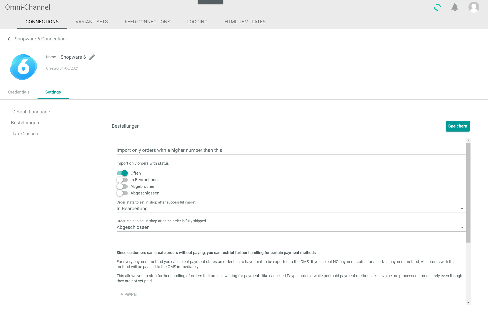
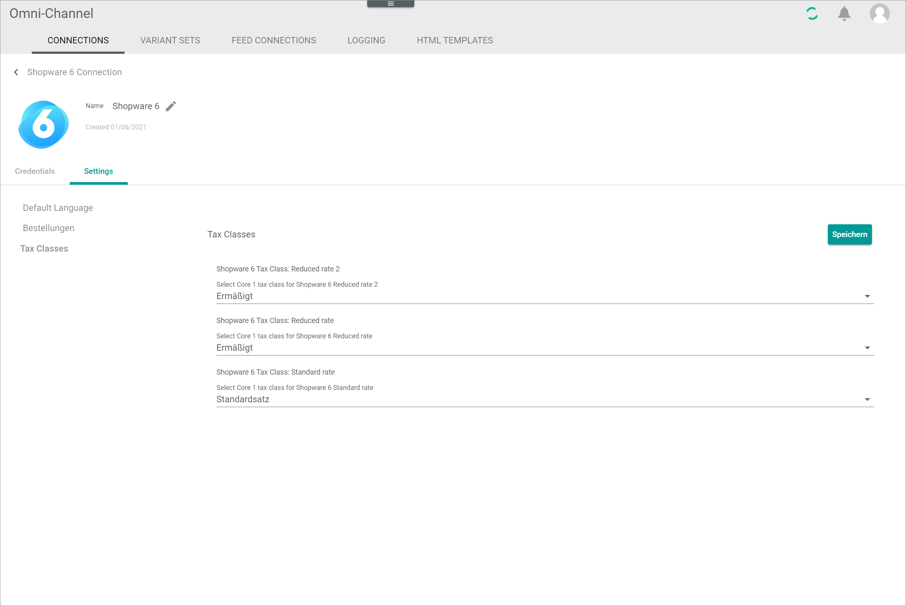
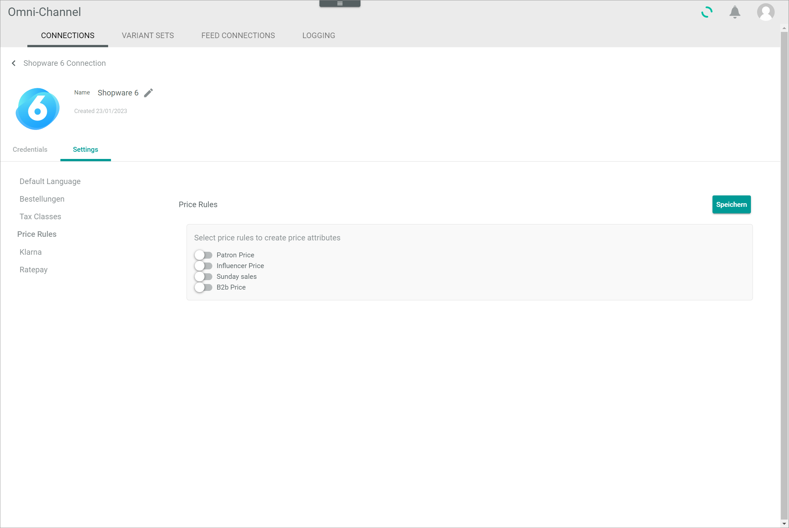
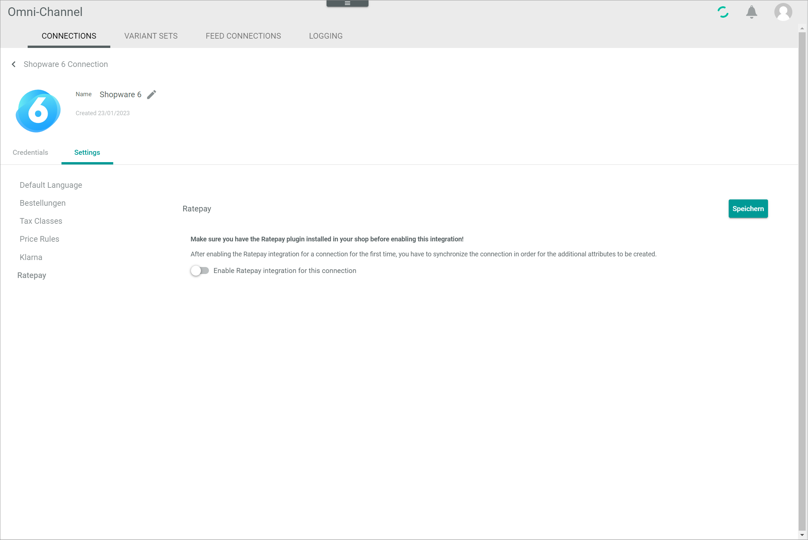

[!!Manage the Shopware 6 connection](../Integration/01_ManageShopware6connection.md)

# Connections

*Omni-Channel > Settings > Tab CONNECTIONS*

**Connections**

-  (Refresh)   
    Click this button to update the list of connections.

- *VIEW*   
    Click the drop-down list to select the view. All created views are displayed in the drop-down list. Click the  (Points) button to the right of the *VIEW* drop-down list to display the context menu and create a view.   

    -  (Points)      
        Click this button to the right of the *VIEW* drop-down list to display the context menu. The following menu entries are available:

        -  create  
            Click this entry to create a view. The *Create view* window is displayed, see [Create view](#create-view).

        -  rename  
            Click this entry to rename the selected view. The *Rename view* window is displayed, see [Rename view](#rename-view). This menu entry is only displayed if a view has been selected.

        -  reset  
            Click this entry to reset all unsaved changes to the settings of the selected view. This menu entry is only displayed if a view has been selected and any changes have been made to the view settings.

        -  publish  
            Click this entry to publish the view. This menu entry is only displayed if a view has been selected and unpublished.

        -  unpublish  
            Click this entry to unpublish the view. This menu entry is only displayed if a view has been selected and published.

        -  save  
            Click this entry to save the current view settings in the selected view. This menu entry is only displayed if a view has been selected.

            > [Info] When the settings of a view have been changed, an asterisk is displayed next to the view name. The asterisk is hidden as soon as the changes have been saved.

        -  delete  
            Click this entry to delete the selected view. A confirmation window to confirm the deletion is displayed. This menu entry is only displayed if a view has been selected.

-  Columns (x)   
    Click this button to display the columns bar and customize the displayed columns and the order of columns in the list. The *x* indicates the number of columns that are currently displayed in the list.

- [x]     
    Select the checkbox to display the editing toolbar. If you click the checkbox in the header, all connections in the list are selected.

- [DELETE]  
    Click this button to delete the selected connection. This button is only displayed if a single checkbox in the list of connections is selected.
    
    > [Info] Deleting a connection is a very complex process and can therefore take a long time. 

- [SYNCHRONIZE]  
    Click this button to synchronize the selected connection. This button is only displayed if a single checkbox in the list of connections is selected. The *Sync triggered* pop-up window is displayed.

    

- [DISABLE]  
    Click this button to disable the selected connection(s). This button is only displayed if the checkbox of at least one active connection is selected.

- [ENABLE]  
    Click this button to enable the selected connection(s). This button is only displayed if the checkbox of at least one inactive connection is selected. 

-  (Edit)  
    Click this button to edit the Shopware 6 connection. This button is only displayed if a single checkbox in the list of connections is selected. Alternatively, you can click directly a row in the list to edit a connection. The *Edit connection* view is displayed, see [Edit Shopware 6 connection](#edit-shopware-6-connection).

The list displays all available connections. Depending on the settings, the displayed columns may vary. All fields are read-only.

- *Name*  
    Connection name.

- *Status*  
    Connection status. The following statuses are available:
    -  **Active**   
        The connection is enabled and data is being synchronized via the connection.
    -  **Inactive**   
        The connection is disabled and no data is being synchronized via the connection.   

- *Order/Return have errors*  
    Indication whether errors have occurred in orders or  returns:. The following options are available:  
    - **Yes**   
        Errors have occurred.   
    - **No**   
        No errors have occurred.

- *Driver*  
    Driver name.

- *ID*  
    Connection identification number. The ID number is automatically assigned by the system.

-  (Add)  
    Click this button to add a Shopware 6 connection. The *Create connection* view is displayed, see [Create Shopware 6 connection](#create-shopware-6-connection).

## Create view

*Omni-Channel > Settings > Tab CONNECTIONS > Button Points > Menu entry create*

- *Name*   
    Enter a name for the view.

- [CANCEL]   
    Click this button to cancel creating a view. The *Create view* window is closed.

- [SAVE]   
    Click this button to save the new view and display it in the *VIEW* drop-down list. The *Create view* window is closed.

## Rename view

*Omni-Channel > Settings > Tab CONNECTIONS > Button Points > Menu entry rename*

- *Name*   
    Click this field to edit the view name.

- [CANCEL]   
    Click this button to cancel renaming the view. The *Rename view* window is closed.

- [SAVE]   
    Click this button to save the changes and display it in the *VIEW* drop-down list. The *Rename view* window is closed.

## Create Shopware 6 connection

*Omni-Channel > Settings > Tab CONNECTIONS > Button Add*

-  (Back)   
    Click this button to close the *Create connection* view and return to the connection list. All changes are rejected.

- *Name*   
    Enter a connection name.

-  (Apply)  
    Click this button to apply the entered connection name. This button is only displayed if the connection name has not yet been confirmed. 

-  (Edit)  
    Click this button to edit the connection name. This button is only displayed if the connection name has been confirmed. 

- *Driver*  
    Click the drop-down list and select the Shopware 6 driver. All installed drivers are displayed. The *Credentials* section is displayed below the drop-down list.

    > [Info] Drivers are licensed and must be acquired via the app store or the corresponding e-commerce partner platform. The applicable driver credentials to establish the connection are obtained when acquiring the corresponding license.

**Credentials**

- URL  
    Enter the shop base URL.

- Access key ID  
    Enter the access key ID provided in the Shopware 6 backend.

- Secret access key  
    Enter the secret access key provided in the Shopware 6 backend.

- [SAVE]  
    Click this button to save the connection.

## Edit Shopware 6 connection

*Omni-Channel > Settings > Tab CONNECTIONS > Select Shopware 6 connection*

-  (Back)   
    Click this button to close the *Edit connection* view and return to the connection list. All changes are rejected.

- *Name*   
    Connection name. Click the button  (Edit) to the right of the name to edit it.

-  (Edit)  
    Click this button to edit the connection name.

-  (Apply)  
    Click this button to apply the changes to the connection name.  This button is only displayed if you are editing the connection name.

- *Created DD/MM/YYYY*  
    Creation date of the connection. This field is read-only.  

## Edit Shopware 6 connection &ndash; Credentials

*Omni-Channel > Settings > Tab CONNECTIONS > Select Shopware 6 connection > Tab Credentials*

- *Driver*  
    Driver name. For Shopware 6, the Shopware 6 driver is displayed. This drop-down list is read-only.

**Credentials** 

- URL  
    Click the field to edit the shop base URL.

- Access key ID  
    Click the field to edit the access key ID for the Shopware 6 connection.

- Secret access key  
    Click the field to edit the secret access key for the Shopware 6 connection. 

- [SAVE]  
    Click this button to save any changes made.

## Edit Shopware 6 connection &ndash; Settings

*Omni-Channel > Settings > Tab CONNECTIONS > Select Shopware 6 connection > Tab Settings*

By default, the *Settings* tab is composed of the following settings entries:

- [Default language](#default-language)
- [Orders](#orders)
- [Tax classes](#tax-classes)

Additional menu entries may be displayed if the corresponding functions have been configured in Shopware 6:
- [Price rules](#price-rules)
- [Klarna](#klarna)
- [Ratepay](#ratepay)

### Default language

*Omni-Channel > Settings > Tab CONNECTIONS > Select Shopware 6 connection > Tab Settings > Menu entry Default language*

- [Save]  
    Click this button to save any changes made.

- *Select Shopware 6 default language*  
    Click the drop-down list and select the default language configured in the Shopware 6 backend. 

### Orders

*Omni-Channel > Settings > Tab CONNECTIONS > Select Shopware 6 connection > Tab Settings > Menu entry Orders*

- [Save]  
    Click this button to save any changes made.

- *Import only orders with a higher number than this*  
    Enter any desired order number to import orders with a higher order number than the specified.

- *Import only orders with status*  
    Enable the toggles of all statuses for which the orders are to be imported. All statuses available in Shopware 6 are displayed. By default, the toggles are disabled. 
    
- *Order state to set in shop after successful import*  
    Click the drop-down list and select the state that will be set for the order if the import has been successful. All states available in Shopware 6 are displayed.

- *Order state to set in shop after the order is fully shipped*  
    Click the drop-down list and select the state that will be set for the order if the shipment has been completed. All states available in Shopware 6 are displayed.

- Payment methods  
    Click the desired payment method to display all available order state toggles. All payment methods configured in Shopware 6 are displayed. For each payment method, enable the toggles of all states for which the orders are to be imported. All states available in Shopware 6 are displayed for each payment method. 

[comment]: <> (Check mit Oli: For every payment method you can select payment states an order has to have for it to be exported to the OMS. Also imported from Shopware to Actindo oder weiter exported zu OMS?)
    
### Tax classes

*Omni-Channel > Settings > Tab CONNECTIONS > Select Shopware 6 connection > Tab Settings > Menu entry Tax classes*

- [Save]  
    Click this button to save any changes made.

- *Select Core1 tax class for Shopware 6 "tax class"*  
    Click the drop-down list and select the corresponding tax class in the *Actindo Core1 Platform*. All available tax classes are displayed in the list.

### Price rules

*Omni-Channel > Settings > Tab CONNECTIONS > Select Shopware 6 connection > Tab Settings > Menu entry Price rules*

> [Info] This menu entry is only displayed if the corresponding price rules have been configured in the Shopware 6 backend. 

- [Save]  
    Click this button to save any changes made.

- *Select price rules to create price attributes*   
    Enable the toggles for all price rules for which you want to create a price attribute in the *Actindo Core1 Platform* to maintain deviating prices. All price rules available in Shopware 6 are displayed.

### Klarna

*Omni-Channel > Settings > Tab CONNECTIONS > Select Shopware 6 connection > Tab Settings > Menu entry Klarna*

> [Info] This menu entry is only displayed if the *Klarna Integration for Shopware 6 plugin* has been installed in your *Actindo Core1 Platform* and the *Klarna Payment Plugin for Shopware 6* has been installed in your Shopware 6 account. 

- [Save]  
    Click this button to save any changes made.

-  *Enable Klarna integration for this connection*   
    Enable this toggle to import additional fields from the shop for further processing.

### Ratepay

*Omni-Channel > Settings > Tab CONNECTIONS > Select Shopware 6 connection > Tab Settings > Menu entry Ratepay*

> [Info] This menu entry is only displayed if the *Ratepay Integration for Shopware 6 plugin* has been installed in your *Actindo Core1 Platform* and the *Ratepay Payment Plugin for Shopware 6* has been installed in your Shopware 6 account. 

- [Save]  
    Click this button to save any changes made.
    
  *Enable Klarna integration for this connection*   
    Enable this toggle to import additional fields from the shop for further processing.
