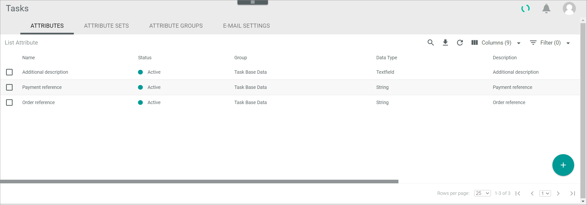

[!!User interface Attributes](../UserInterface/02a_Attributes.md)
[!!Manage an attribute in DataHub](../../DataHub/Integration/01_ManageAttributes.md)

# Manage an attribute for tasks

A task is an entity type. Like all entity types, a task is defined through a series of attributes. 

Tasks contain by default a number of fields, such as *Title*, *Description*, *Event*, and *Assignee*, to specify how the task is called, what it entails, in which scenario it needs to be performed, and who is person responsible for it. These fields are internally predefined.

[comment]: <> (Sebi: Ist das fachlich korrekt? Gerne verbessern bzw. ergänzen.)

You can create any number of attributes you need to add fields to your tasks and specify further values, such as the ones displayed in the example. 

[comment]: <> (Sebi: Sinnvolle Beispiele? Bitte auch Beispiele bei Attribute set und attribute group prüfen bzw. verbessern.)

The *ATTRIBUTES* tab in the *Tasks* module equals the *ATTRIBUTES* tab contained in the *DataHub* module. In the *Tasks* module, however, you can only manage tasks-related attributes, as only the task-relevant attributes are displayed. 

For detailed information on how to manage an attribute, see [Manage an attribute](../../DataHub/Integration/01_ManageAttributes.md) in the *DataHub* documentation.

