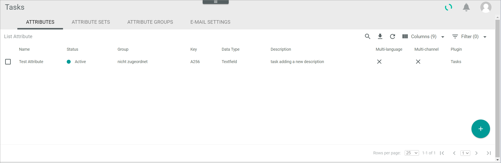

[!!User interface Attributes](../UserInterface/to-be-determined)
[!!Manage an attribute in DataHub](../../DataHub/Integration/01_ManageAttributes.md)

# Manage the attributes for tasks

A task is an entity type. Like all entity types, a task is defined through a series of attributes. In the *Tasks* module, you can create, edit, deactivate, and delete attributes that are specific to your tasks. 

The *ATTRIBUTES* tab in the *Tasks* module equals the *ATTRIBUTES* tab contained in the *DataHub* module. In the *Tasks* module, however, only the tasks-relevant attributes are displayed. 

For detailed information on how to create, edit, deactivate, and delete attributes, see [Manage an attribute](../../DataHub/Integration/01_ManageAttributes.md) in the *DataHub* documentation.

[comment]: <> (so allgemein, oder unter dem jeweiligen Procedure?)

## Create an attribute

*Tasks > Settings > Tab ATTRIBUTES*

For detailed information on how to create an attribute, see [Create an attribute](../../DataHub/Integration/01_ManageAttributes.md#create-an-attribute) in the *DataHub* documentation.

## Edit an attribute

*Tasks > Settings > Tab ATTRIBUTES*

For detailed information on how to edit an attribute, see [Edit an attribute](../../DataHub/Integration/01_ManageAttributes.md#edit-an-attribute) in the *DataHub* documentation.

## Deactivate an attribute

*Tasks > Settings > Tab ATTRIBUTES*

For detailed information on how to deactivate an attribute, see [Deactivate an attribute](../../DataHub/Integration/01_ManageAttributes.md#deactivate-an-attribute) in the *DataHub* documentation.

## Delete an attribute

*Tasks > Settings > Tab ATTRIBUTES*

For detailed information on how to edit an attribute, see [Delete an attribute](../../DataHub/Integration/01_ManageAttributes.md#delete-an-attribute) in the *DataHub* documentation.

## Recover an attribute

*Tasks > Settings > Tab ATTRIBUTES*

For detailed information on how to edit an attribute, see [Recover an attribute](../../DataHub/Integration/01_ManageAttributes.md#recover-an-attribute) in the *DataHub* documentation.

## Permanently delete an attribute

*Tasks > Settings > Tab ATTRIBUTES*

For detailed information on how to edit an attribute, see [Permanently delete an attribute](../../DataHub/Integration/01_ManageAttributes.md#permanently-delete-an-attribute) in the *DataHub* documentation.

