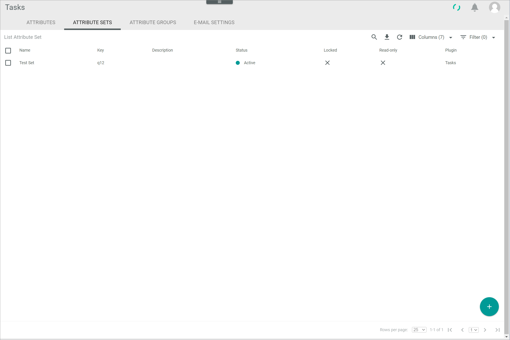

# Manage the attribute sets for tasks

An attribute set consist of multiple attributes to classify certain entity type, in this case, a task. In the *Tasks* module, you can create, edit, and deactivate attribute sets that are specific to your tasks. 

The *ATTRIBUTE SETS* tab in the *Tasks* module equals the *ATTRIBUTE SETS* tab contained in the *DataHub* module. In the *Tasks* module, however, only the tasks-relevant attribute sets are displayed. 

For detailed information on how to create, edit, deactivate, and delete attribute sets, see [Manage an attribute](../../DataHub/Integration/01_ManageAttributes.md) in the *DataHub* documentation.

[comment]: <> (Hier Button LOCK für Attribute sets. So gewollt? Auch in DataHub in terminologie-einspielen 2!)

[comment]: <> (so allgemein, oder unter dem jeweiligen Procedure?)

## Create an attribute set

*Tasks > Settings > Attributes*

For detailed information on how to create an attribute set, see [Create an attribute set](../../DataHub/Integration/01_ManageAttributes.md#create-an-attribute-set) in the *DataHub* documentation.

## Edit an attribute set

*Tasks > Settings > Attributes*

For detailed information on how to edit an attribute set, see [Edit an attribute set](../../DataHub/Integration/01_ManageAttributes.md#edit-an-attribute-set) in the *DataHub* documentation.

## Deactivate an attribute set

*Tasks > Settings > Attributes*

For detailed information on how to deactivate an attribute set, see [Deactivate an attribute set](../../DataHub/Integration/01_ManageAttributes.md#deactivate-an-attribute-set) in the *DataHub* documentation.

## Delete an attribute set

*Tasks > Settings > Attributes*

For detailed information on how to edit an attribute set, see [Delete an attribute set](../../DataHub/Integration/01_ManageAttributes.md#delete-an-attribute-set) in the *DataHub* documentation.

