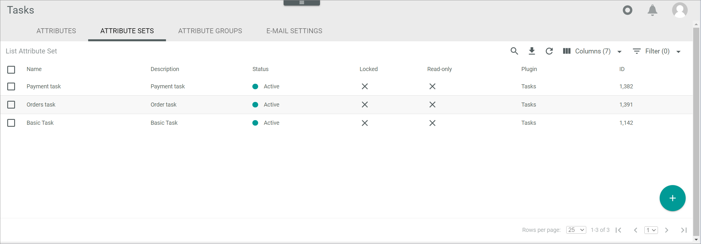

[!!User interface Attribute sets](../UserInterface/02b_AttributeSets.md)
[!!Manage an attribute set in DataHub](../../DataHub/Integration/02_ManageAttributeSets.md)

# Manage an attribute set for tasks

An attribute set consists of multiple attributes to classify certain entity type, in this case, a task. You may need to define different type of tasks, such as a basic task, a payment task, or an order task, such as the ones displayed in the example. 

The fields you may want to include in each type of task will probably differ. For example, an order task will include an *Order reference* field, whereas a payment task will contain a *Payment reference* field that does not need to be included in the order task. 

The *ATTRIBUTE SETS* tab in the *Tasks* module equals the *ATTRIBUTE SETS* tab contained in the *DataHub* module. In the *Tasks* module, however, you can only manage the tasks-related attribute sets, as only the task-relevant attribute sets are displayed.

For detailed information on how to manage an attribute set, see [Manage an attribute](../../DataHub/Integration/02_ManageAttributeSets.md) in the *DataHub* documentation.

[comment]: <> (Sebi/Entwicklung: Bitte LOCK-Button aus Editing Toolbar abbauen!)
