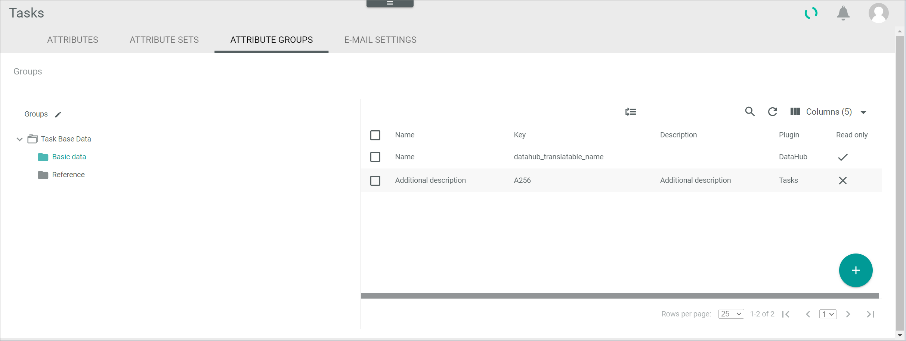

[!!User interface Attribute groups](../UserInterface/02c_AttributeGroups.md)
[!!Manage an attribute group in DataHub](../../DataHub/Integration/03_ManageAttributeGroups.md)

# Manage an attribute group for tasks

The attribute groups serve the logical organization of the entity attributes, in this case the task attributes. You can create additional groups or subgroups to organize all task-related attributes if necessary, such as the one displayed in the example.

The *ATTRIBUTE GROUPS* tab in the *Tasks* module equals the *ATTRIBUTE GROUPS* tab contained in the *DataHub* module. In the *Tasks* module, however, you can only manage the tasks-related attribute groups, as only the task-relevant attribute groups are displayed. 

For detailed information on how to manage an attribute group, see [Manage an attribute group](../../DataHub/Integration/03_ManageAttributeGroups.md) in the *DataHub* documentation.

