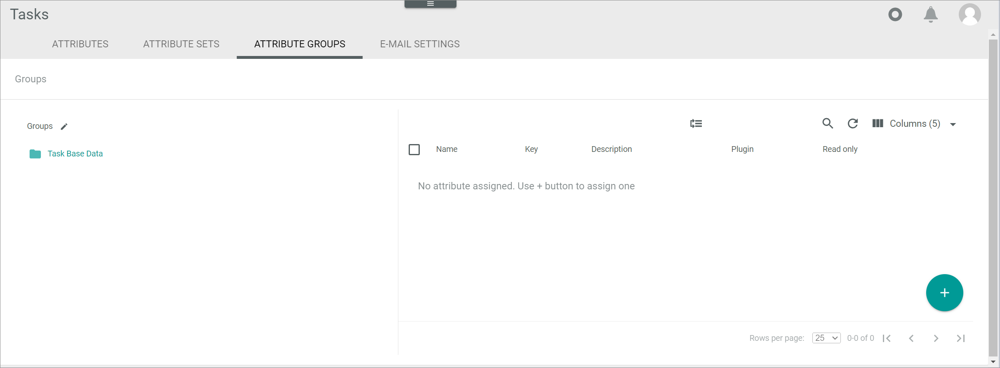

[!!User interface Attribute groups](../UserInterface/to-be-determined)
[!!Manage an attribute group in DataHub](../../DataHub/Integration/03_ManageAttributeGroups.md)

# Manage an attribute group for tasks

The attribute groups serve the logical organization of the entity attributes, in this case the task attributes. In the *Tasks* module, you can create and edit attribute groups that are specific to your tasks. 

The *ATTRIBUTE GROUPS* tab in the *Tasks* module equals the *ATTRIBUTE GROUPS* tab contained in the *DataHub* module. In the *Tasks* module, however, only the tasks-relevant attribute groups are displayed. 

For detailed information on how to create, edit, deactivate, and delete attributes, see [Manage an attribute group](../../DataHub/Integration/03_ManageAttributeGroups.md) in the *DataHub* documentation.

[comment]: <> (so allgemein, oder unter dem jeweiligen Procedure?)

## Create an attribute group

*Tasks > Settings > Tab ATTRIBUTE GROUPS*

For detailed information on how to create an attribute, see [Create an attribute group](../../DataHub/Integration/03_ManageAttributeGroups.md#create-an-attribute-group) in the *DataHub* documentation.

## Edit an attribute group

*Tasks > Settings > Tab ATTRIBUTE GROUPS*

For detailed information on how to edit an attribute, see [Edit an attribute group](../../DataHub/Integration/03_ManageAttributeGroups.md#edit-an-attribute-group) in the *DataHub* documentation.

