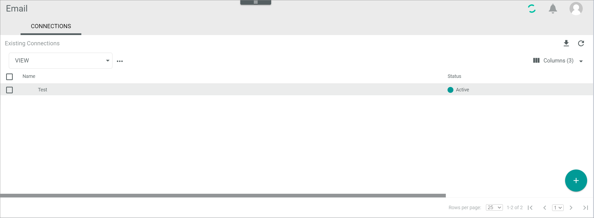
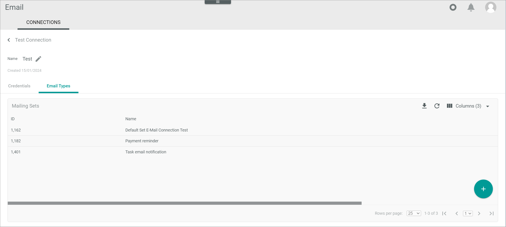

[!!User interface Email settings](../UserInterface/02d_EmailSettings.md)

# Manage the email settings

The *EMAIL SETTINGS* tab allows you configure how a user is notified per email when a task is created. It contains a menu on the left with two settings entries: *General settings* and
*Email sending per event*.

To configure the email general settings, see [Configure the general settings](#configure-the-general-settings).  
To configure the email notification settings, see [Configure the email sending per event](#configure-the-email-sending-per-event).

> [Info] This tab is only displayed if the *Email* module (1.6.1 version or higher) is installed. 

[comment]: <> (Email procedures zur Email-Doku hinzufügen, wenn verfügbar, und von hier aus darauf verweisen)

## Create a connection in the *Email* module

To be able to set up the email notifications, you have to create a connection to an email server in the *Email* module first.

[comment]: <> (Link auf allgemeine Prozedur Verbindung erstellen oder auf Email-Doku, wenn verfügbar)

#### Prerequisites

The *Email* module (1.6.1 version or higher) is installed.

#### Procedure

*Email > Settings > Connections*

1. Click the  (Add) button in the bottom right corner.    
    The *Create connection* view is displayed.

    

2. Enter a name for the connection in the *Name* field.

3. Click the *Driver* drop-down list and select the desired driver, for example, **SMTP**. All available drivers are displayed in the list.   

    > [Info] Drivers must be purchased from the main account and then be installed separately in each sandbox or account where you want to use them.    

    The *Credentials* section is displayed below the drop-down list. 

    

    > [Info] Depending on the selected driver, the fields in the *Credentials* section differ. 

4. Enter the required data in the fields in the *Credentials* section. For your credential details, refer to your email provider's documentation or support resources.

    

5. Click the [SAVE] button.    
    The connection will be established. The *Checking credentials...* notice is displayed.
    The *Create connection* view is automatically closed when the connection has been established. The initial sync has been automatically triggered. A confirmation message is displayed.

## Create an email type in the email connection

For every email connection configured, you can create different email types depending on the email purpose, for example, a payment reminder, a delivery status update, or an invoice.

For every email type you create in the *Email* module, the corresponding attribute set is automatically created in the *DataHub* module. All email attribute sets contain by default a number of basic email attributes, such as *To*, *From*, *CC*, *Subject*, or *Body*. Depending on the email connection, the basic email attributes may vary. If necessary, you can add additional attributes to include other fields to a specific email type. 

For every email type attribute set you can have different ETL mappings to determine which data is contained in a specific email. For example, in an invoice email you will need to include the invoice number, whereas in a payment reminder email you need to specify the bank details. The data contained in the different emails must be configured via ETL mapping in the *DataHub* module under *DataHub > ETL > Tab MAPPINGS*. In the case of the *Tasks-Email* connection, an ETL mapping from the desired task attribute set to the corresponding email type attribute set must be created. For detailed information on ETL mappings, see [Manage the ETL mappings](../../DataHub/Operation/01_ManageETLMappings.md).

Besides, you can further customize the email body in the *DataHub* module if desired under *DataHub > Settings > HTML templates*. For detailed information, see [Manage the HTML templates](../../DataHub/Operation/03_ManageHTMLTemplates.md) in the *DataHub* documentation. 

For the task email notification purposes, a simple email type containing the basic attributes is sufficient, as explained in the following procedure. 

#### Prerequisites

At least one email connection has been established, see [Create a connection in the *Email* module](#create-a-connection-in-the-email-module).

#### Procedure

*Email > Settings > Connections > Select a connection > Tab Email types*

1. Click the  (Add) button in the bottom right corner.    
    The *Create email type* view is displayed.

    

2. Enter a name for the email type in the *Name* field and, if desired, add an email type description in the *Description* field.

    > [Info] If you want to provide the email type name and description in different languages in the system, you can select the desired system language in the *"Language"* drop-down list on top of this view. By default, the following options are currently available: **English (United States)** and **Deutsch (Deutschland)**.

3. Click the [SAVE] button.  
    The email type has been saved. The *Create email type* view is closed.

## Configure the general settings

In the *General settings* menu entry, you can configure the email type that is used to send email notifications and the email address to be displayed as sender.

#### Prerequisites

At least one email type has been created in the email connection, see [Create an email type in the email connection](#create-an-email-type-in-the-email-connection).

#### Procedure

*Tasks > Settings > Tab EMAIL SETTINGS > Menu entry General settings*

1. Click the *Email type* drop-down list in the *General settings* view and select the desired option. All available email types are displayed in the list.

2. Click the *From* field and enter a valid email address, such as in the following example. This will be displayed as the sender email address in the email.

    

3. If necessary, click the *Email sending per event* menu entry to configure further settings, see [Configure the email sending per event](#configure-the-email-sending-per-event). Otherwise, continue with step 4.

4. Click the [SAVE] button.  
    A confirmation message is displayed. The email general settings have been saved.

## Configure the email sending per event

In the *Email sending per event* menu entry, you can enable or disable email notification per event. By default, email notification is enabled for all events.

#### Prerequisites

The general settings have been configured, see [Configure the general settings](#configure-the-general-settings).

#### Procedure

*Tasks > Settings > Tab EMAIL SETTINGS > Email sending per event*

1. Disable the *Apply from default* toggle to be able to modify the predefined email sending per event settings.  
    The email sending per event settings are unlocked.

2. Disable or enable the desired event toggle to deactivate or activate email notification for the desired events.

3. Click the [SAVE] button.  
    A confirmation message is displayed. The email sending settings have been saved.
