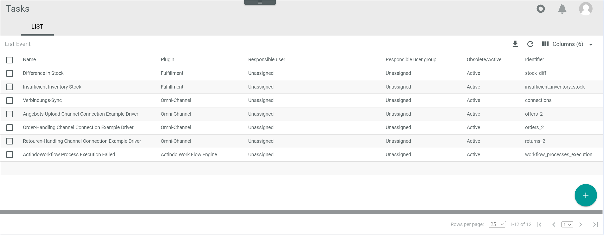
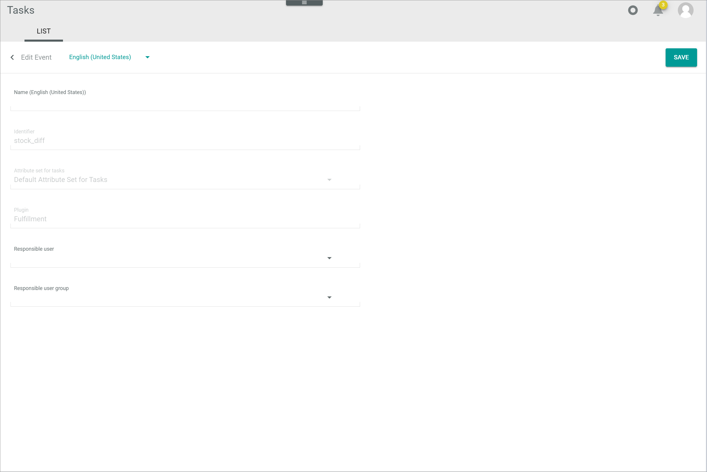

[!!User interface Events](../UserInterface/03a_List.md)
[!!Process Orchestration](../../ActindoWorkFlow/Overview/01_General.md)

# Manage the events

An event is an occurrence that originates a task. For example, when inconsistencies in stock are found, the *Differences in stock* event creates a task to assure a user checks the stock inconsistencies manually.

You can create events manually in the *Tasks* module. However, most events are automatically created by the system when installing a plugin or module, such as the *Actindo Workflow Process Execution Failed*. 

When the *Process Orchestration* module is installed, the *Actindo Workflow Process Execution Failed* event is automatically created in the *Tasks* module. This means that a task is created by default every time an error occurs in any action of the process. If a specific event is configured in an individual process action, a task is created for the configured event when an error occurs in this individual process action. The workflow process in the *Process Orchestration* module goes then into *Error* status and it remains in this state until a user retries the faulty process action. The task, in this case, is just a notification that the workflow process has encountered an error. For detailed information about the workflow processes, see the [Process Orchestration](../../ActindoWorkFlow/Overview/01_General.md) documentation. 

[comment]: <> (Link anpassen, wenn veröffentlicht: For detailed information, see Track the workflow process in the Process Orchestration documentation. ActindoWorkFlow/Operation/09_TrackWorkflowProcess.md)

You can create an event manually, edit an existing event, and delete an event that is no longer needed.

## Create an event

You can create an event to define a scenario that requires a user to perform a task.

#### Prerequisites

No prerequisites to fulfill.

#### Procedure

*Tasks > Events*

1. Click the  (Add) button in the bottom right corner.   
    The *Create event* view is displayed.

    

2. Enter a name for the event in the *Name* field.

    > [Info] If you want to provide the event name in different languages in the system, you can select the desired system language in the *"Language"* drop-down list on top of this view. By default, the following options are currently available: **English (United States)** and **Deutsch (Deutschland)**.

3. Enter an identifier for the event in the *Identifier* field. The event identifier works like an attribute key. A key is required for API access and must be system-wide unique. Just like a key, the identifier must fulfill the following criteria:
    - valid characters are **a-z** (upper and lower case), **0-9** and the underscore ( **_** )
    - the key must not start with a number
    - a double underscore ( **___** ) and a trailing underscore are forbidden

4. Click the *Attribute set for tasks* drop-down list and select the desired option. All available attribute sets for tasks are displayed in the list.

    > [Info] As you are creating the event manually, the *Plugin* drop-down list is locked. After saving the event, the value **Manually created** is displayed in the *Plugin* column.

5. If desired, click the *Responsible user* drop-down list and select the user to whom you want to assign the event, and the related tasks, by default. All users that are registered in the current instance are displayed in the list. 

6. Alternatively, click the *Responsible user group* drop-down list and select the user group to which you want to assign the event, and the related tasks, by default. All user groups that are registered in the current instance are displayed in the list.

    > [Info] You can select a responsible user, a responsible user group, or both for the event. The responsible user does not need to be included in the responsible user group. In any case, it is strongly recommended to define at least one of both fields. Otherwise, the task will be created but no one is responsible for it. If necessary, you can further assign an individual task to a specific user in the *Tasks* menu entry, see [Assign a task](./02_ManageTasks.md#assign-a-task).

7. Click the [SAVE] button.  
    A confirmation message is displayed. The event has been saved. The *Create event* view is closed.  

## Edit an event

Once an event has been created, you can edit it. However, only some event properties are editable. For instance, the identifier, the attribute set, and the plugin cannot be subsequently modified.

#### Prerequisites
 
At least one event has been created, see [Create an event](#create-an-event).

#### Procedure

*Tasks > Events*

1. Click the event you want to edit in the list of events.   
    The *Edit event* view is displayed. 

    

    > [Info] Be aware that you can only edit the event name, the responsible user, and the responsible user group. All other fields are locked.

2. Edit the desired data of the event in the corresponding fields.

3. Click the [SAVE] button in the upper right corner.   
   A confirmation message is displayed. The changes have been saved. The *Edit event* view is closed.  

## Delete an event

You can delete an event that is no longer needed. 

> [Caution] **Loss of data**   
    Deleting will permanently remove the selected data. The deletion cannot be undone and the deleted data cannot be restored.       
    Problems may occur due to unresolved dependencies.   
    Make sure you really want to delete the selected data.

#### Prerequisites

At least one event has been created, see [Create an event](#create-an-event).

#### Procedure

*Tasks > Events*

1. Click the checkbox of the event you want to delete.  
    The editing toolbar is displayed.

    > [Caution] Deleting will permanently remove the selected data. The deletion cannot be undone and the deleted data cannot be restored. Problems may occur due to unresolved dependencies. 

2. Click the [DELETE] button.  
    The selected event is deleted and removed from the list of events.

