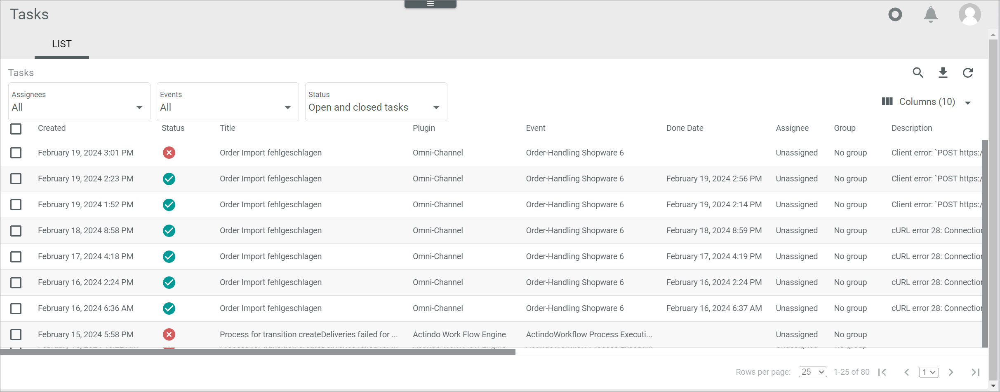
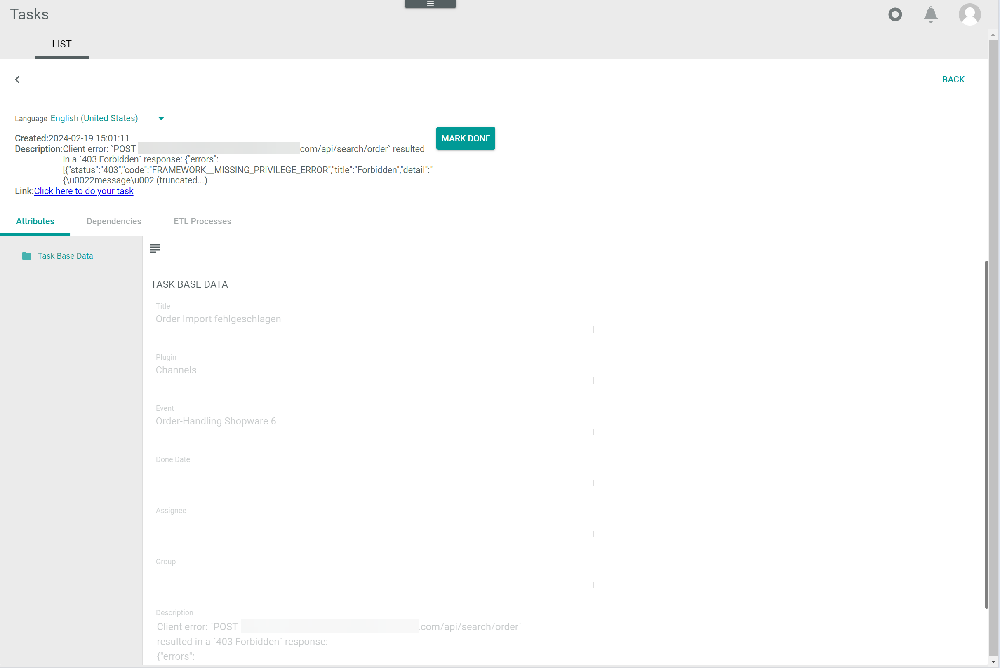
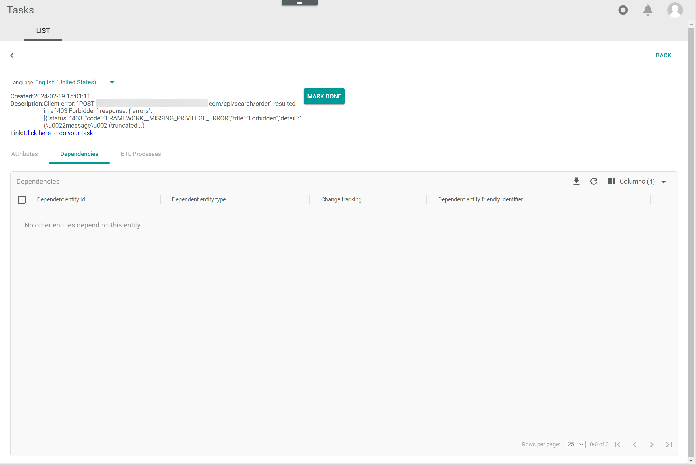
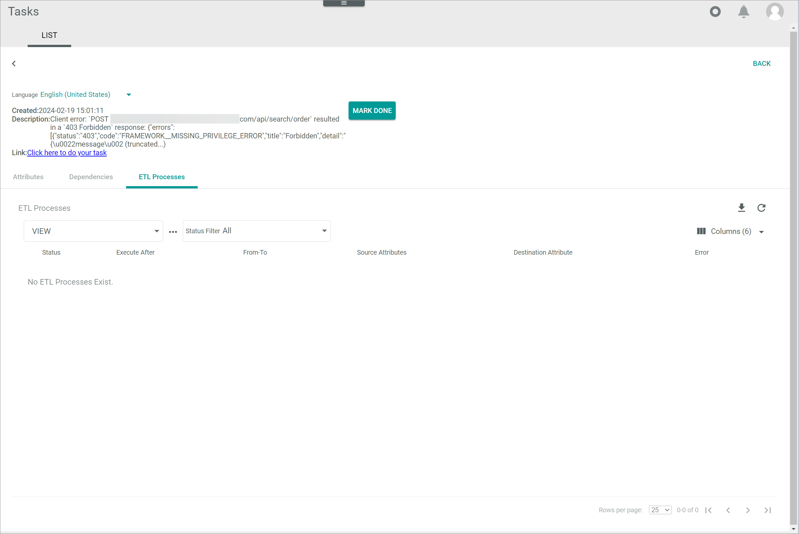

[!!User Interface List of events](./03a_List.md)
[!!Manage the tasks](../Operation/02_ManageTasks.md)

# List (Tasks)

*Tasks > Tasks > Tab LIST*

**Tasks**

The list displays all tasks. Depending on the settings, the displayed columns may vary. All fields are read-only.

The following functions are available for the editing toolbar: 

- [MARK DONE]  

- [REOPEN]  

- [ASSIGN TO ME]  

- *Unassigned*  

- [ASSIGN] 

The following functions and fields are available in this view:

- *Assignees*  
    Click the drop-down list to filter the list of tasks by assignee. The following options are available:  
    - **All**  
    - **Assigned directly to me**  
    - **Assigned to me via groups**
    - **Assigned to me directly or via groups**
    - **Unassigned**

- *Events*  
    Click the drop-down list to filter the list of tasks by event. All events created in the *Event* menu entry are displayed.

- *Status*  
    Click the drop-down list to filter the list of tasks by status. The following options are available:  
    - **Open tasks**  
        Select this option to display only the open, that is, pending, tasks.
    - **Open and closed tasks**  
        Select this option to display all tasks, both open (pending) and closed (done).

     

- *Created*  
    Date and time of creation.

- *Status*  
    Task status. The following options are available:
    -  (Cross)   
        The task is pending.  
    -  (Check)  
        The task is done.

- *Title*  

- *Description*  

- *Plugin*  

- *Event*  

- *Link*  

- *Done date*  

- *Assignee*  

- *Group*  

- *ID*

## Task

*Tasks > Tasks > Tab LIST > Select a task*

- *Created*  

- *Description*  

- *Link*  

- [MARK DONE]  

- [REOPEN]  

## Tasks &ndash; Attributes

*Tasks > Tasks > Tab LIST > Select a task*

For a detailed description of this user interface, see [Attributes tab](../../DataHub/UserInterface/07_DependenciesTab.md) in the *DataHub* documentation.

## Tasks &ndash; Dependencies

*Tasks > Tasks > Tab LIST > Select a task > Tab Dependencies*

For a detailed description of this user interface, see [Dependencies tab](../../DataHub/UserInterface/07_DependenciesTab.md) in the *DataHub* documentation.

## Tasks &ndash; ETL processes

*Tasks > Tasks > Tab LIST > Select a task > Tab ETL processes*

