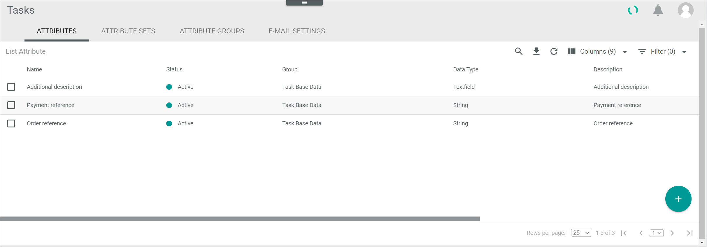

[!!Manage an attribute for tasks](../Integration/01_ManageAttributesTasks.md)
[!!User Interface Attributes in DataHub](../../DataHub/UserInterface/01a_Attributes.md)

# Attributes

*Tasks > Settings > Tab ATTRIBUTES*

The *ATTRIBUTES* tab in the *Tasks* module equals the *ATTRIBUTES* tab contained in the *DataHub* module. In the *Tasks* module, however, only the tasks-relevant attributes are displayed. 

For a detailed description of this view, see [Attributes](../../DataHub/UserInterface/01a_Attributes.md) in the *DataHub* documentation.

[comment]: <> (so allgemein, oder unter dem Create an attribute und Edit an attribute dazu?)

