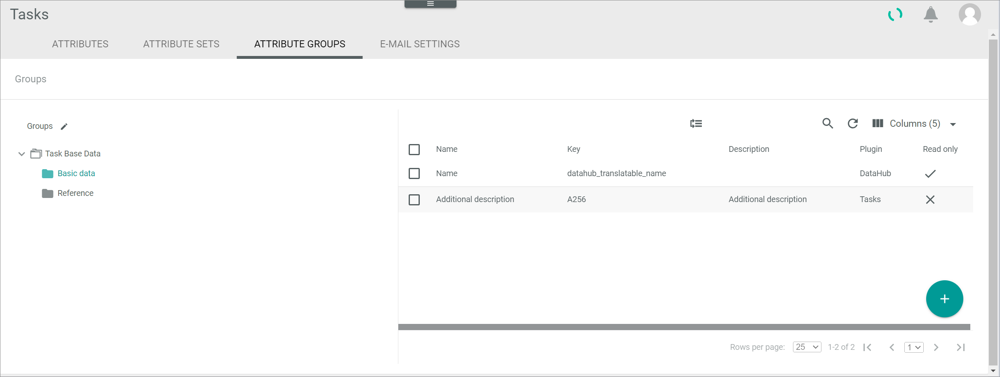

[!!Manage an attribute group for tasks](../Integration/03_ManageAttributeGroupsTasks.md)
[!!User Interface Attribute groups in DataHub](../../DataHub/UserInterface/01c_AttributeGroups.md)

# Attribute groups

*Tasks > Settings > Tab ATTRIBUTE GROUPS*

The *ATTRIBUTE GROUPS* tab in the *Tasks* module equals the *ATTRIBUTE GROUPS* tab contained in the *DataHub* module. In the *Tasks* module, however, only the task-relevant attribute groups are displayed. 

For a detailed description of this view, see [Attribute groups](../../DataHub/UserInterface/01c_AttributeGroups.md) in the *DataHub* documentation.

