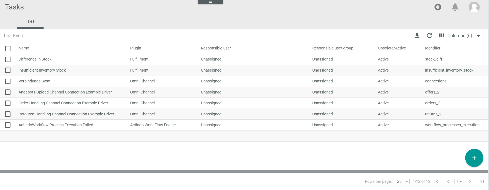

[!!Email settings](../UserInterface/02d_EmailSettings.md)
[!!Manage the events](../Operation/01_ManageEvents.md)

# List (Events)

*Tasks > Events > Tab LIST*

**List of events**

The list displays a list of all events created in the system. Depending on the settings, the displayed columns may vary. All fields are read-only.

The following functions are available for the editing toolbar:

- [EDIT]  
    Click this button to edit an event. This button is only displayed if the checkbox of an event is selected. The [Edit event](#edit-event) view is displayed.

- [DELETE]  
    Click this button to delete an event. This button is displayed if the checkbox of at least one event is selected.

The following functions and fields are available in this view:

- *Name*  
    Event name.

- *Plugin*  
    Module or plugin that owns the event. 
    
    > [Info] Most events are created automatically by the system when installing a module or plugin. If you create an event manually in the *Tasks* module, **Manually created** is displayed.

- *Responsible user*  
    User to whom the event is assigned. If the task has not been assigned to any user, **Unassigned** is displayed.

- *Responsible user group*  
    User group to whom the event is assigned. If the task has not been assigned to any user group, **Unassigned** is displayed.

- *Obsolete/Active*  
    Indication whether the even is **Active** or **Obsolete**.

- *Identifier*  
    Event identifier. The event identifier is similar to a key and therefore is must be system-wide unique.

- *ID*  
    Event identification number. The ID number is automatically assigned by the system.

## Create event

*Tasks > Events > Tab LIST > Button Add*

The following functions and fields are available in this view:

- *"Language name"*  
    Click the drop-down list and select the language in which the *Name (Language)* is displayed. By default, the following options are available:

    - **English (United States)**
    - **Deutsch (Deutschland)**

[comment]: <> (Tasks ist offenbar nur auf Englisch im UI. UI-Element hier evtl. weglassen!)

- *Name*  
    Enter a name for the event.

- *Identifier*  
    Event identifier. The event identifier is similar to a key and therefore is must be system-wide unique.

- *Attribute set for tasks*  
    Click the drop-down list and select the appropriate attribute set. All available attribute sets that are relevant for tasks are displayed in the list.

- *Plugin*  
    The owner module or plugin is set automatically and therefore this field is locked. 

- *Responsible user*  
    Click the drop-down list to select a user to whom you want to assign the event. The user is then responsible for the event and all associated tasks, unless you assign an individual task to a specific user in the *Tasks* menu entry.

- *Responsible user group*  
    Click the drop-down list to select a user to whom you want to assign the event. The user group is then responsible for the event and all associated tasks, unless you assign an individual task to a specific user in the *Tasks* menu entry.

[comment]: <> (Muss dann der User in der Group sein oder kann man einem User aus einem anderen Group ein Task individuell zuweisen?)

- [SAVE]  
    Click this button to save the event. The *Create event* view is closed.

## Edit event

*Tasks > Events > Tab LIST > Select an event*

[Comment]: <> (evtl. Beschreibung hier weglassen und auf Create event verweisen? For detailed description of all fields, see Create event...)

The following functions and fields are available in this view:

- *"Language name"*  
    Click the drop-down list and select the language in which the *Name (Language)* is displayed. By default, the following options are available:

    - **English (United States)**
    - **Deutsch (Deutschland)**

[comment]: <> (Tasks ist offenbar nur auf Englisch im UI. UI-Element hier evtl. weglassen!)

- *Name*  
    Click this field to edit the event name.

- *Identifier*  
    Event identifier. The event identifier cannot be edited.

- *Attribute set for tasks*  
    The attribute set for tasks cannot be edited. 

- *Plugin*  
    Owner module or plugin that owns the event. The plugin cannot be edited. 

- *Responsible user*  
    Click the drop-down list to select a user to whom you want to assign the event. The user is then responsible for the event and all associated tasks, unless you assign an individual task to a specific user in the *Tasks* menu entry.

- *Responsible user group*  
    Click the drop-down list to select a user to whom you want to assign the event. The user group is then responsible for the event and all associated tasks, unless you assign an individual task to a specific user in the *Tasks* menu entry.

[comment]: <> (Muss dann der User in der Group sein oder kann man einem User aus einem anderen Group ein Task individuell zuweisen?)

- [SAVE]  
    Click this button to save the changes made. The *Edit event* view is closed.
