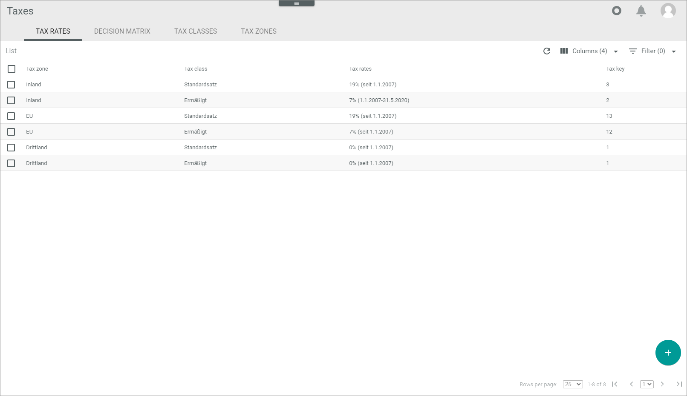
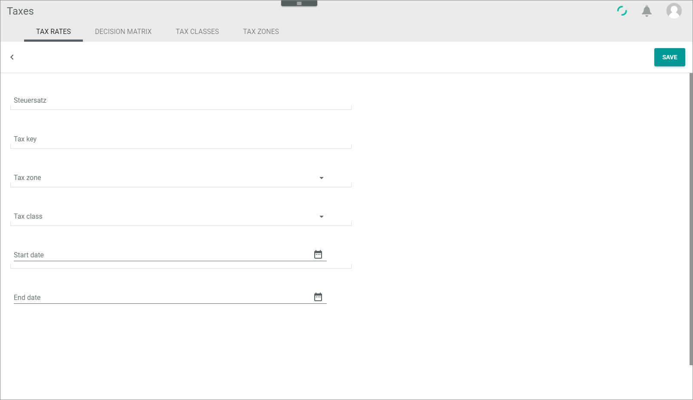
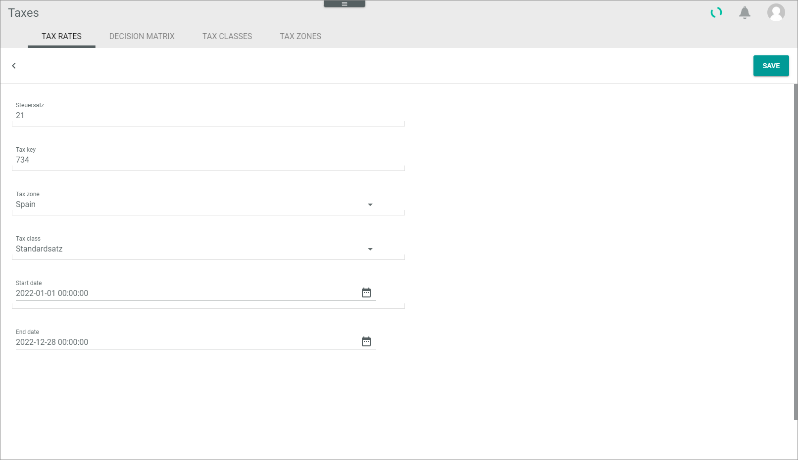

[!!Accounting](RetailSuiteAccounting)  
[!!Fakturierung](RetailSuiteFaktBase)  
[!!User Interface tax rates](../UserInterface/XX_TaxRates.md)  
[!!Manage the tax classes](./02_ManageTaxClasses.md)  
[!!Manage the tax zones](./03_ManageTaxZones.md)  

# Manage the tax rates

Generally speaking, a tax rate is the percentage to which a product is taxed and depends on the product type (tax class) and the territory where it is to be taxed (tax zone). The *Taxes* module allows to configure different tax rates according to a combination of tax class and tax zone.

The *Taxes* module provides the *Invoicing* module with the appropriate tax rate to be applied to a particular order. Taking into account the details available in the order confirmation and the delivery note, the system decision matrix determines the tax zone to be applied, which is in turn needed to define the applicable tax rate. For detailed information, see [Manage the decision matrix](./Operation/01_ManageDecisionMatrix.md).

The *TAX RATES* tab displays a list of all available tax rates. The default configuration covers all standard cases for a company based in Germany delivering within the European Union. New tax rates can be added to adapt the system to the customer's needs, also dealing with special tax regimes within or outside the European Union.

## Create a tax rate

Create a new tax rate to cover a specific tax regime.

#### Prerequisites  

- An applicable tax class is created, see [Create a tax class](./02_ManageTaxClasses.md#create-a-tax-class).
- An applicable tax zone is created, see [Create a tax zone](./02_ManageTaxZones.md#create-a-tax-zone).

#### Procedures

*Taxes > Settings > Tab TAX RATES*

1. Click the  (Add) button in the bottom right corner.   
  A new data entry window is displayed.  

  

2. Enter the applicable tax rate in the *Tax rate* field.  

3. Enter the applicable tax key in the *Tax key* field. The tax keys can be checked, created, edited and deleted in the *Accounting* module, see [Manage the tax keys](../../../../RetailSuiteAccounting/Integration/02_ManageTaxKeys.md).

[comment]: <> (Check with FH why tax keys are necessary here. You can save the tax rate without tax key. Does the Taxes module interact somehow with the Accounting module? Or does it affect performance with Fakturierung, if no tax key or a wrong tax key, z.B. already in use with other tax rate/Steuersatz, is used? Or does it affect bookings/posting in Accounting?)

4. Click the *Tax zone* drop-down list and select the appropriate tax zone.

5. Click the *Tax class* drop-down list and select the appropriate tax class.  

6. Enter the applicable tax rate validity period in the *Start date* and *End date* fields. You can enter the date with the keyboard or clicking the  (Calendar) button. The date format must be YYYY.MM.DD. hh:mm:ss.

7. Click the [SAVE] button.  
The data entry window closes automatically. The new tax rate is displayed in the list.

## Edit a tax rate

Edit a tax rate to adjust any of the configured parameters.

> [Info] Editing a tax rate has far-reaching consequences for the proper functioning of the system, as the *Taxes* module interacts with the *Invoicing* and *Accounting* modules. In case of doubt, contact our customer support.

#### Prerequisites

A tax rate is created, see [Create a tax rate](#create-a-tax-rate).

#### Procedures

*Taxes > Settings > Tab TAX RATES*

1. Click the tax rate to be edited in the tax rate list.  
The data entry window is displayed.

  

2. Edit the desired data in the corresponding field(s).

  > [Info] Be aware that any changes made to an existing tax rate will overwrite the previously configured values.

3. Click the [SAVE] button.  
The data entry window closes automatically. The edited tax rate is displayed in the list.

  > [Info] It may be necessary to refresh the list view to display the changes made. To do so, click the  (Refresh) button in the upper right corner.

## Delete a tax rate

Delete a tax rate that is no longer applicable.

> [Warning] Be aware that any deletion is permanent and cannot be undone.

#### Prerequisites

A tax rate is created, see [Create a tax rate](#create-a-tax-rate).

#### Procedures

*Taxes > Settings > Tab TAX RATES*

1. Select the tax rate to be deleted by clicking the checkbox on the left.  
The editing toolbar is displayed.

  > [Warning] Be aware that the existing tax rate will be deleted permanently.

2. Click the [DELETE] button in the upper right corner.  
The selected tax rate is deleted.

[comment]: <> (28.07.22 - DELETE Button not working. Bug reported.)
