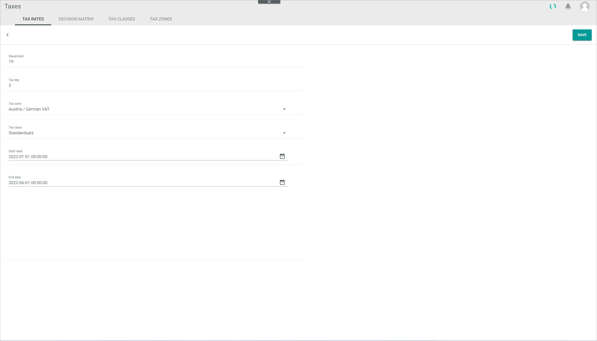

[!!Accounting](../../RetailSuiteAccounting/Overview/01_General.md)
[!!User Interface Tax rates](../UserInterface/01a_TaxRates.md)
[!!Manage the tax classes](./02_ManageTaxClasses.md)
[!!Manage the tax zones](./03_ManageTaxZones.md)

# Manage the tax rates

Generally speaking, a tax rate is the percentage to which a product is taxed and depends on the product type (tax class) and the territory where it is to be taxed (tax zone). The *Taxes* module allows to configure different tax rates according to a combination of tax class and tax zone as well as rules to determine the tax zone given on specific criterias.

Tax rates can be created, edited and deleted to adapt the automatic taxation feature to the customer's specific and changing needs.

## Create a tax rate

Create a tax rate to cover a specific tax regime.

#### Prerequisites  

- An applicable tax class has been created, see [Create a tax class](./02_ManageTaxClasses.md#create-a-tax-class).
- An applicable tax zone has been created, see [Create a tax zone](./03_ManageTaxZones.md#create-a-tax-zone).

#### Procedures

*Taxes > Settings > Tab TAX RATES*

1. Click the  (Add) button in the bottom right corner.   
  The *Create tax rate* view is displayed.  

  

2. Enter the desired tax rate in the *Tax rate* field. The tax rate is entered as a percentage. You can only enter numbers in the *Tax rate* field.

3. Enter the corresponding tax key in the *Tax key* field. The applicable tax key must be checked in the *TAX KEYS* tab of the *Accounting* module. For detailed information, see [Manage the tax keys](../../RetailSuiteAccounting/Integration/02_ManageTaxKeys.md).

  > [Info] The tax rate linked to the tax key must also be checked for validity and updated if necessary. Choosing the right tax key, and with the valid tax rate, is essential for the automatic posting function in the *Accounting* module, as the *Taxes* module provides the *Order management* module with the configured tax key, which in turn is used by the *Order management* module to post the transaction in the *Accounting* module.

4. Click the *Tax zone* drop-down list and select the appropriate tax zone. All available tax zones are displayed in the list.

5. Click the *Tax class* drop-down list and select the appropriate tax class. All available tax classes are displayed in the list.

6. Click the  (Calendar) button to enter the applicable validity period start date in the *Start date* field.

  > [Info] The validity period start date of a new tax rate cannot be earlier than the start date of an existing tax rate with same tax class and tax zone. Otherwise, an error message is displayed and the new tax rate is rejected.

7. If desired, click the  (Calendar) button to enter the applicable validity period end date in the *End date* field.

  > [Info] If no end date is entered, the tax rate continues to be valid for an unspecified period of time.

8. Click the [SAVE] button.  
  The *Create tax rate* view is closed and the list of tax rates is displayed again.  

9. Click the  (Refresh) button in the upper right corner.   
  The new tax rate is displayed in the list of tax rates.

  > [Info] If a new tax rate is created with the same tax class and tax zone as an existing tax rate, and its start date lies after the start date of the existing one, the existing tax rate end date is set up automatically before the start date of the new one.

## Edit a tax rate

Edit a tax rate to adjust any of the configured parameters.

> [Info] Editing a tax rate has far-reaching consequences for the proper functioning of the system, as the *Taxes* module interacts with the *Order management* and *Accounting* modules.

#### Prerequisites

A tax rate has been created, see [Create a tax rate](#create-a-tax-rate).

#### Procedures

*Taxes > Settings > Tab TAX RATES*

1. Click the tax rate to be edited in the list of tax rates.  
  The *Edit tax rate* view is displayed.

  

2. Edit the desired data in the corresponding field(s).

  > [Info] Be aware that any changes made to an existing tax rate will overwrite the previously configured values.

3. Click the [SAVE] button.  
  The *Edit tax rate* view is closed and the list of tax rates is displayed again.  

4. Click the  (Refresh) button in the upper right corner.   
  The edited tax rate is displayed in the list of tax rates.

## Delete a tax rate

Delete a tax rate that is no longer applicable.

> [Caution] Be aware that any deletion is permanent and cannot be undone.

#### Prerequisites

A tax rate has been created, see [Create a tax rate](#create-a-tax-rate).

#### Procedures

*Taxes > Settings > Tab TAX RATES*

1. Select the checkbox of the tax rate to be deleted.  
  The editing toolbar is displayed.

  > [Caution] Be aware that the existing tax rate will be deleted permanently.

2. Click the [DELETE] button in the upper right corner.  
  The selected tax rate has been deleted.

3. Click the  (Refresh) button in the upper right corner.   
  The deleted tax rate is removed from the list of tax rates.

[comment]: <> (19.09.22 - DELETE Button not working. Bug reported. Check again when fixed if Refresh button is needed here.)

## Define the tax rates for delivery thresholds

Define the necessary tax rates to include tax delivery thresholds in the system configuration.

> [Info] Since July 2021, a new EU-wide threshold of EUR 10,000 has applied. As soon as this threshold has been reached, all products must be taxed in the ship-to (delivery) country to the corresponding delivery country tax rate. For detailed information about the new cross-border taxation rules, see [VAT - One Stop Shop](https://vat-one-stop-shop.ec.europa.eu/index_en) or consult a tax advisor.

### Create a tax rate with the applicable delivery country VAT

Create a specific tax rate with the applicable foreign VAT for each country where you deliver products to.

#### Prerequisites

- All applicable tax classes have been created, see [Create a tax class](./02_ManageTaxClasses.md#create-a-tax-class).
- All applicable tax zones have been created, see [Create a tax zone](./03_ManageTaxZones.md#create-a-tax-zone).

#### Procedures

*Taxes > Settings > Tab TAX RATES*

1. Click the  (Add) button in the bottom right corner.   
  The *Create tax rate* view is displayed.  

  

2. Enter the applicable delivery country VAT rate in the *Tax rate* field, for example **20** in the case of Austria. You can only enter numbers in the *Tax rate* field.

3. Enter the corresponding tax key in the *Tax key* field, for example **751** for Austria. The applicable tax key must be checked in the *TAX KEYS* tab of the *Accounting* module. For detailed information, see [Manage the tax keys](../../RetailSuiteAccounting/Integration/02_ManageTaxKeys.md).

4. Click the *Tax zone* drop-down list and select the appropriate tax zone, for example **Austria/Austrian VAT**. All available tax zones are displayed in the list.

5. Click the *Tax class* drop-down list and select the appropriate tax class. All available tax classes are displayed in the list.

6. Click the  (Calendar) button in the *Start date* field to enter the applicable validity period start date.

  > [Info] The start date must be set at the time when the tax delivery threshold has been reached, since, as of this date, all revenues on products sold to any EU country must be taxed to the delivery country VAT rate. The start date can be set in the future.

7. Click the  (Calendar) button in the *End date* field to enter the applicable validity period end date, for example the end of the current fiscal year. The described example setting is displayed below:

  

8. Click the [SAVE] button.  
  The *Create tax rate* view is closed and the list of tax rates is displayed again.  

9. Click the  (Refresh) button in the upper right corner.   
  The new tax rate is displayed in the list of tax rates.

### Create a tax rate with the applicable domestic VAT

Create a specific tax rate with the applicable domestic VAT for each country where you deliver products to.

#### Prerequisites

- All applicable tax classes have been created, see [Create a tax class](./02_ManageTaxClasses.md#create-a-tax-class).
- All applicable tax zones have been created, see [Create a tax zone](./03_ManageTaxZones.md#create-a-tax-zone).

#### Procedures

*Taxes > Settings > Tab TAX RATES*

1. Click the  (Add) button in the bottom right corner.   
  The *Create tax rate* view is displayed.  

  

2. Enter the applicable delivery country VAT rate in the *Tax rate* field, for example **19** in the case of Germany. You can only enter numbers in the *Tax rate* field.

  > [Info] The first EUR 10,000 revenues on products sold from Germany to any EU country are taxable in Germany.

3. Enter the corresponding tax key in the *Tax key* field, for example **3** for Germany. The applicable tax key must be checked in the *TAX KEYS* tab of the *Accounting* module. For detailed information, see [Manage the tax keys](../../RetailSuiteAccounting/Integration/02_ManageTaxKeys.md).

4. Click the *Tax zone* drop-down list and select the appropriate tax zone, for example **Austria/German VAT**. All available tax zones are displayed in the list.

5. Click the *Tax class* drop-down list and select the appropriate tax class. All available tax classes are displayed in the list.

6. Click the  (Calendar) button in the *Start date* field to enter the applicable validity period start date. The start date must be set at the start of a fiscal year.

7. Click the  (Calendar) button in the *End date* field to enter the applicable validity period end date. The domestic VAT rate must be valid until the delivery country VAT rate validity period starts. The described example setting is displayed below:

  

8. Click the [SAVE] button.  
  The *Create tax rate* view is closed and the list of tax rates is displayed again.  

9. Click the  (Refresh) button in the upper right corner.   
  The new tax rate is displayed in the list of tax rates.

> [Info] Repeat steps **1** to **9** of the *Create a tax rate with the applicable delivery country VAT* and the *Create a tax rate with the applicable domestic VAT* procedure to create the applicable tax rates for all relevant countries.  
