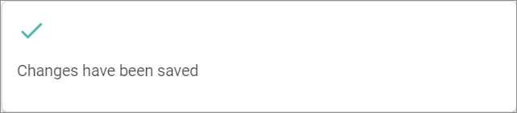

[!!Accounting](RetailSuiteAccounting)  
[!!User Interface Tax classes](../UserInterface/01c_TaxClasses.md)  
[!!Manage the tax rates](./01_ManageTaxRates.md)  

# Manage the tax classes

A tax class is assigned to each product or group of products. The tax class is determined by the competent tax authorities of the territory where the product or group of products is to be taxed. Therefore it usually differs from territory to territory.

There are two main tax classes in most territories: the standard and the reduced tax rate class. However, there can also be special taxes, such as super-reduced or zero taxes. Tax classes can be created, edited and deleted if necessary.

## Create a tax class

Create a tax class to be assigned to a product or group of products.

#### Prerequisites  

No prerequisites to fulfill.

#### Procedures

*Taxes > Settings > Tab TAX CLASSES*

1. Click the  (Add) button in the upper left corner.   
A new data entry line is displayed.  

2. Enter the desired tax class name in the entry line.  

3. Click the [SAVE] button.  
The tax class has been saved.

4. Press **F5** to initialize the *Core1 Platform* and to apply the changes.   
The new tax class is displayed in the list of tax classes.

[comment]: <> (By creating a tax class, SAVE does NOT show the confirmation message. For changes to be displayed in the drop-down list in TAX RATES, the whole module must be refreshed with F5. Refresh icon does not work in this case, i.e. no changes in the drop-down list Tax class are displayed. Stand 08.08.22)

## Edit a tax class

Edit a tax class to modify its name.

#### Prerequisites

A tax class is created, see [Create a tax class](#create-a-tax-class).

#### Procedures

*Taxes > Settings > Tab TAX CLASSES*

1. Click the desired tax class field and enter a new name.  

2. Click the [SAVE] button.  
  The changes have been saved. The *Changes have been saved* pop-up window is displayed.

  

3. Press **F5** to initialize the *Core1 Platform* and to apply the changes.  
The renamed tax class is displayed in the list of tax classes.

[comment]: <> (By editing a tax class, SAVE does show the confirmation message. For changes to be displayed in the drop-down list in TAX RATES, the whole module must be refreshed with F5. Refresh icon does not work in this case, i.e. no changes in the drop-down list Tax class are displayed. Stand 08.08.22)

## Delete a tax class

Delete a tax class that is no longer applicable.  

> [Warning] Be aware that any deletion is permanent and cannot be undone. Bear in mind that the deletion may have far-reaching consequences for the proper functioning of the system, as the *Taxes* module interacts with the *Invoicing* and *Accounting* modules.

#### Prerequisites

A tax class is created, see [Create a tax class](#create-a-tax-class).

#### Procedures

*Taxes > Settings > Tab TAX CLASSES*

1. Click the  (Delete) button next to the tax class to be deleted.  
  The tax class has been removed from the list.

2. Click the [SAVE] button.  
  The tax class has been deleted. The *Changes have been saved* pop-up window is displayed.

  

3. Press **F5** to initialize the *Core1 Platform* and to apply the changes.  
The deleted tax class is no longer displayed in the list of tax classes.  

[comment]: <> (By deleting a tax class, SAVE does show the confirmation message. For changes to be displayed in the drop-down list in TAX RATES, the whole module must be refreshed with F5. Refresh icon does not work in this case, i.e. no changes in the drop-down list Tax class are displayed. Stand 08.08.22)
