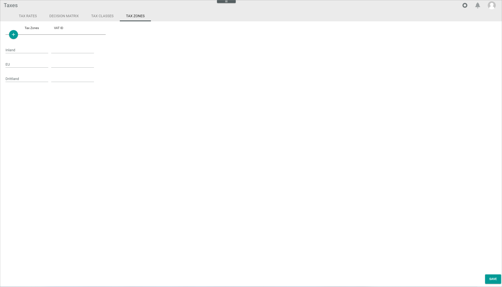
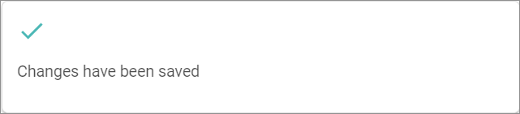
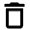

[!!Accounting](../../RetailSuiteAccounting/Overview/01_General.md)
[!!User interface Tax zones](../UserInterface/01d_TaxZones.md)
[!!Manage the tax rates](./01_ManageTaxRates.md)
[!!Manage the tax classes](./02_ManageTaxClasses.md)
[!!Manage the decision matrix](../Operation/01_ManageDecisionMatrix.md)

# Manage the tax zones

Tax zones are essential to determine where a specific tax rate is to be applied. The applicable tax zone depends on several factors, such as the country where the selling company is based, the country where the product is shipped from, and the country where the product is shipped to. The *Decision matrix* consists of a list of rules to determine the applicable tax zone.

The default configuration includes three tax zones:
- Domestic, that is, where the selling company is based
- EU (European Union)  
- Third country, that is, any territory other than the two specified above  

Next to the configured tax zone, a VAT ID (value-added-tax identification number) can be added. The VAT ID number is an identifier used by companies operating in the European Union for value-added-tax purposes. VAT ID numbers can be verified at the EU's [VIES](https://ec.europa.eu/taxation_customs/vies/) (VAT Information Exchange System) official website.

In case of multiple legal entities in different countries the VAT ID field can be used to determine which VAT ID will be printed on the documents depending on the relevant tax zone.

Tax zones can be created, edited and deleted to configure the automatic taxation feature according to the customer's business needs.

## Create a tax zone

Create a tax zone to define a territory where a specific tax rate is to be applied.

#### Prerequisites  

No prerequisites to fulfill.

#### Procedures

*Taxes > Settings > Tab TAX ZONES*

1. Click the  (Add) button in the upper left corner.   
  A new data input line with two fields is displayed.  

2. Enter the desired tax zone name in the field in the *Tax zones* column.  

3. Enter the relevant VAT ID number in the field in the *VAT ID* column.  

  > [Info] The VAT ID refers to the seller's VAT ID number, which will be printed on the relevant order-related documents.

4. Click the [SAVE] button.  
  The changes have been saved. The *Changes have been saved* pop-up window is displayed.

  

5. Press the **F5** key to initialize the *Core1 Platform* and to apply the changes.   
  The new tax zone is displayed in the list of tax zones.

## Edit a tax zone

Edit a tax zone name or its configured VAT ID number.

#### Prerequisites

A tax zone has been created, see [Create a tax zone](#create-a-tax-zone).

#### Procedures

*Taxes > Settings > Tab TAX ZONES*

1. If desired, click the field in the *Tax zone* column and enter a new tax zone name.

2. If desired, click the field in the *VAT ID* column and enter a new VAT ID.

3. Click the [SAVE] button.  
  The changes have been saved and are displayed in the list of tax zones. The *Changes have been saved* pop-up window is displayed.

  

4. Press the **F5** key to initialize the *Core1 Platform* and to apply the changes.  
  The edited tax zone is displayed in the list of tax rates.

## Delete a tax zone

Delete a tax zone that is no longer applicable.  

> [Caution] Be aware that any deletion is permanent and cannot be undone. Besides, a deletion may have far-reaching consequences for the proper functioning of the system, as the *Taxes* module interacts with the *Order management* module and, indirectly, with the *Accounting* module.

#### Prerequisites

A tax zone has been created, see [Create a tax zone](#create-a-tax-zone).

#### Procedures

*Taxes > Settings > Tab TAX ZONES*

1. Click the  (Delete) button next to the tax zone to be deleted.  
  The tax zone is removed from the list.

3. Click the [SAVE] button.  
  The tax zone has been deleted. The *Changes have been saved* pop-up window is displayed.

  

4. Press the **F5** key to initialize the *Core1 Platform* and to apply the changes.  
  The deleted tax zone is no longer displayed in the list of tax rates.
