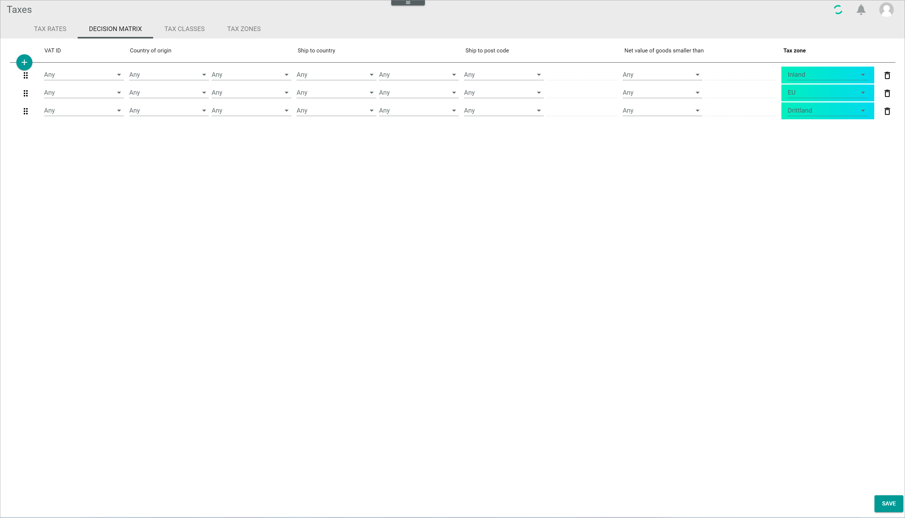
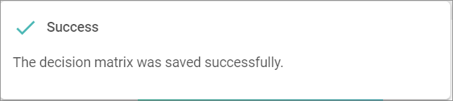

[!!Accounting](RetailSuiteAccounting)  
[!!Fakturierung](RetailSuiteFaktBase)  
[!!User Interface Decision matrix](../UserInterface/01b_DecisionMatrix.md)  
[!!Manage the tax rates](../Integration/01_ManageTaxRates.md)  
[!!Manage the tax classes](../Integration/02_ManageTaxClasses.md)  
[!!Manage the tax zones](../Integration/03_ManageTaxZones.md)  

# Manage the decision matrix

The decision matrix is designed to help the system decide which tax zone, and therefore which tax rate, is applicable to an order. The decision matrix consists of a list of decision-making criteria based on the information provided by the *Invoicing* module.

Taking into account the order confirmation and the delivery note, the *Invoicing* module provides the *Taxes* module with the following details: country of origin, ship-to country, ship-to postcode, and VAT ID. Using this information, the decision matrix is able to determine the tax zone. Once the tax zone has been determined, the *Taxes* module can provide the *Invoicing* module with this information, as well as with the applicable tax key and tax rate.  

The correct order of the decision-making criteria is crucial, as the system goes through the criteria in the order they are listed, starting from the top, and stops checking them as soon as a matching criterion is found. This means, that the criteria must be organized from specific to general to cover all possible relevant cases.

## Create an entry

Create an entry to define a new tax zone.

#### Prerequisites  

- An applicable tax class is created, see [Create a tax class](../Integration/02_ManageTaxClasses.md#create-a-tax-class).
- An applicable tax zone is created, see [Create a tax zone](../Integration/03_ManageTaxZones.md#create-a-tax-zone).

#### Procedures

*Taxes > Settings > Tab DECISION MATRIX*

1. Click the  (Add) button in the upper left corner.   
  A new data entry line is displayed.

2. Click the *VAT ID* drop-down list and select the appropriate option. The following options are available:

  - **Yes**: The end customer is a company and, therefore, has a VAT ID number (business-to-business transaction).
  - **No**: The end customer is a private individual and, therefore, has no VAT ID number (business-to-customer transaction).
  - **Any**: Wildcard; any value is accepted.

3. Click the *Country of origin* drop-down list(s) and select the appropriate option(s). Use the drop-down list on the left to select a group of countries and the one on the right to select an individual country.

  > [Info] The current version only provides the option **EU - European Union** as a group of countries. When a group of countries is selected, the drop-down list on the right is grayed out.

4. Click the *Ship-to country* drop-down list(s) and select the appropriate option(s). Use the drop-down list on the left to select a group of countries and the one on the right to select an individual country.

  > [Info] The current version only provides the option **EU - European Union** as a group of countries. When a group of countries is selected, the drop-down list on the right is grayed out.

5. Click the *Ship-to postcode* drop-down list and select the appropriate option. The following options are available:

  - **Range**: Enter a postcode range, for example, 27498-27498 to limit the criterion to a specific target area.
  - **Regex**: Use regular expressions to specify postcodes containing alphanumeric characters, for example /^BT.*/.  

  > [Info] There are many regular expressions testing tools available free of charge in the Internet, such as [Regex101](https://regex101.com/).

  For detailed information about this function, see [Define tax exceptions on ZIP code level](#define-tax-exceptions-on-ZIP-code-level).

6. Click the *Net value of goods smaller than* drop-down list and select the applicable currency. If necessary, specify an amount using the keyboard or the increase and decrease arrows on the right.

7. Click the *Tax zone* drop-down list and select the applicable tax zone.

8. Click the [SAVE] button.  
A pop-up window confirms that the decision matrix has been saved. The new entry has been saved.

  

## Edit an entry

Edit an entry to modify any of the configured parameters or to change its position in the decision matrix.

#### Prerequisites  

An entry in the decision matrix is created, see [Create an entry](#create-an-entry).

#### Procedures

*Taxes > Settings > Tab DECISION MATRIX*

1. Click the drop-down list to be edited.  
The selected field becomes active and the corresponding drop-down list is displayed.

2. Select a different option from the drop-down list.  
The newly selected option is displayed in the field.

3. If an option from a drop-down list is already selected, click the selected option again to deselect it.  
The option **Any** (wildcard) is displayed in the field.

4. Click the *Ship-to postcode* drop-down list on the left to select a different option, if necessary, and/or the field on the right to modify the range or the regular expression. Use the keyboard to enter a different value.

5. Click the *Net value of goods smaller than* drop-down list on the left to select a different currency, if necessary, and/or the field on the right to modify the net value amount entered. You can use the keyboard or the increase and decrease arrows.

6. Click the *Tax zone* drop-down list to select a different applicable tax zone.

7. To modify the entry position in the matrix, click the  (Drag) button to the left of the entry line, move the entry to a different position with the left mouse button pressed and drop it in the desired position by releasing the mouse button.   

  > [Info] It is important to remember that the correct order of the decision-making criteria is crucial, as the system goes through the criteria in the order they are listed.

8. Click the [SAVE] button.  
A pop-up window confirms that the decision matrix has been saved. The edited entry has been saved.

  

## Delete an entry

Delete a entry that is no longer applicable.  

> [Warning] Be aware that any deletion is permanent and cannot be undone.

#### Prerequisites  

An entry in the decision matrix is created, see [Create an entry](#create-an-entry).

#### Procedures

*Taxes > Settings > Tab DECISION MATRIX*

1. Select the entry you want to delete.

  > [Warning] Be aware that the deletion may have far-reaching consequences for the proper functioning of the system, as the *Taxes* module interacts with the *Invoicing* and *Accounting* modules. In case of doubt, contact our customer support.

2. Click the  (Delete) button to the right of the entry to be deleted.  
  The entry is deleted from the list.

3. Click the [SAVE] button.  
A pop-up window confirms that the decision matrix has been saved.  

  

## Define a tax delivery threshold

As of July 2021, a new taxation system for cross-border business-to-customer transactions performed by online retailers within the UE applies. The previous tax delivery thresholds that were individually determined by each EU member state have been replaced by a new EU-wide threshold of 10,000 EUR.

As soon as the new EU-wide threshold of 10,000 EUR has been reached, the product must be taxed in the ship-to (delivery) country to the corresponding delivery country tax rate. A special case are companies having fulfillment centers in different EU countries, that is, shipping their products from a country other than the country where the company is based.

For detailed information about the new cross-border taxation rules, see [VAT - One Stop Shop](https://vat-one-stop-shop.ec.europa.eu/index_en) or consult a tax advisor.

Important aspects to take into account:

- 10,000 EUR/year threshold (online sales in all countries in total)
- from 10,000 EUR on, sales are taxable in the ship-to country
- 26 possible ship-to countries:
  - different tax rates and tax classes in the different EU member states
  - in some of them, different currency, therefore beware of exchange rate

[comment]: <> (Work in progress! RS FH)
[comment]: <> (RS FH -> Unterschiedliche Währungen -> Folgen für unser System/Einstellen von Lieferschwellen / Decision matrix?)

The different tax scenarios can be configured using the decision matrix.

#### Prerequisites  

- An applicable tax class is created, see [Create a tax class](../Integration/02_ManageTaxClasses.md#create-a-tax-class).
- An applicable tax zone is created, see [Create a tax zone](../Integration/03_ManageTaxZones.md#create-a-tax-zone).

#### Procedures

*Taxes > Settings > Tab DECISION MATRIX*

1. Click the  (Add) button in the upper left corner.   
  A new data entry line is displayed.

2. Click the *VAT ID* drop-down list and select **No**, as the end customer must be a private individual.

3. Click the *Country of origin* drop-down list on the left to select **Any**, and the drop-down list on the right to select the country where the product is shipped from.

  > [Info] The country of origin can be the country where the dealer is based or where the dealer's fulfillment center is located, which may or may not coincide with the dealer country.

4. Click the *Ship-to country* drop-down list on the left to select **Any**, and the drop-down list on the right to select the country where the product is to be shipped to.  

  > [Info] The ship-to country continues to be relevant in the new taxation system, as any sales revenues exceeding the 10,000 EUR threshold must be taxed to the tax rate applicable in the ship-to country.

5. Click the *Ship-to postcode* drop-down list and select the appropriate option. For detailed information, see [Define tax exceptions on ZIP code level](#define-tax-exceptions-on-ZIP-code-level).

  > [Info] This function can be used to define, for example, the special tax regime of Northern Ireland in relation to the EU after Brexit.

[comment]: <> (Ship-to country Drop-down-Menü hat Noridland als Land! Wieso? Und warum denn der Ship-to postcode Drop-down-Menü? Anderes Beispiel?)

6. Click the *Net value of goods smaller than* drop-down list and select the applicable currency.   

[comment]: <> (10 000 EUR bei Net value of goods smaller denn? Hat das überhaupt mit Lieferschwelle zu tun? Sonst wie kann man den Lieferschwelle-Wert bestimmen? Was ist, wenn die Währung GBP ist? Muss man umgerechnet eintragen oder wird vom System automatisch umgerechnet? Und wie bestimmt das System, AB WANN die Lieferschwelle überschritten ist? Vorher in Fakturierung -> Datum.)

7. Click the *Tax zone* drop-down list and select the applicable tax zone.

8. To modify the entry position in the matrix, click the  (Drag) button to the left of the entry line, move the entry the a different position with the left mouse button pressed and drop it in the desired position by releasing the mouse button.    

  > [Info] It is important to remember that the correct order of the decision-making criteria is crucial, as the system goes through the criteria in the order they are listed.

9. Click the [SAVE] button.  
A pop-up window confirms that the decision matrix has been saved. The new entry has been saved.

  

10. Repeat this procedure to configure one by one all the applicable tax scenarios depending on your business needs.

## Define tax exceptions on ZIP code level

Some areas within a territory have special tax regulations. This is the case, for example, of Helgoland in Germany or Northern Ireland in the United Kingdom.

These tax exceptions can be defined using the *Ship-to postcode* fields.

#### Prerequisites  

- An applicable tax class is created, see [Create a tax class](../Integration/02_ManageTaxClasses.md#create-a-tax-class).
- An applicable tax zone is created, see [Create a tax zone](../Integration/03_ManageTaxZones.md#create-a-tax-zone).

#### Procedures

*Taxes > Settings > Tab DECISION MATRIX*

1. Click the  (Add) button in the upper left corner.   
  A new data entry line is displayed.

2. Click the *VAT ID* drop-down list and select the appropriate option. The following options are available:

  - **Yes**: The end customer is a company and, therefore, has a VAT ID number (business-to-business transaction).
  - **No**: The end customer is a private individual and, therefore, has no VAT ID number (business-to-customer transaction).
  - **Any**: Wildcard; any value is accepted.

3. Click the *Country of origin* drop-down list(s) and select the appropriate option(s). Use the drop-down list on the left to select a group of countries and the one on the right to select an individual country.

  > {Info] The current version only provides the option **EU - European Union** as a group of countries. When a group of countries is selected, the right drop-down list is grayed out.

4. Click the *Ship-to country* drop-down lists and select **Any** on the left and the country where the product is to be shipped to on the right.  

5. Click the *Ship-to postcode* drop-down list and select the appropriate option. The following options are available:

  - **Range**: Enter a postcode range, for example, 27498-27498 to limit the criterion to a specific target area.
  - **Regex**: Use regular expressions to specify postcodes containing alphanumeric characters, for example /^BT.*/.

  > [Info] There are many regular expressions testing tools available free of charge in the Internet, such as [Regex101](https://regex101.com/).

6. Enter a postcode range or a regular expression to define a specific tax exception area in the selected country.

7. Click the *Net value of goods smaller than* drop-down list and select the applicable currency. If necessary, specify an amount using the keyboard or the increase and decrease arrows on the right.

8. Click the *Tax zone* drop-down list to select the applicable tax zone.

9. Click the [SAVE] button.  
A pop-up window confirms that the decision matrix has been saved.  

  
