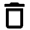

[!!Accounting](../../RetailSuiteAccounting/Overview/01_General.md)
[!!User Interface Decision matrix](../UserInterface/01b_DecisionMatrix.md)
[!!Manage the tax rates](../Integration/01_ManageTaxRates.md)
[!!Manage the tax classes](../Integration/02_ManageTaxClasses.md)
[!!Manage the tax zones](../Integration/03_ManageTaxZones.md)

# Manage the decision matrix

The decision matrix is designed to determine which tax zone, and therefore which tax rate, is applicable to an order. The decision matrix consists of a list of decision-making criteria based on the information provided by the *Order management* module.

Taking into account the order confirmation and the delivery note, the *Order management* module provides the *Taxes* module with the following details:
- country of origin (determined by the country of the source warehouse with fallback to the tenant country)
- ship-to country
- ship-to postcode
- VAT ID (set in case of B2B orders)   

Using this information, the decision matrix is able to determine the tax zone. Once the tax zone has been determined, the *Taxes* module can provide the *Order management* module with this information, as well as with the applicable tax key and tax rate.  

The correct order of the decision-making criteria is crucial, as the system goes through the criteria in the order they are listed, starting from the top, and stops checking them as soon as a matching criterion is found.
This means, that the criteria must be organized from specific to general to cover all possible relevant cases.

## Create an entry

Create an entry to determine a new tax zone.

#### Prerequisites  

- An applicable tax class has been created, see [Create a tax class](../Integration/02_ManageTaxClasses.md#create-a-tax-class).
- An applicable tax zone has been created, see [Create a tax zone](../Integration/03_ManageTaxZones.md#create-a-tax-zone).
- An applicable tax rate has been created, see [Create a tax rate](../Integration/01_ManageTaxRates.md#create-a-tax-rate).

#### Procedures

*Taxes > Settings > Tab DECISION MATRIX*

1. Click the  (Add) button in the upper left corner.   
  A new data input line is displayed.

2. Click the *VAT ID* drop-down list and select the appropriate option. In this case, the VAT ID refers to the buyer's VAT ID number. The following options are available:
  - **Yes**  
    Select this option if the customer is a company and, therefore, has a VAT ID number (B2B transaction).
  - **No**  
    Select this option if the customer is a private individual and, therefore, has no VAT ID number (B2C transaction).

3. Click the *Country of origin* drop-down list and select the appropriate option. Use the drop-down list on the left to select a group of countries or the one on the right to select an individual country. As a group of countries, only the **EU - European Union** option is available. In the drop-down list of individual countries, all available countries in the system are displayed. When a group of countries is selected, the drop-down list on the right is locked.

4. Click the *Ship-to country* drop-down list and select the appropriate option. Use the drop-down list on the left to select a group of countries or the one on the right to select an individual country. As a group of countries, only the **EU - European Union** option is available. In the drop-down list of individual countries, all available countries in the system are displayed. When a group of countries is selected, the drop-down list on the right is locked.

5. If necessary, click the *Ship-to postcode* drop-down list and select the appropriate option. The following options are available:
  - **Range**  
    Select this option to specify a numeric postcode range, for example 27498 or 52001-52006.
  - **Regex**  
    Select this option to specify a postcode containing alphanumeric characters with regular expressions, for example /^BT.*/ in case of Northern Ireland. The site https://regex101.com/ can be useful to test regular expressions.  

  The field to the right of the *Ship-to postcode* drop-down list is unlocked.

  > [Info] This feature can be used to define special tax regimes within a territory, such as that of Northern Ireland in the United Kingdom or Helgoland in Germany. For detailed information, see [Define tax exceptions on ZIP code level](#define-tax-exceptions-on-ZIP-code-level).

6. Enter the applicable postcode range or regular expression in the unlocked field on the right of the *Ship-to postcode* drop-down list.

7. If necessary, click the *Net value of goods smaller than* drop-down list and select the applicable currency. All available currencies are displayed in the list.      
  The field to the right of the *Net value of goods smaller than* drop-down list is unlocked.

8. Enter the applicable amount using the keyboard or the increase and decrease arrows in the field on the right of the *Net value of goods smaller than* drop-down list.

9. Click the *Tax zone* drop-down list and select the applicable tax zone. All available tax zones are displayed in the list.

10. Click the [SAVE] button.  
  The new tax rule has been saved. The *Success* pop-up window is displayed.

  

## Edit an entry

Edit an entry to modify any of the configured parameters.

#### Prerequisites  

An entry has been created in the decision matrix, see [Create an entry](#create-an-entry).

#### Procedures

*Taxes > Settings > Tab DECISION MATRIX*

1. Click the *VAT ID* drop-down list and select a different option, if necessary.

2. Click the *Country of origin* drop-down list on the left and deselect the selected group of countries, if necessary. As a group of countries, only the **EU - European Union** option is available. When no group of countries is selected, the drop-down list on the right is unlocked. Click the drop-down list on the right to select an individual country.

3. Click the *Ship-to county* drop-down list on the left to deselect the selected group of countries, if necessary. As a group of countries, only the **EU - European Union** option is available. When no group of countries is selected, the drop-down list on the right is unlocked. Click the drop-down list on the right to select an individual country.

4. Click the *Ship-to postcode* drop-down list on the left and select a different option, if necessary. Click the field on the right to modify the range or the regular expression entered. Use the keyboard to enter a different value.

5. If necessary, click the *Net value of goods smaller than* drop-down list on the left to select a different currency. Click the field on the right to modify the amount entered. You can use the keyboard or click the increase and decrease arrows.

6. Click the *Tax zone* drop-down list to select a different applicable tax zone.

7. Click the [SAVE] button.  
  The edited tax rule has been saved. The *Success* pop-up window is displayed

  

## Change the order of entries

Modify the position of one or more entries to organize them from specific to general and cover all possible tax scenarios.

> [Info] The correct order of the decision-making criteria is crucial, as the system goes through the criteria in the order they are listed.

#### Prerequisites  

At least two entries have been created in the decision matrix, see [Create an entry](#create-an-entry).

#### Procedures

*Taxes > Settings > Tab DECISION MATRIX*

1. Click the  (Drag) button to the left of the entry line, move the entry to a different position with the left mouse button pressed and drop it in the desired position by releasing the mouse button.   

2. Click the [SAVE] button.  
  The entry position has been saved. The *Success* pop-up window is displayed.

  

3. If necessary, repeat the steps **1** and **2** for all entries that need to be repositioned.

## Delete an entry

Delete an entry that is no longer applicable.  

> [Caution] Be aware that any deletion is permanent and cannot be undone.

#### Prerequisites  

An entry has been created in the decision matrix, see [Create an entry](#create-an-entry).

> [Caution] Be aware that the deletion may have far-reaching consequences for the proper functioning of the system, as the *Taxes* module interacts with the *Order management* and *Accounting* modules.

#### Procedures

*Taxes > Settings > Tab DECISION MATRIX*

1. Click the  (Delete) button to the right of the entry to be deleted.  
  The entry is removed from the list.

2. Click the [SAVE] button.  
  The entry has been deleted. The *Success* pop-up window is displayed.  

  

## Define a tax delivery threshold

The decision matrix can be configured to specify tax delivery thresholds in different EU countries.  

#### Prerequisites  

All applicable tax rates have been defined for delivery thresholds, see [Define the tax rates for delivery thresholds](../Integration/01_ManageTaxRates.md#define-the-tax-rates-for-delivery-thresholds).

#### Procedures

*Taxes > Settings > Tab DECISION MATRIX*

1. Click the  (Add) button in the upper left corner.   
  A new data input line is displayed.

2. Click the *VAT ID* drop-down list and select **No** in case the rule should only apply for B2C transactions.

3. Click the *Country of origin* drop-down list on the right and select the country where the product is shipped from. The *Country of origin* drop-down list on the left must remain blank (**Any**).

  > [Info] To change the selection of a drop-down list back to **Any**, reselect the already selected option in the drop-down list.

4. Click the *Ship-to country* drop-down list on the right to select the country where the product is to be shipped to. The *Ship-to country* drop-down list on the left must remain blank (**Any**).

5. If necessary, click the *Ship-to postcode* drop-down list and select the appropriate option. Specify a postcode in the unlocked field on the right of the *Ship-to postcode* drop-down list. For detailed information, see [Define tax exceptions on ZIP code level](#define-tax-exceptions-on-ZIP-code-level).

6. If necessary, click the *Net value of goods smaller than* drop-down list and select the applicable currency. Enter the applicable amount in the unlocked field on the right of the *Net value of goods smaller than* drop-down list by using the keyboard or by clicking the increase and decrease arrows on the right of the field.   

7. Click the *Tax zone* drop-down list and select the applicable tax zone. All available tax zones are displayed in the list.

8. Click the [SAVE] button.  
  The decision matrix has been saved. The **Success** pop-up window is displayed.

  

9. Repeat all steps to configure one by one all the applicable tax scenarios depending on your business needs. If it is necessary to change the position of an entry in the decision matrix, see [Change the order of entries](#change-the-order-of-entries).

> [Info] It is important to remember that the correct order of the decision-making criteria is crucial, as the system goes through the criteria in the order they are listed.

## Define tax exceptions on ZIP code level

Some areas within a territory have special tax regulations. This is the case, for example, of Helgoland in Germany or Northern Ireland in the United Kingdom.

These tax exceptions can be defined using the *Ship-to postcode* fields.

#### Prerequisites  

- An applicable tax class has been created, see [Create a tax class](../Integration/02_ManageTaxClasses.md#create-a-tax-class).
- An applicable tax zone has been created, see [Create a tax zone](../Integration/03_ManageTaxZones.md#create-a-tax-zone).
- An applicable tax rate has been created, see [Create a tax rate](../Integration/01_ManageTaxRates.md#create-a-tax-rate).

#### Procedures

*Taxes > Settings > Tab DECISION MATRIX*

1. Click the  (Add) button in the upper left corner.   
  A new data input line is displayed.

2. Click the *VAT ID* drop-down list and select the appropriate option. The following options are available:
  - **Yes**  
    The customer is a company and, therefore, has a VAT ID number (B2B transaction).
  - **No**  
    The customer is a private individual and, therefore, has no VAT ID number (B2C transaction).
  - **Any**   
    To match any of the previous two cases.

3. Click the *Country of origin* drop-down list and select the appropriate option. Use the drop-down list on the left to select a group of countries or the one on the right to select an individual country. As a group of countries, only the **EU - European Union** option is available. In the drop-down list of individual countries, all available countries in the system are displayed. When a group of countries is selected, the drop-down list on the right is locked.

4. Click the *Ship-to country* drop-down list on the right to select the country where the product is to be shipped to. The *Ship-to country* drop-down list on the left must remain blank (**Any**).

  > [Info] To change the selection of a drop-down list back to **Any**, reselect the already selected option in the drop-down list.  

5. Click the *Ship-to postcode* drop-down list and select the appropriate option. The following options are available:
  - **Range**  
    Select this option to specify a numeric postcode range, for example 27498 or 52001-52006.
  - **Regex**  
    Select this option to specify a postcode containing alphanumeric characters with regular expressions, for example /^BT.*/. For detailed information about regular expressions, see https://regex101.com/.

6. Enter a postcode range or a regular expression to define a specific tax exception area in the selected country.

7. If necessary, click the *Net value of goods smaller than* drop-down list and select the applicable currency. Enter the applicable amount in the unlocked field on the right of the *Net value of goods smaller than* drop-down list by using the keyboard or by clicking the increase and decrease arrows on the right of the field.

8. Click the *Tax zone* drop-down list to select the applicable tax zone.

9. Click the [SAVE] button.  
  The decision matrix has been saved. The **Success** pop-up window is displayed.

  
