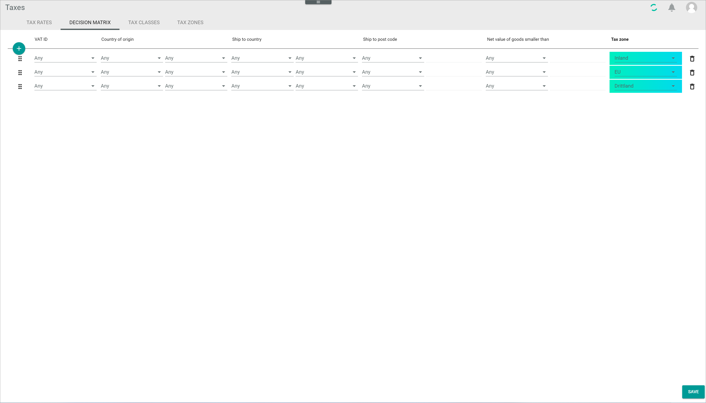

[!!Manage the decision matrix](../Operation/01_ManageDecisionMatrix.md)
[!!Manage the tax zones](../Integration/03_ManageTaxZones.md)

# Decision matrix

*Taxes > Settings > Tab DECISION MATRIX*

-  (Add)   
    Click this button to create an entry. A new input line is displayed. For detailed information, see [Create an entry](../Operation/01_ManageDecisionMatrix.md#create-an-entry).

-  (Drag)  
    Click this button to move the entry to a different position with the left mouse button pressed. Drop it in the desired position by releasing the mouse button. For detailed information, see [Change the order of entries](../Operation/01_ManageDecisionMatrix.md#change-the-order-of-entries).

**VAT ID**

- VAT ID  
    Value-added tax identification number. In this case, the VAT ID refers to the buyer's VAT ID number.   
  Click the drop-down list to select the appropriate option. The following options are available:
    - **No**  
        Select this option if the customer is a private individual and, therefore, has no VAT ID number (B2C transaction).
    - **Yes**  
        Select this option if the customer is a company and, therefore, has a VAT ID number (B2B transaction).
    - **Any**   
        To match any of the previous two cases.

    > [Info] To change the selection of a drop-down list back to **Any**, reselect the already selected option in the drop-down list.  

**Country of origin**

- Country of origin  
    Country where the product is shipped from.
    + Click the drop down-list on the left to select a group of countries. As a group of countries, only the **EU - European Union** option is available.   
    When selecting this option, the drop-down list on the right is locked. Leave it blank (**Any**) if you want to specify an individual country in the drop-down list on the right.
    + Click the drop-down list on the right to select an individual country. All available countries in the system are displayed.

    > [Info] To change the selection of a drop-down list back to **Any**, reselect the already selected option in the drop-down list.

**Ship-to country**

- Ship-to country  
    Country where the product is shipped to.
    + Click the drop down-list on the left to select a group of countries. As a group of countries, only the **EU - European Union** option is available.   
    When selecting this option, the drop-down list on the right is locked. Leave it blank (**Any**) if you want to specify an individual country. When selecting this option, the drop-down list on the right is unlocked.
    + Click the drop-down list on the right to select an individual country. All available countries in the system are displayed.

    > [Info] To change the selection of a drop-down list back to **Any**, reselect the already selected option in the drop-down list.

    For detailed information, see [Define a tax delivery threshold](../Operation/01_ManageDecisionMatrix.md#define-a-tax-delivery-threshold).

**Ship-to postcode**  

- Ship-to postcode  
    Specific area within a country or territory where the product is shipped to.   
    + Click the drop-down list and select the appropriate option. The following options are available:
        - **Range**  
            Select this option to specify a numeric postcode range, for example **27498** or **52001-52006**.
        - **Regex**  
            Select this option to specify a postcode containing alphanumeric characters with regular expressions, for example **/^BT.*/** in case of Northern Ireland.   

    The field to the right of the *Ship-to postcode* drop-down list is unlocked.  

    + Enter the applicable range or regular expression in the unlocked field on the right.
    
    For detailed information, see [Define a tax exceptions on ZIP code level](../Operation/01_ManageDecisionMatrix.md#define-tax-exceptions-on-zip-code-level).

**Net value of goods smaller than**

- Net value of goods smaller than    
    Relevant top amount for a criterion to be applied.   
    Click the drop-down list to select the applicable currency. All available currencies are displayed in the list. When selecting a currency, the field to the right of the *Net value of goods smaller than* drop-down list is unlocked. Enter a maximum net value amount in the field by using the keyboard or by clicking the increase and decrease arrows on the right of the field.

**Tax zone**

- Tax zone  
    Click the drop-down list and select the applicable tax zone. All available tax zones are displayed in the list. Additionally, the following options are available by default:
    - **Domestic**  
        Select this option if the product is to be taxed according to the country of origin, that is, the dealer country.
    - **EU**  
        Select this option if the product is to be taxed according to EU regulations.
    - **Third country**  
        Select this option if the product is to be taxed outside the EU.

-  (Delete)  
    Click this button to delete the corresponding entry.  

- [SAVE]  
    Click this button to save any changes made.
