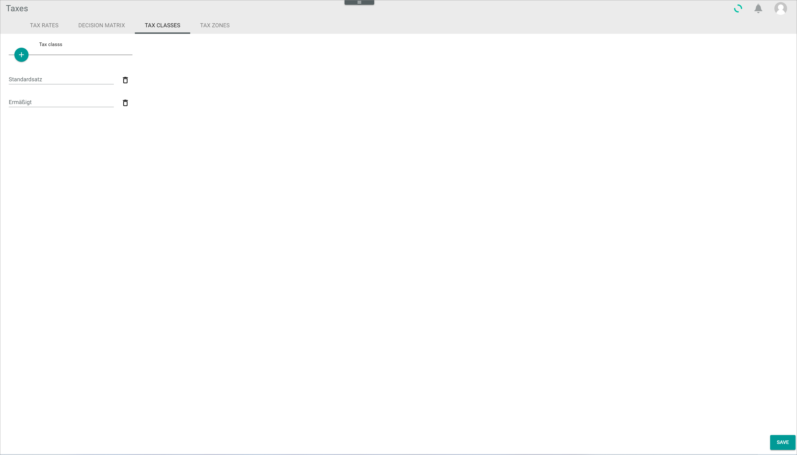

# Tax classes

*Taxes > Settings > Tab TAX CLASSES*

- *Tax classes*  
All available tax classes are listed. By default, the standard rate and the reduced rate tax class are displayed. Tax classes can be created, edited and deleted, see [Manage the tax classes](../Integration/02_ManageTaxClasses.md).

-  (Add)   
Click this button to create an entry. A new entry line is displayed.

- *Standard rate*  
Click the field to edit the tax class name.

- *Reduced rate*  
Click the field to edit the tax class name.

-  (Delete)  
Click this button to delete the corresponding entry.  

- [SAVE]  
Click this button to save any changes made.
