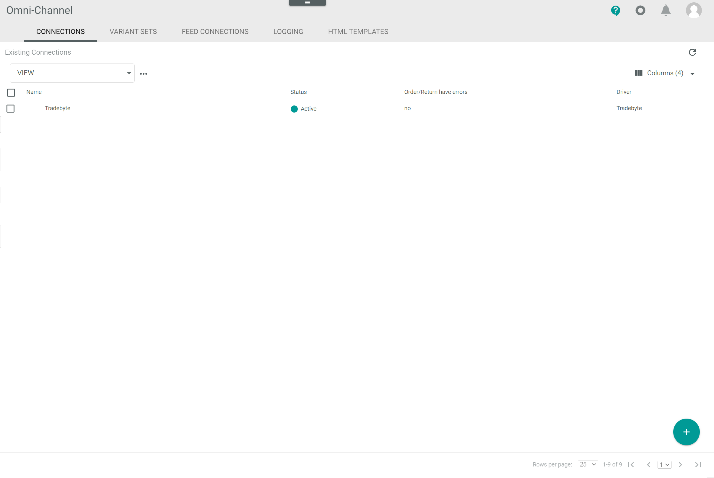

[!!User interface Connection (Tradebyte)](../UserInterface/01_Connections.md)

# Manage the Tradebyte connection

To establish a connection to a Tradebyte account, there are several particularities to consider. Therefore, the creation and the configuration of the Tradebyte connection are described in detail below.

## Create a Tradebyte connection

Create the connection to a Tradebyte account using the Tradebyte driver. Further settings can only be configured after the connection has been established.

All necessary credentials and information to establish the connection are provided by Tradebyte when an account has been created in Tradebyte.

#### Prerequisites

- A Tradebyte account has been created.
- The *Tradebyte Integration* plugin has been installed.

#### Procedure

*Omni-Channel > Settings > Tab CONNECTIONS*

1. Click the  (Add) button in the bottom right corner.    
    The *Create connection* view is displayed.

    

2. Enter a name for the connection in the *Name* field.

3. Click the *Driver* drop-down list and select the *Tradebyte* driver.  
    The *Credentials* section is displayed below the drop-down list.

    

4. Enter the merchant number in the *Merchant number* field.

5. Enter the shop name in the *Shop name* field.

6. Enter the username and the password for API access in the corresponding *Username (REST)* and *Password (REST)* fields.

7. Enter the username and the password for server access in the corresponding *Username (SFTP)* and *Password (SFTP)* fields.

8. If desired, enable the *Test API?* toggle if the API to be connected corresponds to a test account. Disable the toggle if the API to be connected corresponds to a productive account. By default, the toggle is disabled.

9. Click the [SAVE] button.  
    The *Checking credentials* notice is displayed. The connection will be established and the synchronization is triggered. The *Sync triggered* pop-up window is displayed.  

    

    The *CONNECTIONS* tab in the *Settings* menu entry of the *Omni-Channel* module is displayed when the connection has been established. The *Tradebyte* connection is displayed in the list of connections.

    	

10. If necessary, continue to configure the Tradebyte connection after the initial sync, see [Configure the Tradebyte connection](#configure-the-Tradebyte-connection).

## Configure the Tradebyte connection   

After the connection to a Tradebyte account has been established, further settings can be configured for the connection.

#### Prerequisites

A Tradebyte connection has been established and synchronized, see [Create a Tradebyte connection](#create-a-tradebyte-connection).

#### Procedure

*Omni-Channel > Settings > Tab CONNECTIONS*

1. Click the Tradebyte connection in the list of connections.   
    The *Edit connection* view is displayed. By default, the *Credentials* tab is selected.

    

2. Click the *Settings* tab.   
    The *Settings* tab is displayed. By default, the *Selected sales channels* settings are selected. 

    

3. Select the checkboxes of the sales channels you want to activate.  

4. Click the *Enable languages* menu entry in the left side bar.  
    The language settings are displayed on the right side. 

    

5. Enable the toggles of the languages you want to manage in the *Actindo Core1 Platform*. All languages available in Tradebyte are displayed.

    > [Info] The default language is automatically set and cannot be edited.

6. Click the [SAVE] button.  
    All changes have been saved. The *Saving successful* pop-up window is displayed.

    

> [Info] If the sales channels have been modified, you must synchronize the connection to update the ETL mapping, see [Synchronize a connection](../../Channels/Integration/01_ManageConnections.md#synchronize-a-connection).