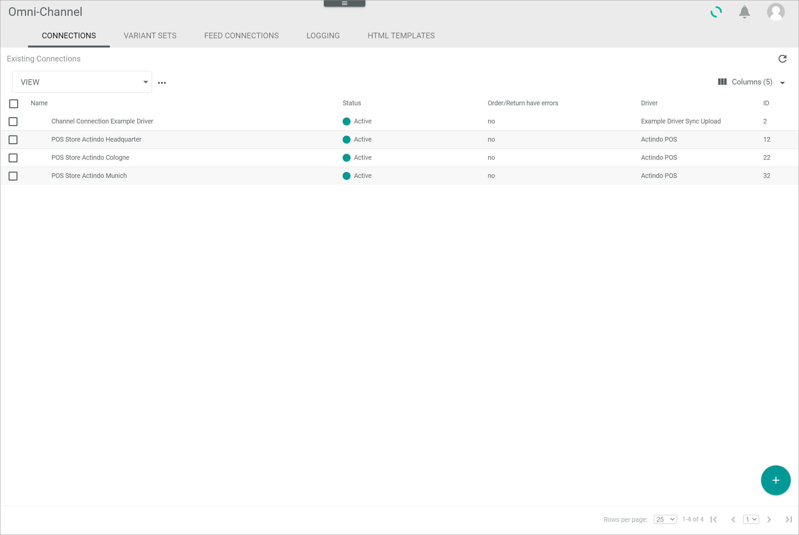
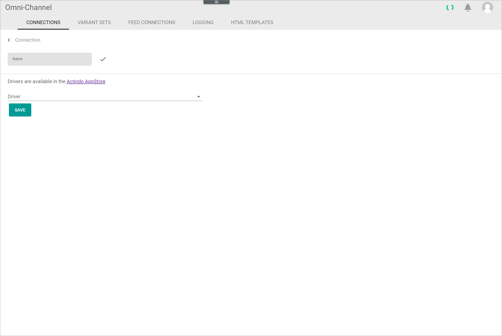
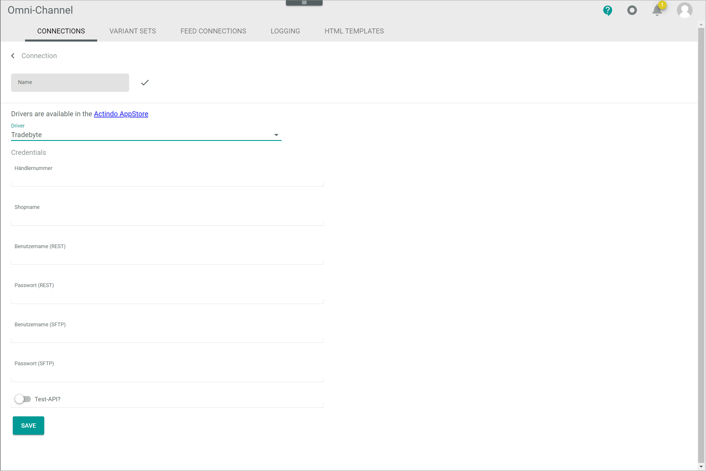
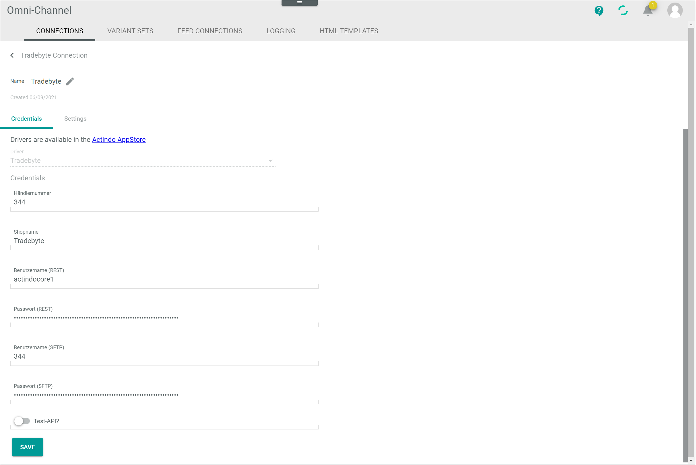
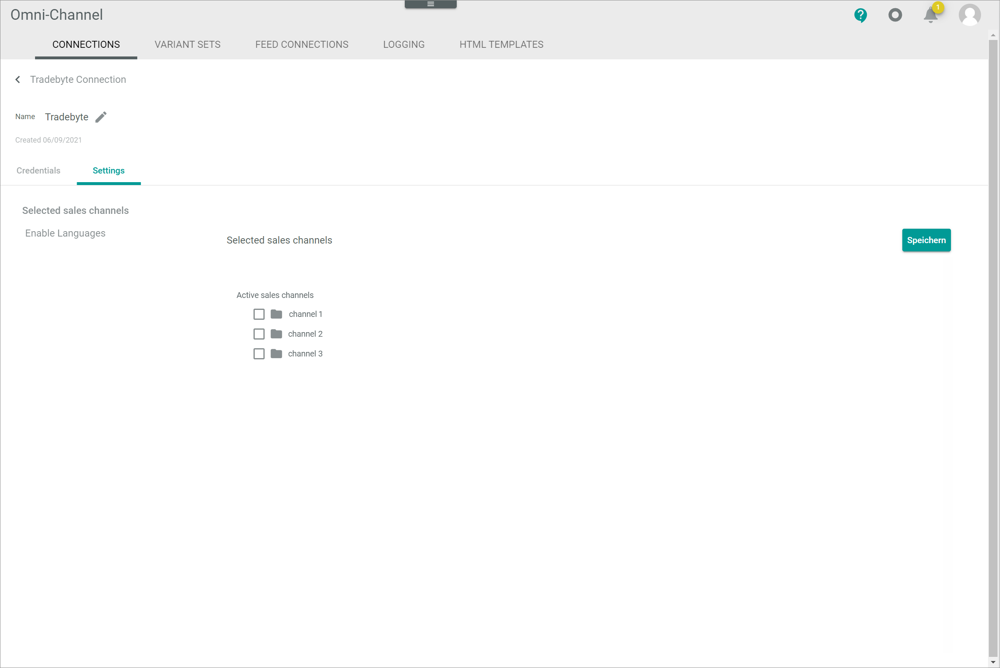

[!!Manage the Tradebyte connection](../Integration/01_ManageTradebyteConnection.md)

# Connections

*Omni-Channel > Settings > Tab CONNECTIONS*

**Connections**

-  (Refresh)   
    Click this button to update the list of connections.

- *VIEW*   
    Click the drop-down list to select the view. All created views are displayed in the drop-down list. Click the  (Points) button to the right of the *VIEW* drop-down list to display the context menu and create a view.   

    -  (Points)      
        Click this button to the right of the *VIEW* drop-down list to display the context menu. The following menu entries are available:

        -  create  
            Click this entry to create a view. The *Create view* window is displayed, see [Create view](#create-view).

        -  rename  
            Click this entry to rename the selected view. The *Rename view* window is displayed, see [Rename view](#rename-view). This menu entry is only displayed if a view has been selected.

        -  reset  
            Click this entry to reset all unsaved changes to the settings of the selected view. This menu entry is only displayed if a view has been selected and any changes have been made to the view settings.

        -  publish  
            Click this entry to publish the view. This menu entry is only displayed if a view has been selected and unpublished.

        -  unpublish  
            Click this entry to unpublish the view. This menu entry is only displayed if a view has been selected and published.

        -  save  
            Click this entry to save the current view settings in the selected view. This menu entry is only displayed if a view has been selected.

            > [Info] When the settings of a view have been changed, an asterisk is displayed next to the view name. The asterisk is hidden as soon as the changes have been saved.

        -  delete  
            Click this entry to delete the selected view. A confirmation window to confirm the deletion is displayed. This menu entry is only displayed if a view has been selected.

-  Columns (x)   
    Click this button to display the columns bar and customize the displayed columns and the order of columns in the list. The *x* indicates the number of columns that are currently displayed in the list.

- [x]     
    Select the checkbox to display the editing toolbar. If you click the checkbox in the header, all connections in the list are selected.

- [DELETE]  
    Click this button to delete the selected connection. This button is only displayed if a single checkbox in the list of connections is selected.
    
    > [Info] Deleting a connection is a very complex process and can therefore take a long time. 

- [SYNCHRONIZE]  
    Click this button to synchronize the selected connection. This button is only displayed if a single checkbox in the list of connections is selected. The *Sync triggered* pop-up window is displayed.

    

- [DISABLE]  
    Click this button to disable the selected connection(s). This button is only displayed if the checkbox of at least one active connection is selected.

- [ENABLE]  
    Click this button to enable the selected connection(s). This button is only displayed if the checkbox of at least one inactive connection is selected. 

-  (Edit)  
    Click this button to edit the selected Tradebyte connection. This button is only displayed if a single checkbox in the list of connections is selected. Alternatively, you can click directly a row in the list to edit a connection. The *Edit connection* view is displayed, see [Edit Tradebyte connection](#edit-tradebyte-connection).

The list displays all available connections. Depending on the settings, the displayed columns may vary. All fields are read-only.

- *Name*  
    Connection name.

- *Status*  
    Connection status. The following statuses are available:
    -  **Active**   
        The connection is enabled and data is being synchronized via the connection.
    -  **Inactive**   
        The connection is disabled and no data is being synchronized via the connection.   

- *Order/Return have errors*  
    Indication whether errors have occurred in orders or  returns. The following options are available:  
    - **Yes**   
        Errors have occurred.   
    - **No**   
        No errors have occurred.

- *Driver*  
    Driver name.

- *ID*  
    Connection identification number. The ID number is automatically assigned by the system.

-  (Add)  
    Click this button to add a Tradebyte connection. The *Create connection* view is displayed, see [Create Tradebyte connection](#create-tradebyte-connection).

## Create view

*Omni-Channel > Settings > Tab CONNECTIONS > Button Points > Menu entry create*

- *Name*   
    Enter a name for the view.

- [CANCEL]   
    Click this button to cancel creating a view. The *Create view* window is closed.

- [SAVE]   
    Click this button to save the new view and display it in the *VIEW* drop-down list. The *Create view* window is closed.

## Rename view

*Omni-Channel > Settings > Tab CONNECTIONS > Button Points > Menu entry rename*

- *Name*   
    Click this field to edit the view name.

- [CANCEL]   
    Click this button to cancel renaming the view. The *Rename view* window is closed.

- [SAVE]   
    Click this button to save the changes and display it in the *VIEW* drop-down list. The *Rename view* window is closed.

## Create Tradebyte connection

*Omni-Channel > Settings > Tab CONNECTIONS > Button Add*

-  (Back)   
    Click this button to close the *Create connection* view and return to the connection list. All changes are rejected.

- *Name*   
    Enter a connection name.

-  (Apply)  
    Click this button to apply the entered connection name. This button is only displayed if the connection name has not yet been confirmed. 

-  (Edit)  
    Click this button to edit the connection name. This button is only displayed if the connection name has been confirmed. 

- *Driver*  
    Click the drop-down list and select the *Tradebyte* driver. All installed drivers are displayed. The *Credentials* section is displayed below the drop-down list.

    > [Info] Drivers are licensed and must be acquired via the app store or the corresponding e-commerce partner platform. The applicable driver credentials to establish the connection are obtained when acquiring the corresponding license.

**Credentials**

- *Merchant number*  
    Enter the merchant number.

- *Shop name*  
    Enter the shop name.

- *Username (REST)*  
    Enter the username for API access.

- *Password (REST)*  
    Enter the password for API access.

- *Username (SFTP)*  
    Enter the username for server access.

- *Password (SFTP)*  
    Enter the password for server access.

-  *Test API?*  
    Enable the toggle if the API to be connected corresponds to a test account. Leave the toggle disabled if the API to be connected corresponds to a productive account. By default, the toggle is disabled.

- [SAVE]  
    Click this button to save the connection.

## Edit Tradebyte connection

*Omni-Channel > Settings > Tab CONNECTIONS > Select Tradebyte connection*

-  (Back)   
    Click this button to close the *Edit connection* view and return to the connection list. All changes are rejected.

- *Name*   
    Connection name. Click the button  (Edit) to the right of the name to edit it.

-  (Edit)  
    Click this button to edit the connection name.

-  (Apply)  
    Click this button to apply the changes to the connection name.  This button is only displayed if you are editing the connection name.

- *Created DD/MM/YYYY*  
    Creation date of the connection. This field is read-only.  

## Edit Tradebyte connection &ndash; Credentials

*Omni-Channel > Settings > Tab CONNECTIONS > Select Tradebyte connection > Tab Credentials*

- *Driver*  
    Driver name. For Tradebyte, the *Tradebyte* driver is displayed. This drop-down list is read-only.

**Credentials** 

- *Merchant number*  
    Click this field to edit the merchant number.

- *Shop name*  
    Click this field to edit the shop name.

- *Username (REST)*  
    Click this field to edit the username for API access.

- *Password (REST)*  
    Click this field to edit the password for API access.

- *Username (SFTP)*  
    Click this field to edit the username for server access.

- *Password (SFTP)*  
    Click this field to edit the password for server access.

-  *Test API?*  
    Enable the toggle if the API to be connected corresponds to a test account. Disable the toggle if the API to be connected corresponds to a productive account. By default, the toggle is disabled.

- [SAVE]  
    Click this button to save any changes made.

## Edit Tradebyte connection &ndash; Settings

*Omni-Channel > Settings > Tab CONNECTIONS > Select Tradebyte connection > Tab Settings*

The *Settings* tab is composed of the following setting entries:

- [Selected sales channels](#selected-sales-channels)
- [Enable languages](#enable-languages)

### Selected sales channels

*Omni-Channel > Settings > Tab CONNECTIONS > Select Tradebyte connection > Tab Settings > Menu entry Selected sales channels*

**Selected sales channels**

- [Save]   
    Click this button to save any changes made.

- *Active sales channels*  
    - [x] "Channel name"  
        Select the checkboxes of the sales channels you want to activate. For each sales channel available in Tradebyte, a single checkbox is displayed.

### Enable languages

*Omni-Channel > Settings > Tab CONNECTIONS > Select Tradebyte connection > Tab Settings > Menu entry Enable languages*

**Enable languages**

- [Save]  
    Click this button to save any changes made.

- *Enable languages that exist in Tradebyte*
    -  Language code  
        Enable the toggles of the languages you want to manage in the *Actindo Core1 Platform*. For each language available in Tradebyte, a single toggle is displayed. 

- *Default language of Tradebyte (automatically set)*
    - *Default language*   
        The default language of Tradebyte is automatically set and cannot be edited. 

