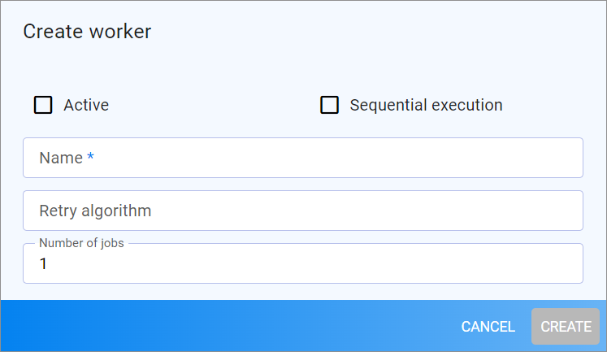

# Manage workers

The workers define how the webhooks waiting in the queue are to be executed. You must first create the workers, because you need them to define the webhooks later. The workers define the retry algorithm, which specifies the number of retries. Additionally, they define if the webhook messages in the queue are processed sequentially or in parallel.

**Sequential processing**   
Sequential processing of webhooks is recommended for events that are related to status changes. For example, an order status change must be sent in the correct update sequence so that the status "Completed" is not overwritten by the status "Delivered". In sequential processing, only one worker processes the webhooks.<!---Wie heißen die korrekten Status für die Order?-->

> [Info] When defining the webhooks, you can specify conditions such as special fields that are to be considered for triggering an event. For detailed information, see [Define webhook conditions](./02_ManageWebhooks.md#define-webhook-conditions).

**Parallel processing**   
Parallel processing of webhooks is recommended for events where there is no particular sequence to follow. For example, all post persist events are suitable for parallel processing. The advantage of parallel processing is that you can define the number of workers, so you can respond to high system loads.

## Create worker

Create a worker that you will assign to a webhook later. To know the workers you will need, you need to have an idea of the different characteristics of the workers. 
Alternatively, you can define the webhooks first and associate the workers later by editing the webhooks.<!---Geht das wirklich? Prüfen--> 

#### Prerequisites

No prerequisites to fulfill.

#### Procedure

*Webhooks > Workers*

1. Click the  (Add) button in the bottom right corner.    
    The *Create worker* view is displayed.

    

2. If you want to activate the worker directly when saving it, click the *Active* checkbox. Alternatively, you can activate the worker later, see [Activate worker](#activate-worker).

3. Define whether you want this worker for sequential execution. In this case, click the *Sequential execution* checkbox.   
    The *Number of jobs* field is hidden, because in sequential execution only one worker executes the webhooks.

2. Enter a name for the worker in the *Name* field. It is recommended to describe the execution mode and the retry algorithm in the name for better identification later.

3. Specify the retry algorithm in the *Retry algorithm* field, separated by commas. It defines the time intervals in seconds in which the worker execution should be retried after a webhook message could not be sent successfully. You have the following options: 
    -   You can leave the field empty. <!--- Stimmt das?-->In this case, the following default is used: First try = 60 sec, second try = 120 sec, third try = 300 sec, fourth try = 600 sec. 
    - You can define up to 4 time intervals in seconds, for example **60, 300, 600, 6000**. Each interval is counted from the time of the first try.<!---Stimmt das ?-->

4. Define the number of jobs in case you have decided for parallel processing.  

5. Click the [CREATE] button.   
    The *Create worker* view is closed and the *Workers* view is displayed.

## Activate worker

Activate a worker if you want to use it for processing the queue.

#### Prerequisites

At least one worker has been created, see [Create worker](#create-worker).

#### Procedure

*Webhooks > Workers*

1. Click the checkbox at the worker(s) you want to activate.   
    The [ACTIVATE] button on the top left is highlighted.

2. Click the [ACTIVATE] button.   
    The status of the worker(s) in the *Active* column has switched to  (Active). 

## Deactivate worker

Deactivate a worker if you no longer want to use it. Note that all associated webhooks will no longer be executed after deactivating a worker.

#### Prerequisites

At least one worker has been created, see [Create worker](#create-worker).

#### Procedure

*Webhooks > Workers*

1. Ensure that no unwanted webhook is associated with the worker(s) you want to deactivate. To do this, select the worker for which you want to check the webhook association.   
    The *DETAILS* tab of the webhook is displayed.

2. Click the *WEBHOOKS* tab.   
    All webhooks associated with the worker are displayed.

    

3. Remove the webhook association. For detailed information, see [Remove associated worker](./02_ManageWebhooks.md#remove-associated-worker). Do this for all workers that are listed in the *Webhooks* tab. 

4. Click the checkbox at the worker(s) you want to deactivate. 
    The [DEACTIVATE] button on the top left is highlighted.

4. Click the [DEACTIVATE] button.   
    The status of the worker(s) in the *Active* column has switched to  (Inactive).    

## Disable execution of workers

Disable the workers so that no new workers are executing the queue. This might be necessary when editing the workers or webhooks.

#### Prerequisites

- You have the permission to enable/disable feature flags in the engine room. For detailed information on feature flags, see [Switch on/off single feature flags](../../Core1/AdministratingCore1/06_ExpertKnowledge.md#switch-onoff-single-feature-flags) in the *Core1 Platform documentation*.

#### Procedure

*Actindo Core1 Platform > Any workspace> Click the Engine room button > System information*

1. Select the *Disable webhooks* checkbox in the *Webhooks* section. For detailed information, see [Switch on&frasl;off single feature flags](Core1Platform/AdministratingCore1/06_ExpertKnowledge.md#switch-on⁄off-single-feature-flags) in the *Core1 Platform* documentation.   
    The webhook workers have been disabled. No new webhooks will be sent as long as the *Disable webhooks* checkbox is selected.

2. Clear the *Disable webhooks* checkbox in the *Webhooks* section after you have finished editing workers or webhooks.   
    The execution of the queue will be continued after one minute. 

## Shut down workers

After you have disabled the execution of workers, it may be necessary to stop the current execution of the queue for workers that are currently running. In this case, you can shut down a single worker or shut down all workers at once.  

If you have enabled the execution of workers again, it will be started after about 1 minute. Any workers that were previously stopped will also be restarted so that no data is lost.

### Shut down single worker

Shut down a single worker to avoid that the associated webhooks are executed by it. 

#### Prerequisites

- At least one worker has been created, see [Create worker](#create-worker).
- The execution of workers is disabled, see [Disable execution of workers](#disable-execution-of-workers).

#### Procedure

*Webhooks > Workers*

1. Click the checkbox at the active worker you want to shut down.    
    The [ SHUT DOWN] button is enabled.

    <!--- Noch prüfen, ob man auch mehrere ankreuzen kann-->

2. Click the [ SHUT DOWN] button.   
    The worker is stopped. The associated webhooks in the queue are no longer executed.

### Shut down all workers

Shut down all workers to stop the current execution of all webhooks in the queue.

#### Prerequisites

- At least one worker has been created, see [Create worker](#create-worker).
- The execution of webhooks is disabled, see [Disable execution of workers](#disable-execution-of-workers).

#### Procedure

*Webhooks > Workers*

Click the [ SHUT DOWN] button top right.   
The execution of all currently running workers is stopped.

## Delete worker

Delete a worker if you no longer need it. You can only delete workers that are not associated to any webhook. 

#### Prerequisites

At least one worker has been created, see [Create worker](#create-worker).

#### Procedure

*Webhooks > Workers*

1. Ensure that no webhook is associated with the worker(s), you want to delete. To do this, select the worker for which you want to check the webhook association.   
    The *DETAILS* tab of the worker is displayed.

3. Click the *WEBHOOKS* tab. 
    All webhooks associated with the worker are displayed.

    

    <!--- Prüfen, hier sieht es so aus, als wenn ich hier einen Webhook löschen könnte. Aber ich will doch nur die Zuordnung löschen, oder nicht?-->

4. Remove the webhook association. For detailed information, see [Remove associated worker](./02_ManageWebhooks.md#remove-associated-worker). Do this for all workers that are listed in the *Webhooks* tab.

6. Return to the *Workers* view.

7. Select the workers you want to delete.   
    The [ DELETE] button is highlighted.

8. Click the [ DELETE] button.   
    The workers are deleted.

