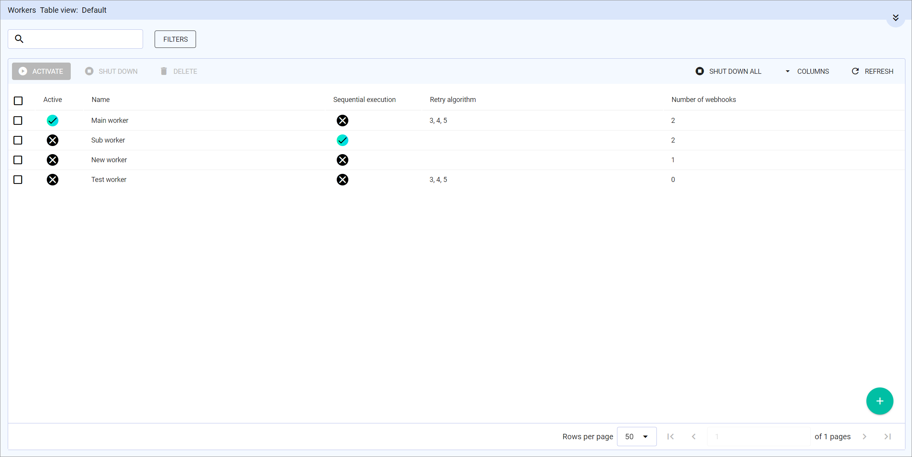
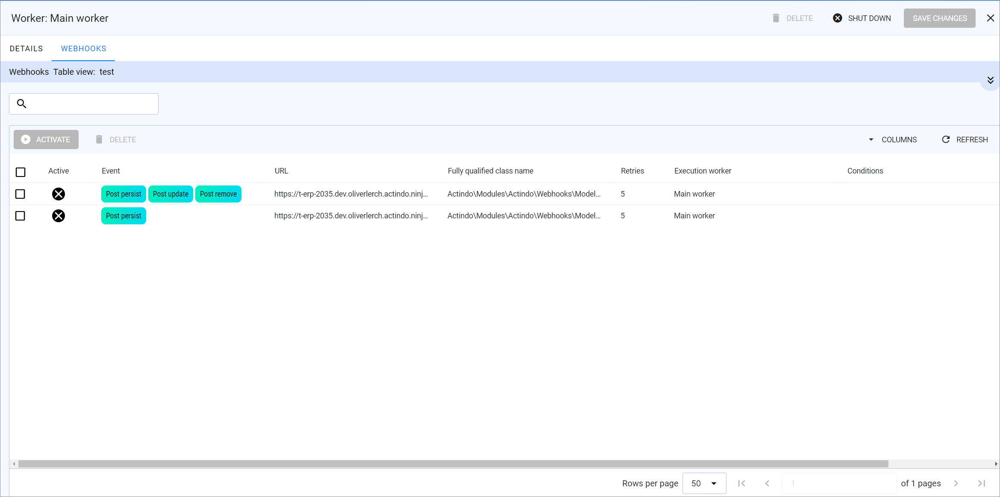

# Manage workers

The workers define how the webhooks waiting in the queue are to be executed. Since the workers are associated with the webhooks, you must first create the workers. They define the retry algorithm, which specifies both the number of retries as well as if the webhook messages in the queue are processed sequentially or in parallel.

**Sequential processing**   
Sequential processing of webhooks is recommended for events that are related to status changes. For example, an order status change must be sent in the correct update sequence so that the status "Completed" is not overwritten by the status "Delivered". In sequential processing, only one worker processes the webhooks.<!---Wie heißen die korrekten Status für die Order?-->

> [Info] When defining the webhooks, you can specify conditions such as special fields that are to be considered. For detailed information, see [Define webhook conditions](./02_ManageWebhooks.md#define-webhook-conditions).

**Parallel processing**   
Parallel processing of webhooks is recommended for events where there is no particular sequence to follow. For example, all post persist events are suitable for parallel processing. The advantage of parallel processing is that you can define the number of workers, so you can respond to high system loads.

## Create worker

Create a worker 

#### Prerequisites

No prerequisites to fulfill

#### Procedure

*Webhooks > Workers*

## Activate worker

## Deactivate worker

## Disable execution of workers

Disable the workers so that no new workers are executing the queue, which may be necessary to edit the workers or webhooks.

#### Prerequisites

- You have the permission to enable/disable feature flags in the engine room.

#### Procedure

*Actindo Core1 Platform > Any workspace> Click the engine room button*

<!---Screenshot von Engine room-->

1. Enable the *Disable workers* toggle in the *Webhooks* box.<!---Namen prüfen--> For detailed information, see [Switch on&frasl;off single feature flags](Core1Platform/AdministratingCore1/06_ExpertKnowledge.md#switch-on⁄off-single-feature-flags) in the *Core1 Platform* documentation.   
    The webhook workers have been disabled. No new webhooks will be sent as long as the *Disable workers* toggle is enabled.

2. Disable the *Disable workers* toggle in the *Webhooks* box after you have finished editing the workers or webhooks.   
    The execution of the queue will be continued after one minute. 

## Shut down workers

Sometimes it may be necessary to stop the current execution of the queue for specific workers, for example, if you want to edit the worker or associated webhooks. Therefore, you have to shut down a worker to avoid that the associated webhooks are executed by this worker. Alternatively, you can shut down all workers. <!---wie starte ich einen worker wieder?-->    

### Shut down single worker

Sometimes it may be necessary to stop the execution of the queue for a specific worker, for example, if you want to edit the worker or associated webhooks. Therefore, you have to shut down a worker to avoid that the associated webhooks are executed by this worker. <!---wie starte ich einen worker wieder?-->

#### Prerequisites

 At least one worker has been created, see [Create worker](#create-worker).

#### Procedure

*Webhooks > Workers*

1. Click the checkbox at the worker you want to shut down.    
    The [<!---Icon-->SHUT DOWN] button is enabled.

2. Click the [<!---Icon-->SHUT DOWN] button.   
    The worker is stopped. The associated webhooks in the queue are no longer executed.

### Shut down all workers

Shut down all workers to stop the current execution of all webhooks in the queue. <!---In welchen Situation würde ich das tun? wie starte ich einen worker wieder?-->   
To avoid, that workers are started again by an event, you must disable the workers, see [Disable workers](#disable-workers).

#### Prerequisites

At least one worker has been created, see [Create worker](#create-worker).

#### Procedure

*Webhooks > Workers*

Click the [<!---Icon-->SHUT DOWN] button to right.   
The execution of all currently running workers is stopped.

## Delete worker

Delete a worker if you no longer need it. You can only delete workers that are not associated to any webhook. 

#### Prerequisites

At least one worker has been created, see [Create worker](#create-worker).

#### Procedure

*Webhooks > Workers*

1. Ensure that no webhook is associated with the worker(s), you want to delete. To do this, select the worker for which you want to check the webhook association.   
    The *DETAILS* tab of the webhook is displayed.

3. Click the *WEBHOOKS* tab. 
    All webhooks associated with the worker are displayed.

    

4. Remove the webhook association. For detailed information, see [Remove associated worker](./02_ManageWebhooks.md#remove-associated-worker). Do this for all workers that are listed in the *Webhooks* tab.

6. Return to the *Workers* view.

7. Select the worker(s) you want to delete.   
    The [<!---Icon-->DELETE] button is highlighted.

8. Click the [<!---Icon-->DELETE] button.   
    The worker is deleted.

