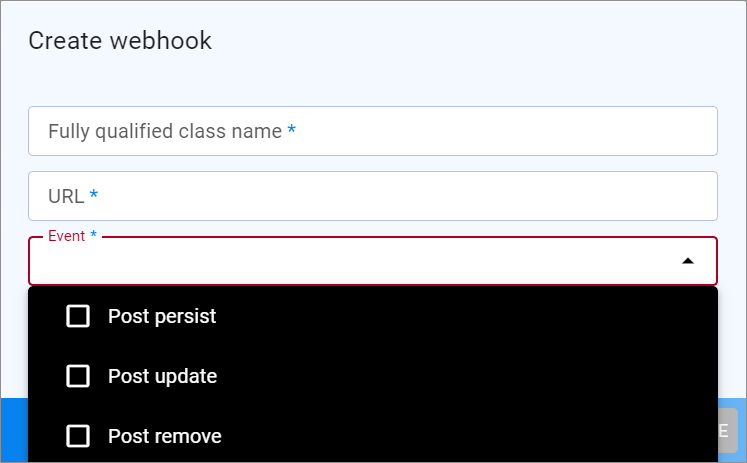

# Manage webhooks

You can use webhooks to send messages to your business partners. Webhooks contain specific conditions that determine the event that should generate a webhook message.  
A webhook is defined in conjunction with a worker. The webhook defines what and to whom the message is to be transferred. The worker defines how the messages are to be transferred.  

## Create webhook

Create a webhook to send messages to your business partners.

#### Prerequisites

No prerequisites to fulfill.

#### Procedure

*Webhooks > Webhooks*

1. Click the  (Add) button in the bottom right corner.    
    The *Create webhook* view is displayed.

    

2. Enter the class name / data model to be used for the webhook in the *Fully qualified class name* field. To get the names, see the data models under *Dev Tools > API > Tab DATA MODELS* for reference. Use the data model that contain the entities you want to send with a webhook. Copy the desired data model names and replace the dots with slashes. See the following examples:
    - Actindo\Modules\Actindo\Channels\Models\Offer 
    - Actindo\Modules\Actindo\Channels\Models\Order
    - Actindo\Modules\Actindo\Channels\Models\Shipment

3. Enter the URL of the message receiver in the *URL* field.

4. Click the *Event* drop-down list and click the checkbox for each event that you want to trigger the webhook. The following events are available:

    - **Post persist**   
        A new database entry has been added, for example, a new offer.      
    - **Post update**   
        An existing database entry has been changed, for example, the name of an offer has been changed.   
    - **Post remove**   
        An existing database entry has been deleted, for example, an offer is no longer available.

    The selected events are added to the *Event* field.

    

5. If applicable, click the *Worker* drop-down list and select the worker to process the webhook. You can also add this information later after you have created the worker <!--Nochmal am realen UI prüfen-->. For detailed information, see [Create worker](./03_ManageWorkers.md#create-worker).

<!---Ergänzen, wenn UI vollständig  6. Select the Authentification method you want to use. The following methods are available:-->
   
6. Click the [CREATE] button.   
    <!---Ergänzen, wenn UI da. Was passiert dann?-->

7. Continue with [Edit webhook](#edit-webhook) to specify optional properties and conditions.

## Edit webhook

Edit the webhook to add the number of retries, the workers, or optional properties.

### Prerequisites

At least one webhook has been created, see [Create webhook](#create-webhook).

### Procedure

*Webhooks > Webhooks*

1. Click the webhook you want to edit.
    The *Webhook "Webhook class name"* view is displayed.

    

2. If desired, edit the events. Proceed as follows: 
    - To remove an event from the *Event* field, click the  button at the event name.
    - To add an event, click the *Event* drop-down list and select the event you want to add.

3. If desired, enter the number of retries in the *Workers* field. This number should fit to the *Retry algorithm* specified in the worker definition.

4. If desired, select a worker in the *Worker* drop-down list.

5. If desired, define optional properties in the *Optional properties* section. This allows you to add additional data to the webhook message you want to send. For example, DataHub attributes are not added to the payload by default, so you can add them here. You can enter DataHub entities as well as any database field. The following prerequisites must be fulfilled:   
    
    - The properties must be part of the model you have entered in the *Fully qualified class name* field.  
    - DataHub entities must have a leading underscore.  
    - The data must be passed as array.  
    
    See the following examples:   
    - lineItems._channels_order_shipment_line_item_quantity   
    - lineItems._lineitem_idInShop   
    - _order_idInShop   
    - connection   

6. If desired, define conditions to be used to trigger the creation of a webhook message, see [Define webhook conditions](#define-webhook-conditions).

## Define webhook conditions

Define the conditions that must be met to trigger the creation of a webhook message.

#### Prerequisites

At least one webhook has been created, see [Create webhook](#create-webhook).

#### Procedure

*Webhooks > Webhooks > Select a webhook*

1. Click the [ ADD CONDITION] in the top right corner of the *Conditions* section.    
    A new condition input line is displayed.

    

2. Enter the property on the basis of which you want to trigger the sending of the webhook message. The property must be part of the model you have entered in the *Fully qualified class name* field. Note that DataHub entities need a leading underscore. See the following examples: 
    - _channels_order_deliver_status.oldValue (DataHub)
    - importStatus.newValue.scalar (Channels)<!---ich finde es nicht in den Models?-->
    - connection.id (Channels)
    - _channels_order_deliver_status (DataHub)

3. Select the operator in the *Operator* drop-down list. The operator defines the relation that must exist between the property and the value for a condition to be fulfilled. The following operators are available:
    - **Not equal**   
        The value of the property is not the value defined in the *Value* field.
    - **Equal**   
        The value of the property is the value defined in the *Value* field.
    - **Is set**   
        There is a value available for this property.

4. Define the value in the *Value* field. This describes a value that the property can have. For example, it can be the connection ID or the order delivery status.

5. If you want that the condition applies to the change set, select the checkbox in the *Apply on change set* column.    
    For example, you might want to send a webhook message when the price of an offer for a particular channel has changed. To set this up, you need two conditions that both are required. One that identifies the channel, and one that applies on the change set, where the new price is stored. For the condition that apply to the change set, you must select the *Apply on change set* checkbox.

    **x All conditions required** 
    |Property |Operator|Value|Apply on change set|
    |-------|------|------|-------|
    |connection ID|equal|[connection ID]|    |
    |channels_price|is set|true|   x  |
<!--- Eventuell im Screenshot zeigen, wenn wieder da-->

5. If desired, add further conditions by clicking the [ ADD CONDITION] button.

6. Specify whether all conditions must be met to trigger the sending of the webhook message. If all must be met, click the [All conditions required] checkbox in the top right corner of the *Conditions* section. If you do not click the checkbox, at least one of the conditions must be met.

7. If desired, delete a condition line by clicking on the (Delete) button at the right end of the line.

8. Click the [SAVE CHANGES] button in the top right corner.

9. Clear the tenant cache, see [Clear tenant cache](#clear-tenant-cache).

## Clear tenant cache

For performance reasons, all webhooks are part of the tenant cache. After you have created a new webhook or have changed an existing one, you must ensure, that the tenant cache is rebuild.

#### Prerequisites

You have administrator rights for the related instance.

#### Procedure

For detailed information on how to clear the tenant cache, see [Clear tenant cache](../../Core1/AdministratingCore1/05_EngineRoom.md#clear-tenant-cache) in the *Core1 Platform* documentation.

## Remove associated worker

Remove an associated worker from a webhook, for example, if you want to delete a worker.

#### Prerequisites

- At least one webhook has been created, see [Create webhook](#create-webhook).
- At least one worker has been created, see [Create worker](./01_ManageWorkers.md#create-worker)

#### Procedure

*Webhooks > Webhooks > Select a webhook*

1. Select another worker in the *Worker* drop-down list to remove the current association. <!--- Pflichtfeld oder kann man auch leer lassen?-->

2. Click the [SAVE CHANGES] button in the top right corner.   
    The webhook association at the worker is no longer displayed, see under *Workers > Select worker > Tab WEBHOOKS*.
    
    