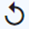

# Manage queues

The *Queues* menu entry shows the following webhooks:
<!--- Nochmal nachfragen -->
 - Wait to be executed/sent by the worker after the conditions have been successfully passed (status *Ready to be sent*)
 - For performance reasons, all webhooks for which changes have been made to the data of the model for which it is defined (status *Pre remove*).
 - All those that have been sent successfully (status *Success*).
 - Those that have been finally failed after the last retry (status *Failed*).

>[Info] The *Queues* view contains all queue entries created for the webhooks. Only queue entries with status *Success* are automatically deleted after ten days.

You can retry failed webhooks, reset the execution, and delete no longer needed or finally failed webhooks.

## Retry queue entry

Retry sending the webhook.

#### Prerequisites

- At least one queue entry is available with status *Failed*.

#### Procedure

*Webhook > Queue*

1. Select the desired queue entries with status *Failed*.

2. Click the [ RETRY] button.
    The workers are started to retry sending the webhooks. If the retry is successful, the related queue entries change their status to *Success*. If the retry fails again, the related queue entries remain in the status *Failed*.   

3. Analyze the log for the entries remained in the status *Failed*. For detailed information, see <!---To be enhanced-->

4. If you can resolve the issue causing the error, retry the queue entries again. 

5. If you cannot resolve the issue causing the error, you will need to manually transfer the message. The *Queue entry* view displays the details of what should have been sent by the webhook.

## Reset queue entry

Reset the number of retries to start again following the retry algorithmtegy. You can only retry queue entries that have a number in the *Tries* column that is not 0.

#### Prerequisites

- At least one queue entry is available with status *Failed*.

#### Procedure

*Webhook > Queue*

1. Click the checkbox of the queue entry you want to reset.

2. Click the [ RESET] button.   
    The workers are started again to follow the retry algorithm defined in the worker. 

## Delete queue entry

Delete a queue entry that has finally failed and for which you have manually sent the message. This is recommended so that you can keep track of the entries you still need to analyze. 

#### Prerequisites

- At least one queue entry is available with status *Failed*.

#### Procedure

*Webhook > Queue*

1. Click the checkbox of the queue entry you want to delete. 

2. Click the [ DELETE] button.
    The queue entry is deleted.