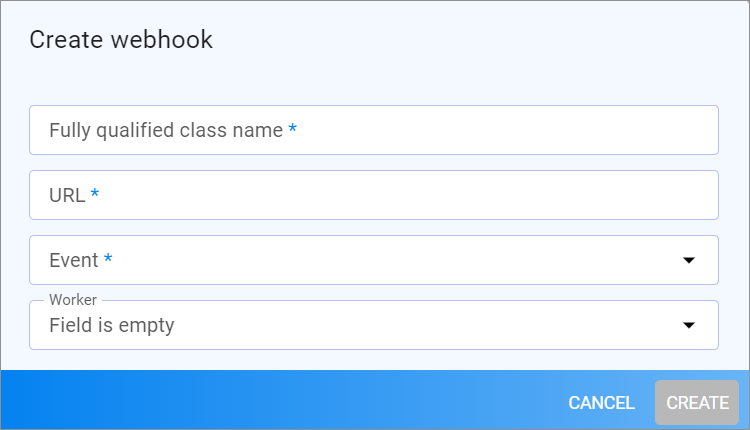
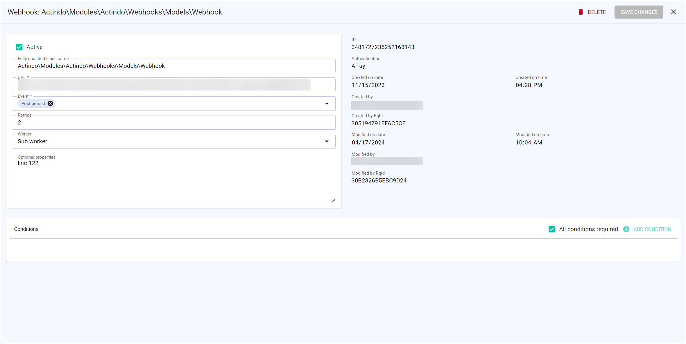

# Webhooks

*Webhooks > Webhooks*

The list displays all available webhooks. Depending on the settings, the displayed columns may vary. All fields are read-only.

The following functions are available in row above the list header:

-       
    Select the checkbox to the left of a list entry. This allows you to select one or more entries for an action, which you can then perform by clicking a button in the upper left corner above the list header.
    If you click the checkbox in the list header, all entries in the list are selected. 

- [ ACTIVATE]    
    Click this button to activate the selected webhooks. You can activate several webhooks at once. 

- [ DELETE]    
    Click this button to delete a webhook. <!---You can delete several webhooks at once?-->

The following fields are available in the list:

- *Active*   
    Status of the webhook. The following statuses are available:
    
    -  **Active**  
        The webhook can be used for data transfer.

    -  
    **Inactive**   
        The webhook is inactive and cannot be used for data transfer.

- *Event*  
    Event that triggers the sending of a webhook message. 

- *URL*  
    URL to which the webhook notifications are to be sent, URL of the recipient.

- *Fully qualified class name*   
    Name of the data model that contains the entities you want to send with a webhook. See the data models under *Dev Tools > API > Tab DATA MODELS* for reference. 

- *Retries*  
    Number of retries the worker should make to successfully send the message.

- *Execution worker*   
    Job that processes the queue and sends webhook messages to the recipients.
    
- *Conditions*   
    Conditions that must be met before a webhook message is sent.

-   (Add)     
   Click this button to create a new webhook.

## Create webhook

*Webhooks > Webhooks > Add webhook*

- *Fully qualified class name*   
    Name of the data model that contains the entities you want to send with a webhook. See the data models under *Dev Tools > API > Tab DATA MODELS* for reference. This field is required.

- *URL*  
    URL to which the webhook notifications are to be sent, that is the URL of the recipient. This field is required.

- *Event*  
    Click the *Event* drop-down list and select the checkboxes at the events that should trigger the sending of webhook messages. This field is required.

- *Worker*   
    Click the *Worker* drop-down list to select the worker who are to be used to process the webhook. The list displays all available workers. For detailed information, see [Create worker](../Integration/01_ManageWorkers.md#create-worker). <!---Ich nehme an, dass es gefüllt sein muss, um einen Webhook zu aktivieren >prüfen, wenn UI da.-->

- [CANCEL]    
    Click this button to cancel creating a webhook.   
    The *Create webhook* window is closed. The *Webhooks* view is displayed.

- [CREATE]   
    Click this button to create a new webhook.   
    The *Create webhook* window is closed. The *Webhooks* view is displayed.

## Edit webhook

*Webhooks > Webhooks > Select webhook*

The view displays on the left side the fields, with which you can define a webhook. On the right side, important administrative data is displayed.

The following fields and functions are available:

- [  DELETE]   
    Click this button to delete the webhook.

- [SAVE CHANGES]   
    Click this button to save any changes.

- *Fully qualified class name*  
    Name of the data model that contains the entities you want to send with a webhook. See the data models under *Dev Tools > API > Tab DATA MODELS* for reference.  

- *URL*  
    URL to which the webhook messages are to be sent, URL of the recipient.

- *Event*  
    Use the *event* drop-down list to select the events that you want to trigger the sending of webhook messages. The following events are available:

    - **Post persist**   
        A new database entry has been added, for example, a new offer.      
    - **Post update**   
        An existing database entry has been changed, for example, the name of an offer has been changed.   
    - **Post remove**   
        An existing database entry has been deleted, for example, if an offer is no longer available.

- *Retries*   
    Enter the number of retries. For example, an entry of 5 means the worker tries to successfully send the message a maximum of 5 times. If the second try is successful, the worker completes the webhook.

- *Worker*   
    Click the *Worker* drop-down list to select the worker who are to be used to process the webhook. The list displays all available workers. For detailed information, see [Create worker](../Integration/01_ManageWorkers.md#create-worker).

- *Optional properties*   
    If desired, enter optional properties, see [Edit webhook](../Integration/02_ManageWebhooks.md#edit-webhook).

**Administrative data**

- *ID*   
    ID of the webhook.

- *Authentication*   
    Authentication method used by the webhook.

- *Created on date*   
    Date of creation.

- *Created on time*   
    Time of creation.

- *Created by*   
    Name (and username) of the person who has created the webhook.

- *Created by RqID*   
    Request ID of the webhook creation.

- *Modified on date*   
    Date of modification.

- *Modified on time*   
    Time of modification.

- *Modified by*   
    Name (and username) of the person who has modified the webhook.

- *Modified by RqID*   
    Request ID of the webhook modification.

## Conditions

*Webhooks > Webhooks > Select webhook*

The *Conditions* section is used to define an unlimited amount of conditions that must be met before a webhook is sent.

The following fields and functions are available:

-  *All conditions required*   
    Select the checkbox, if all conditions in the list must be met before the webhook is sent. If the checkbox is not selected, only one of the conditions available must be met. 

- [ ADD CONDITION]  
    Click this button to add a new condition.

- *Property*   
    Property of the entity to be sent. 

- *Operator*   
    Click the drop-down list to select an operator. The operator describes the relation between an entity and a value. The relation must be met in order to meet a condition. For example: Entity(xxx) is equal 15. The condition is met, if the Entity (xxx) has the value 15.   
    The following operators are available:   
    - **Equal**   
       The entity must have the value defined in the *Value* field.   
    - **Not equal**    
        The entity must not have the value defined in the *Value field*.
    - **Is set**   
        There is a value available for this property.
    
- *Value*   
    Enter the value with which you want to define the relation.

