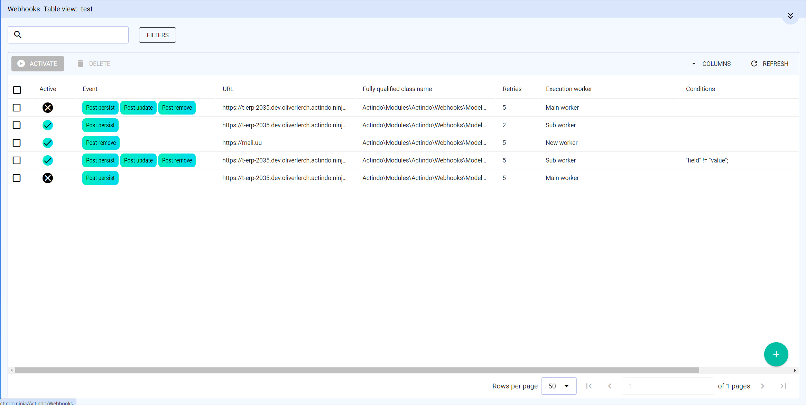

# Workers

*Webhooks > Workers*

The list displays all available workers. Depending on the settings, the displayed columns may vary. All fields are read-only.

The following worker related functions are available in the view header:

-  <!--- Icon-->   
   Select the checkbox to the left of a list entry. This allows you to select one or more entries for an action, which you can then perform by clicking a button in the upper left corner above the list header.
    If you click the checkbox in the list header, all entries in the list are selected. 

- [ACTIVATE] <!---Icon ergänzen-->   
    Click this button to activate the selected workers. You can activate several workers at once. <!---stimmt das?--> This button is only available for workers with the *Active* status.

- [DEACTIVATE]
    Click this button to deactivate the selected workers. You can deactivate several workers at once. <!---stimmt das?--> This button is only available for workers with the *Inactive* status.

- [ SHUTDOWN] <!---Icon-->  
    Click this button to shut down the selected worker. <!--- You can shut down several workers at once?-->

-  DELETE]    
    Click this button to delete a worker. <!---You can delete several webhooks at once?-->   
    You can only delete a worker, if it is not assigned to a webhook. For detailed information, see [Remove worker assignment](../Integration/02_ManageWebhooks.md#remove-worker-assignment).

-  SHUTDOWN ALL] <!---Icon-->  
    Click this button to shut down all active workers.

The following fields are available in the view:

- *Active*
    Status of the worker. The following statuses are available:

    -  <!---Icon-->    
        The worker is active and can be used to send webhook messages.
    -  <!---Icon-->   
        The worker is inactive. It cannot be used to send webhook messages.

- *Name*   
    Name of the worker.

- *Sequential execution*   
    Indication whether the webhooks are executed sequentially or not. The following status are available:
    -  <!---Icon-->   
        Webhooks assigned to this worker are executed sequentially.
    -  <!---Icon-->   
        Webhooks assigned to this worker are executed in parallel.  

    For detailed information, see [Manage workers](../Integration/03_ManageWorkers.md).

- *Retry algorithm*   
    Time intervals in minutes in which the worker execution should be retried after a webhook message could not be sent successfully. 

## DETAILS

*Webhooks > Workers > Select worker*

The *DETAILS* view displays the data recorded for a worker.  All fields are ready for input.

The following functions are available in the header row:   

-  DELETE]   
    Click this button to delete the worker. 
    You can only delete a worker, if it is not associated with a webhook. To check this, change to the *WEBHOOKS* tab, where all associated webhooks are listed.

- [ SHUTDOWN] <!---Icon-->  
    Click this button to shut down the worker.

- [SAVE CHANGES]    
    Click this button to save any changes.

- [X]    
    Click this button to close the *DETAILS* view.  
    The *Workers* view is displayed.

