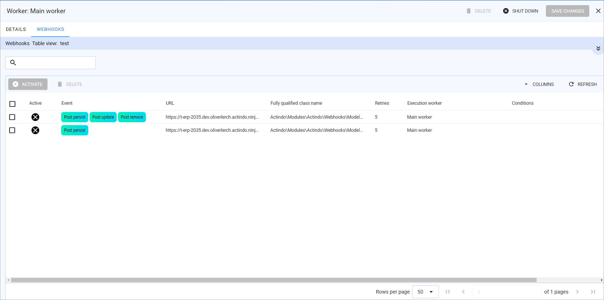

# Workers

*Webhooks > Workers*

The list displays all available workers. Depending on the settings, the displayed columns may vary. All fields are read-only.

The following functions are available in the list header:

-   
   Select the checkbox to the left of a list entry. This allows you to select one or more entries for an action, which you can then perform by clicking a button in the upper left corner above the list header.
    If you click the checkbox in the list header, all entries in the list are selected. 

- [ ACTIVATE]   
    Click this button to activate the selected workers. You can activate several workers at once. <!---stimmt das?--> This button is only available for workers with the *Active* status.

- [ DEACTIVATE]    
    Click this button to deactivate the selected workers. You can deactivate several workers at once. <!---stimmt das?--> This button is only available for workers with the *Inactive* status.

- [ SHUTDOWN]   
    Click this button to shut down the selected worker. <!--- You can shut down several workers at once?-->

- [ DELETE]    
    Click this button to delete a worker. <!---You can delete several webhooks at once?-->   
    You can only delete a worker, if it is not assigned to a webhook. For detailed information, see [Remove associated worker](../Integration/02_ManageWebhooks.md#remove-associated-worker).

-  SHUTDOWN ALL]   
    Click this button to shut down all active workers.

The following fields are available in the view:

- *Active*   
    Status of the worker. The following statuses are available:

    -     
        The worker is active and can be used to send webhook messages.
    -    
        The worker is inactive. It cannot be used to send webhook messages.

- *Name*   
    Name of the worker.

- *Sequential execution*   
    Indication whether the webhooks are executed sequentially or not. The following status are available:
    -    
        Webhooks assigned to this worker are executed sequentially.
    -   
        Webhooks assigned to this worker are executed in parallel.  

    For detailed information, see [Manage workers](../Integration/01_ManageWorkers.md).

- *Retry algorithm*   
    Time intervals in minutes in which the worker execution should be retried after a webhook message could not be sent successfully. 

## Details of worker

*Webhooks > Workers > Select worker*

The *DETAILS* view displays the data recorded for a worker.  All fields are ready for input.

The following functions are available in the header row:   

- [ DELETE]   
    Click this button to delete the worker. 
    You can only delete a worker, if it is not associated with a webhook. To check this, change to the *WEBHOOKS* tab, where all associated webhooks are listed.

- [ SHUTDOWN]   
    Click this button to shut down the worker.

- [SAVE CHANGES]    
    Click this button to save any changes.

-     
    Click this button to close the *DETAILS* view.  
    The *Workers* view is displayed.

## Webhooks

*Webhooks > Workers > Select worker > Tab WEBHOOKS*

The *DETAILS* view displays the data recorded for a worker.  All fields are ready for input.

The following functions are available in the header row:   

- [ ACTIVATE]   
    Click this button to activate the webhook association.   

- [ DELETE]    
    Click this button to delete a webhook association. <!---die Zuordnung oder den ganzen Webhook?-->   
    
The following fields are available in the header list: 

- *Active*   

- *Event*    
    Events that trigger the sending of the webhook messages. The following events are available:

    - **Post persist**   
        A new database entry has been added, for example, a new offer.      
    - **Post update**   
        An existing database entry has been changed, for example, the name of an offer has been changed.   
    - **Post remove**   
        An existing database entry has been deleted, for example, if an offer is no longer available.

- *URL*    
    URL to which the webhook messages are to be sent, URL of the recipient.

- *Fully classified class name*   
    Name of the data model that contains the entities you want to send with a webhook. See the data models under *Dev Tools > API > Tab DATA MODELS* for reference.  

- *Retries*   
    Number of retries. For example, an entry of 5 means the worker tries to successfully send the message a maximum of 5 times. If the second try is successful, the worker completes the webhook.

- *Execution worker*    
    Execution worker which is used to process the webhook. The list displays all available workers. For detailed information, see [Create worker](../Integration/01_ManageWorkers.md#create-worker).

- *Conditions*
<!--Prüfen wenn Sandbox da ist-->

