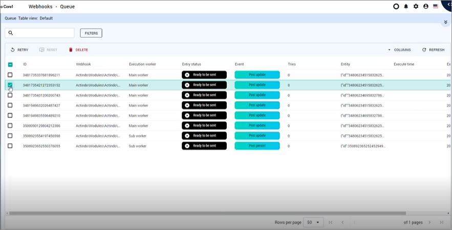
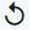
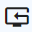
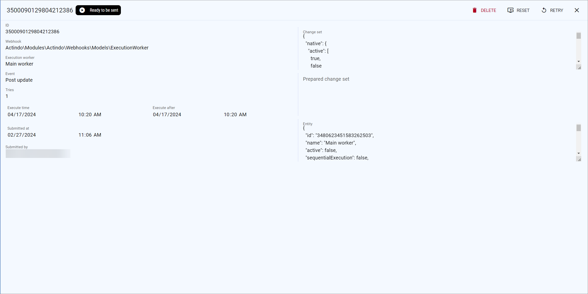

# Queue

*Webhooks > Queue*

The list shows all webhooks in the queue that are waiting to be executed/sent, as well as all those that have been sent successfully and those that have failed. Depending on the settings, the displayed columns may vary. All fields are read-only.

The following functions are available in the row above the list header:

-  
   Select the checkbox to the left of a list entry. This allows you to select one or more entries for an action, which you can then perform by clicking a button in the upper left corner above the list header.
    If you click the checkbox in the list header, all entries in the list are selected. 

- [ RETRY]      
    Click this button to retry sending the webhook. 

- [ RESET] 
    Click this button to reset the amount of tries, so that the system again tries to send the webhooks, depending on the *Retry algorithm* defined in the worker. The button is disabled, if the number of tries is equal to zero.

- [ DELETE]    
    Click this button to delete a queue entry. <!---You can delete several webhooks at once?-->

The following fields are available in the list:
- *ID*   
    ID of the queue entry.

- *Webhook*   
    Class name of the webhook.

- *Execution worker*   
    NName of the worker that is desired to execute the webhook.

- *Entry status*   
    Status of the queue entry. The following statuses are available:

    - **0 = Ready to be sent**   
        The webhook is waiting to be sent.
    - **1 = Success**   
        The webhook was sent successfully
    - **2 = Failed**   
        The sending of the webhook failed and the amount of tries reached the maximum. This entry must be handled manually.   
    - **3 - Pre remove**   
        This entry was created during the preRemove event. It is set to *Ready to be sent* during the postRemove event.<!--????nachfragen-->

- *Event*   
    Event that has triggered the webhook.

- *Tries*   
    Number of tries defined in the webhook configuration. <!--- oder ist es die Anzahl der bisher versuchten Versuche?-->

## Details of queue entry 

*Webhooks > Queue > Select queue*

The view shows the details of a selected queue entry.

The following queue related functions are available in the view header:

- *Queue entry ID*  
    ID of the queue entry.

- Status icon    
    Status of the selected queue entry.

- [ RETRY]   
    Click this button to retry sending the webhook. 

- [ RESET]    
    Click this button to reset the amount of tries, so that the system again tries to send the webhook, depending on the *Retry algorithm* defined in the worker. The button is disabled, if the number of tries in the *Tries* field is equal to zero.

- [ DELETE]    
    Click this button to delete the queue entry. 

The following fields and functions are available on the left part of this view:

- *Webhook*   
    Class name of the webhook.

- *Execution worker*   
    Name of the worker that is desired to execute the webhook or has executed it.

- *Event*   
    Event that has triggered the webhook.

- *Tries*   
    Number of tries defined in the webhook configuration. <!--- oder ist es die Anzahl der bisher versuchten Versuche?-->

- *Execute time*   
    <!---???Rechtschreibfehler?-->
- *Execute after*   
    <!---??? Rechtschreibfehler?-->Date and time of 
- *Submitted at*   
    Date and time of 

- *Submitted by*   
    Name and username of the person who has done the changes that triggered the creation of the webhook.

The following fields and functions are available on the right side in this view:

- *Change set*   
    Native webhook message that is to be sent/has been sent. Use the scroll bar on the right to see the whole message.

- *Prepared change set*   
    More readable version of the change set created by the system during first execution. This prepared change set replaces database IDs with keys to make an entry easier to understand. Use the scroll bar on the right to see the whole message.

- *Entity*   
    Detail information in JSON code about the worker who shall send/has sent the message.

